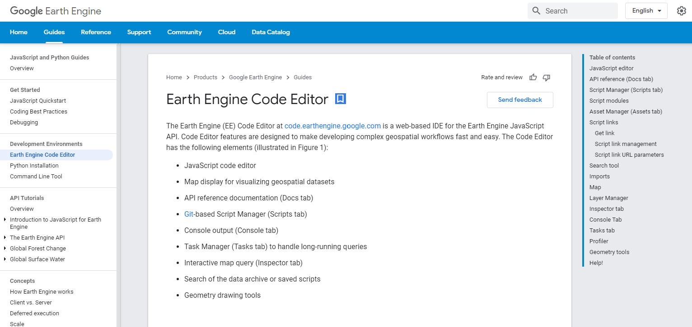
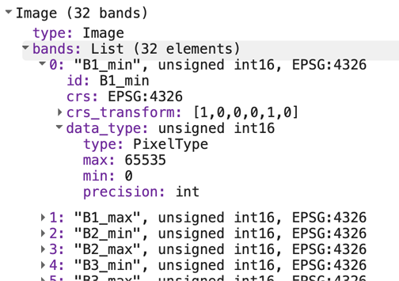

# Lab 00 - PreLab: Getting Started{#lab0}

## Overview{-}

This is a pre-lab designed to introduce the functionality and structure of Google Earth Engine (GEE) before we get into the practical labs. We will provide a brief introduction to the GEE Javascript interface (the code editor) and GEE resources at your disposal. By the end of this lab, you should be able to access GEE imagery, upload your own assets, build some basic visualizations and be comfortable working within the code editor. This lab contains many different outside sources - spending the time now getting associated with the tools will save you significant time as we delve into more complex topics. 

#### Learning Outcomes

- Navigate and find what you need within the Google Earth Engine infrastructure
- Describe and understand the major GEE data types and their associated methods
- Building custom vector data within GEE

#### Setting up an Account

To begin, sign-up for the Google Earth Engine [here](https://signup.earthengine.google.com). Registration is free and straightforward, but it takes approximately 24 hours to be approved to use the code editor. 

While waiting, let's get familiar with the Google Earth Engine. The video below is a quick introduction to Google Earth Engine to get you familiar with the available resources.

[Video Introduction to GEE](https://www.youtube.com/watch?v=Ypo28T6wPbQ)

#### Getting Set Up

In addition to the petabytes of satellite imagery and products that GEE has available, it allows you to incorporate your own raster, vector, and tabular data into your analysis. Note that this process is automatically linked to the same Google Drive account that signed up for GEE. 

If you are not familiar with Google Drive, the [Getting Started Guide](https://support.google.com/a/users/answer/9282958?hl=en) reviews the basics of maintaining resources within your Google Drive account. Although Google Cloud Platform Storage is beyond the scope of this course, it's an option and discussed in the documentaiton. We will go more in-depth on working with external data later, but below are some good resources to peruse. 

* [Managing Assets](https://developers.google.com/earth-engine/guides/asset_manager)
* [Import Raster](https://developers.google.com/earth-engine/guides/image_upload)
* [Import Vector / Tabular Data](https://developers.google.com/earth-engine/guides/table_upload) 
  * Note that GEE only supports Shapefiles and `.csv`files

* [Exporting Data](https://developers.google.com/earth-engine/guides/exporting)

#### Gecomputation with GEE: Server vs. Client

Understanding how Google Earth Engine works is critical for its effective use. The Developer's [overview](https://developers.google.com/earth-engine/guides/concepts_overview) provides much more detail on the intricacies of how GEE processes data on the Google Cloud Platform, but in the simplest terms, there are two sides to the process - the `client` side and `server` side. 

When you open your web browser and begin to work in the code editor, that is considered the `client` side. You can write JavaScript code in the editor and the code will be processed completely within your browser. The code chunk below simply creates variables `x` and `y`, adds them together as the variable `z` and prints the result, which shows up in the console of the code editor. Even though the code is written within the GEE editor, Google Earth Engine plays no role in the execution of this code - your browser executes it. 

```javascript
var x = 1; var y = 2;
var z = x + y;
print(z)
```

To begin using the cloud computing resources of GEE effectively, we can then call upon the server side. Let's say we want to import an image collection. In the snippet below, there is an `ee` before the `ImageCollection` constructor. In simple terms, this signals to Earth Engine that we will be using its resources. Without that indicator, GEE will cede operations to the JavaScript and process within the browser.

```javascript
var sentinelCollection = ee.ImageCollection('COPERNICUS/S2_SR');
```

Over time, you will gain experience understanding the role of working with JavaScript on the `client` side and the `server` side, but the main point in this section is that when programming, we will be building 'packages' that draw upon GEE resources to complete their operations.

An extension of this topic is listed [here](https://developers.google.com/earth-engine/guides/client_server), along with discussions of some specific programming topics (mapping instead of looping) - it might be advanced, but the bottom line is understand that the `client` and `server` work together to create an output. 


#### JavaScript

The intent of this course is not to teach the intricacies of programming within JavaScript. JavaScript is the core language for web development and many of the tutorials and resources you find will not be directly relevant to the type of JavaScript that you will need to work in Earth Engine (e.g., React, JQuery, dynamic app development). JavaScript was chosen because it is an extremely popular language (~97% of websites use it in some fashion) and as an object-oriented language, it is well-suited to pair objects (in this case, imagery provided by Google Earth Engine) with methods (such as using the `reduce` function to summarize the analytical information from a processed image). 

Several excellent resources exist that can help you in working with JavaScript. One such resource is [Javascript.info](https://javascript.info), which provides a thorough overview of working with JavaScript. In this tutorial, focus on part I, as part II and III are directed towards web development and not relevant for this purpose. 

[W3Schools](https://www.w3schools.com/js/default.asp) provides good information on each individual component of working with JavaScript. For instance, if you see the word `var` and wanted more information on it, W3Schools has helpful definitions and code snippets that will be of use. 

Finally, [JavaScript & JQuery](http://www.javascriptbook.com) is an excellent, well-designed book that goes through the fundamentals of working with JavaScript and provides helpful illustrations and use cases. The second half of the book is outside the scope of this course, but if you did want to extend your skill-set, this book is a great starting point. 

## Data and Methods

Working with data structures and their associated methods is essential to understanding Google Earth Engine. 

Most Google Earth Engine tutorials begin with an introduction to the data you will be working with and the operations you can use to analyze this data. Each bullet point below contains a link to the GEE documentation - it is well worth your time to read through this as thoroughly as possible and get familar with these key terms. 

[Intro to Data](https://developers.google.com/earth-engine/guides)

- [Image](https://developers.google.com/earth-engine/guides/image_overview)
  - A singe raster image consisting of values and their associated values
- [ImageCollection](https://developers.google.com/earth-engine/guides/ic_creating)
  - A "stack" or sequence of images with the same attributes
- [Geometry](https://developers.google.com/earth-engine/guides/geometries)
  - Vector data either built within Earth Engine or imported
  - Points, lines, polygons
- [Feature](https://developers.google.com/earth-engine/guides/features)
  -  `geometry` with associated attributes
  -  An example would be a geometric `point` associated with the city of Paris
- [FeatureCollection](https://developers.google.com/earth-engine/guides/feature_collections)
  - A set of features that share a theme
  - An example is a list of geometric `points` that describe all the capitals of the world
- [Reducer](https://developers.google.com/earth-engine/guides/reducers_intro)
  - A method used to compute statistics or perform aggregations on data over space, time, bands, arrays, and other data structures
  - An example - aggregate the mean pixel value from an image for each neighborhood polygon
- [Join](https://developers.google.com/earth-engine/guides/joins_intro)
  - A method to combine datasets (`Image` or `Feature` collections) based on time, location, or specified attribute
- [Array](https://developers.google.com/earth-engine/guides/arrays_intro)
  - A flexible (albeit sometimes inefficient) data structure that can be used for multi-dimensional analyses.

## Images and Image Collections

### Images

**Images** are **Raster** objects composed of:

- Bands, or layers with a unique:
  - Name
  - Data type
  - Scale
  - Mask
  - Projection

- Metadata, stored as a set of properties for that band. 

You can create images from constants, lists, or other objects. In the code editor 'docs', you'll find numerous processes you can apply to images. Ensure that you do not confuse an individual image with an image collection, which is a set of images grouped together, most often as a time series, and often known as a `stack`.

## Image Collections

Let's analyze the code below, which extracts one individual image from an image collection. You can copy and paste this code snippet into the code editor to follow along.

On the first line, we see that we are creating a JavaScript variable named `first`, and then using `ee` in front of `ImageCollection`, which signifies we are requesting information from GEE. The data we are importing ('COPERNICUS/S2_SR') is the Sentinel-2 MSI: MultiSpectral Instrument, Level-2A, with more information found in the dataset [documentation](https://developers.google.com/earth-engine/datasets/catalog/COPERNICUS_S2_SR?hl=en#description). 

The next four steps further refine the extraction of an image from an image collection. 

1. `.filterBounds` filters data to the area specified, in this case a geometry `Point` that was created within GEE.
2. `.filterDate` filters between the two dates specified (filtering down to images collected in 2019)
3. `.sort` organizes the image collection in descending order based upon the percentage of cloudy pixels 
   1. This is an attribute of the image, which can be found in the 'Image Properties' tab in the dataset documentation 

4. `.first` is a JavaScript method of choosing the first image in the list of sorted images

As a result, we can now use the JavaScript variable 'first' to visualize the image. 

`Map.centerObject()` centers the map on the image, and the number is the amount of zoom. The higher that value is, the more zoomed in the image is - you'll likely have to adjust via trial-and-error to find the best fit. 

`Map.addLayer()` adds the visualization layer to the map. Images and image collections each have a unique naming convention of their bands, so you will have to reference the documentation for each one you use. GEE uses Red-Green-Blue ordering (as opposed to the popular Computer Vision framework, OpenCV, which uses a Blue-Green-Red convention). `min` and `max` are the values that normalize the value of each pixel to the conventional 0-255 color scale. In this case, although the maximum value of a pixel in all three of those bands is 2000, for visualization purposes GEE will normalize that to 255, the max value in a standard 8-bit image. 

There is a comprehensive [guide](https://developers.google.com/earth-engine/guides/image_visualization) to working on visualization with different types of imagery that goes quite in-depth. It is a worthwhile read and covers some interesting topics such as false-color composites, mosaicking and single-band visualization. Work with some of the code-snippets to understand how to build visualizations for different sets of imagery. 

```js
var first = ee.ImageCollection('COPERNICUS/S2_SR')
                .filterBounds(ee.Geometry.Point(-70.48, 43.3631))
                .filterDate('2019-01-01', '2019-12-31')
                .sort('CLOUDY_PIXEL_PERCENTAGE')
                .first();
Map.centerObject(first, 11);
Map.addLayer(first, {bands: ['B4', 'B3', 'B2'], min: 0, max: 2000}, 'first');
```

### Sensed versus Derived Imagery

One additional note: GEE provides a rich suite of datasets, and while many of them are traditional sensed imagery (shows reality as it is), others are derived datasets. For instance, the *Global Map of Oil Palm Plantations* [dataset](https://developers.google.com/earth-engine/datasets/catalog/BIOPAMA_GlobalOilPalm_v1) is derived from analysis using the Sentinel composite imagery. If you look at the bands, there are only three values, which refer to categories of palm plantations (industrical Palm Oil Plantation, small farm Palm Oil Plantation or not palm oil). Datasets such as these will have different methods for visualizing the data. As you can see below, this derived dataset is different than typical satellite imagery - the intent is to classify each 10m pixel value as one of the above categories. Click `inspector` to look at the value of each pixel. 


## Geometries

Google Earth Engine handles vector data with the `geometry` data structure. Traditionally, this follows the basics of vector data, broadly: 

* Point
* Line
* Polygon

However, GEE has several different nuances. 

* `Point`
* `LineString`
  * List of points that do not start and end at the same location
* `LinearRing`
  * LineString which starts and ends at the same location
* `Polygon`
  * List of LinearRing's - first item of the list is the outer shell and other components of the list are interior shells

GEE also recognizes `MultiPoint`, `MultiLineString` and `MultiPolygon`, which are simply collections of more than one element. Additionally, you can combine any of these together to form a `MultiGeometry`. Here is a quick [video](https://www.youtube.com/watch?v=gcvhoznx0E8) of working with the geometry tools within GEE. 

Once you have a set of geometries, there are geometric operations you can use for analysis, such as building buffer zones, area analysis, rasterization, etc. The [documentation](https://developers.google.com/earth-engine/guides/geometric_operations) contains examples to show you how to get started, and all of the functions are listed under the 'docs' tab in the Code Editor.




## Features and Feature Collections

### Features

A Feature in GEE is an object which stores a `geometry`  (`Point`, `Line`, `Polygon`) along with its associated properties. GEE uses the GeoJSON data format to store and transmit these features. In the previous video, we saw how to build geometries within Google Earth Engine, while a feature adds meaningful information to it. This would be a good section to review working with dictionaries within JavaScript.

Let's say we created an individual point, which we want to associate with data that we collected. The first line establishes the variable `point`, which is then used as the `geometry` to create a `feature`. The curly braces represent a JavaScript dictionary, which creates `Key:Value` pairs, which in our case is the type of tree and a measurement of the size. This new variable, `treeFeature`, now contains geographic information along with attribute data about that point. 

```javascript
// geometry created from within GEE
var point = ee.Geometry.Point([-79.68, 42.06]);
// Create a Feature from the geometry
var treeFeature = ee.Feature(point, {type: 'Pine', size: 15});
```

Obviously this is just one point, but JavaScript and GEE engine provide functionality for bringing different data sources together and automatically associating geometries with attribute data. This can be done within GEE or outside, depending on your preferences.  

### Feature Collections

Just like the relationship between images and image collections, feature collections are features that can be grouped together for ease of use and analysis. They can be different types and combinations of geometry, as well as associated tabular data. The code segment from the documentation consolidates the operations discussed earlier. Each line has an interior layer which creates the geometry (`ee.Geometry.<geometry>()` ), which is then associated with attribute data (information within the {} ) and then converted to a Feature. This variable is a JavaScript`list`, which contains three separate, individual features.  This is then converted to a feature collection with the command `ee.FeatureCollection(features)`

```javascript
// Make a list of Features.
var features = [
  ee.Feature(ee.Geometry.Rectangle(30.01, 59.80, 30.59, 60.15), {name: 'Voronoi'}),
  ee.Feature(ee.Geometry.Point(-73.96, 40.781), {name: 'Thiessen'}),
  ee.Feature(ee.Geometry.Point(6.4806, 50.8012), {name: 'Dirichlet'})
];

// Create a FeatureCollection from the list and print it.
var fromList = ee.FeatureCollection(features);
print(fromList);
```

If run this code block in Google Earth Engine, you can see the information that is contained within the Feature Collection - three elements (features) and two columns (the `index` and the `properties`). By clicking on the dropdown next to each one, you can see that the first feature is a Polygon that has the name of 'Voronoi'.


Once you have information in a Feature Collection, you can filter it to find specific information, such as the name of an object or based on the size of a polygon, or provide aggregated analysis. The [documentation](https://developers.google.com/earth-engine/guides/features) on working with Feature Collections  is comprehensive and provides many ideas on how to use them efficiently in in your analysis. 

## Methods: Reducers

Up until now, we have focused on objects: Images, Features, and Geometries. Reducers are a method of aggregating data for analysis. For instance, we could take an Image Collection and use `reducer` to find the average value of the magnitude of each pixel across all the images of the collection, simplifying the data into a single layer. Or we could reduce an image to a set of regions, grouping similar data together to create an aggregated map. The applications of Reducer are endless, and can be applied to both Images and Features. There are different functions for different object types, and Reducer can be combined and sequenced to create a chain of analysis. From the documentation, the code chunk below creates the variable `collection` which is Sentinel imgery filtered to the year 2016 and defined to the area surrounding a specific point. The variable `extrema` then reduces the all of the data found at the given point to identify the minimum and maximum value of each image.

```javascript
// Load and filter the Sentinel-2 image collection.
var collection = ee.ImageCollection('COPERNICUS/S2')
																							.filterDate('2016-01-01', '2016-12-31')
    																		.filterBounds(ee.Geometry.Point([-81.31, 29.90]));
// Reduce the collection.
var extrema = collection.reduce(ee.Reducer.minMax());
print(extrema);
```

If you print `extrema` in the console, you can see that the result is 32 separate values, which represents the minimum and maximum value for all 16 bands in the Sentinel data. In the screenshot below, you can expand the first 'band', which identifies the attributes of the minimum value of Band 1. 



There are hundreds of different operations for using `Reducer`, with the functions listed on the left hand table under 'Docs'. Certain functions will only work with specific object types, but follow along with the Reducer [documentation](https://developers.google.com/earth-engine/guides/reducers_intro) to get a better understanding of how to aggregate data and extract meaningful results. Getting familiar with Reducer is an essential component to working with Google Earth Engine. 


## Joins and Arrays

### Join

If you have programmed in the past, joining data together is a familiar concept. This process associates information from different dataset together. Let's say you have an Image Collection of Landsat data that is filtered to the first six months of the year 2016 and a bounding box of your area of study. You also have a table of Redwood tree locations that is filtered to the same area of study, although it contains information over the past decade. You can use a Join to associate information about the trees from the Feature Collection and include it in the Image Collection, keeping only the relevant data that falls within that timeframe. You now have a consolidated dataset with useful information from both the Image Collection and Feature Collection. Although there are different types of joins, the process brings information together, keeping only relevant information. The [documentation](https://developers.google.com/earth-engine/guides/joins_save_all) on Joins goes over specific examples and concepts, but a crucial component is understanding the type of join you need the three most prominent within GEE are: 

* Left Join
  * Keeps all the information from the primary dataset, and only information that joins from the secondary dataset
* Inner Join
  * Keeps only the information where the primary and secondary data match
* Spatial Join
  * A join based on spatial location (e.g., keep only the geometry points that fall within a polygon)

GEE provides some unique types of joins, including 'Save-All', 'Save-Best' and 'Save-First', which are useful if you want to look at a specific area.  

### Arrays

Arrays are a collection of data where information is stored contiguously - matrices are a multi-dimensional array. For instance, an image might have 1024 rows and 1024 columns. Each row is an array, each column is an array, and taken together, you have a 2-dimensional array, also known as a matrix. If the image has three separate color channels, then that is a 3-dimensional array. Some of the terminology changes depending on discipline (ie, physics vs. computer science), but if you are familiar with working with matrices and arrays in programming languages such as Matlab, NumPY or OpenCV, it is important to understand the role of arrays within GEE. 

In fact, Google Earth Engine states that working with arrays outside of the established functions that they have built is not recommended, as GEE is not specifically designed for array-based math, and will lead to unoptimized performance. 

There is a very informative [video](https://developers.google.com/earth-engine/guides/arrays_intro) that delves into the engineering behind Google Earth Engine, but in this course we will only be doing a limited amount with array transformations and Eigen Analysis. In many cases, you will probably be better off aggregating the specific data and then conducting array mathematics with programming languages more geared for this (Python, R, MatLab).

## Additional  Resources 

* Google Earth Engine [link](https://earthengine.google.com)
* Code Editor [Map](https://developers.google.com/earth-engine/guides/playground?hl=en) -- what all the features on the code editor mean
* [Datasets](https://developers.google.com/earth-engine/datasets/)
* [Case Studies](https://earthengine.google.com/case_studies/)
* Google Earth Engine [Blog](https://medium.com/google-earth)
* [Video](https://developers.google.com/earth-engine/tutorials/tutorials) tutorials on using GEE (from the Earth Engine Users' Summit)
