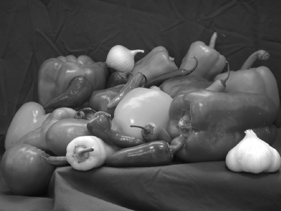
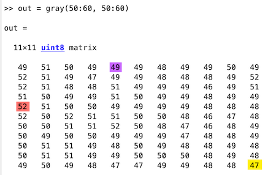
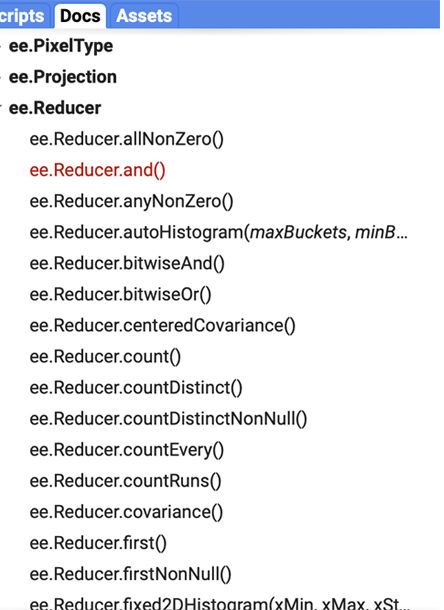
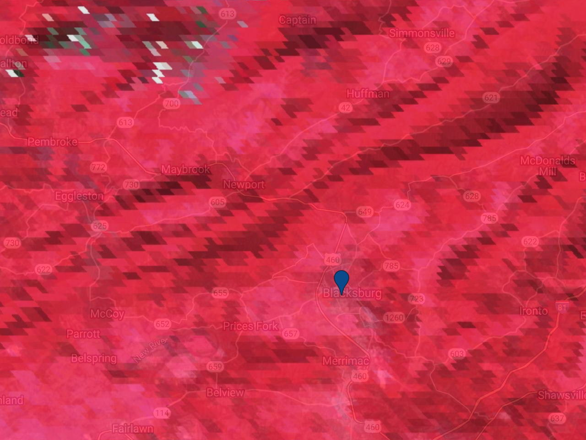

# Lab 01 - Remote Sensing Background {#lab1}


```{css, echo=FALSE}
.blackbox {
  padding: 1em;
  background: black;
  color: white;
  border: 2px solid orange;
  border-radius: 10px;
}
.center {
  text-align: center;
}
```

## Overview

The purpose of this lab is to introduce you to the core concepts of remote sensing. We will cover digital images, datum and projections, and the different types of resolution: spatial, spectral, temporal and radiometric. We will also cover some of the most well-known satellite platforms that we will be working with. At the completion of this lab, you will be able to work within Google Earth Engine to select the data that is the best fit for your use case, visualize the data and begin to extract insight from it.

#### Learning Outcomes

1. Understand and describe the following terms:
   - Digital image
   - Datum
   - Projection
   - Resolution (spatial, spectral, temporal, radiometric)
2. Navigate the Google Earth Engine console to gather information about the imagery contained within a satellite platform
3. Visualize a digital image within Google Earth Engine and use inspector to look at pixel values

## Digital Image

A digital image is a matrix of equally-sized square pixels that are each defined by two main attributes:

1. The position within the matrix, as defined by row, column and layer
2. A value associated with that position

In the context of geospatial imagery, we will refer to these pixel-based data structures as 'raster', as opposed to 'vector' data (points, lines, polygons). While vector and raster data both work in conjunction with one another, they have different attributes and characteristics. Before we discuss geospatial raster imagery, let's understand how a regular photograph is created. All of the images below were used from example photographs in the documentation in MatLab and OpenCV. 

#### One Layer Grayscale

Let's start with a grayscale image of some peppers. This image is rectangle that contains 384 rows and 512 columns of pixels - because it is greyscale, there is only one brightness magnitude value (between 0 and 255) for each position. While humans see shapes, hues and definition, a computer is only recording a brightness value for each pixel. 



Below is a small segment of the matrix of values of the greyscale image between rows 50 and 60 and columns 50 and 60. Note that when working with imagery, the row/column position starts on the top left. Using our row/column designation:

* `greyscale(54, 50)`  has a value of 52
* `greyscale(50, 54)` has a value of 49
* `greyscale(60, 60)` has a value of 47



#### Three Layer Color Image

The image is still the same, although this now has color. The number of rows, columns and the size of each pixel remain the same, but unlike the greyscale image, we now have three layers, or bands. Each band represents the value in each of the three primary colors: red, green, blue. If we look at the size of our matrix, it is now 384x512x3. For each row and column position, we now have 3 separate values between 0 and 255, which blend together into a color that we, as humans, can process. 


#### Extension to Geospatial Imagery

Geospatial imagery poses two additional complications on top of a traditional color photograph. For analysis, we need to be able to tie our imagery to the real world. In the image of peppers, each pixel was built on an arbitrary axis of rows and columns that start at zero. However, this gives us no meaningful information about where in the world the red bell pepper is located. With geospatial imagery, we need to associate pixels with location. We need to know the exact size of the pixel, and position on earth. The high-resolution imagery below is produced by the 'National Agriculture Imagery Program'. This imagery has a red, green and blue value and a latitude and longitude (-74.01, 40.72), in addition to a size (each pixel represents 1 meter by 1 meter). With this information, we can associate our pixel values with location on earth (New York), and aggregate the information we need. 



The other complexity we are faced with is that satellite imagery often has many layers. While our image of peppers had only a red, green and blue value, many satellite platforms are equipped to provide much more information. Most platforms have a value in the near infra-red range - while others have numerous bands, with different scales and resolutions. For instance, the Landsat 8 sensor has eleven bands capturing information from eleven different portions of the electromagentic spectrum, including near infrared (NIR) and thermal bands that are invisible to the human eye. Many Machine Learning projects, which we will explore in later labs, involve normalizing or transforming the information contained within each of these layers. Note that while each pixel size must be the same within each individual layer, the layers can be different. For instance, a satellite platform may have 5 meter spatial resolution in the red/green/blue range, but 60m resolution in the near infra-red range. While visualizing satellite imagery as a traditional photograph is a good starting point, there's much more information that we can incorporate into our analysis. We often build false or pseudocolor images by utilizing different combintions of bands, or we can focus in on certain infrared signatures to detect asphalt roads and roofs. The possibilities of analysis within remote sensing are endless, but this also leads to complications. 


As said before, digital images are often referred to as 'raster' data. ESRI, makers of ArcGIS has an excellent overview of using raster imagery in geospatial analysis featured [here](https://desktop.arcgis.com/en/arcmap/10.3/manage-data/raster-and-images/what-is-raster-data.htm).


### From Digital Image to Geospatial Image

To make the connection between our satellite imagery and real-world location even more complicated is the fact that a digital image is a flat, square surface - the earth is spherical. 

To make use remote sensing imagery, we need to align the pixels in our image to a real-world location. There's quite a bit of mathematics involved in this process, but we will focus on two main components - establishing a Geographic Coordinate System (GCS) and a Projected Coordinate System (PCS).

The GCS defines the spherical location of the image whereas the PCS defines how the grid around that location is constructed. Because the earth is not a perfect sphere, there are different GCS for different regions, such as 'North American Datum: 83' which is used to accurately define North America, and 'World Geodetic System of 1984', which is used globally. 

The PCS then constructs a flat grid around the GCS to create a relationship between each pixel of a 2-dimensional image to the corresponding area on the world. Some of the common PCS formats include EPSG, Albers Conic, Lambert, Eckert, Equidistant, etc. Different types of PCS's are designed for different use cases, as the needs of a petroleum engineer working over a few square miles will differ from than a climate change researcher measuring global change. Much of the discussion of defining GCS is outside the scope of this course, but the important thing to note is that a GCS defines the starting point for a projection.

ESRI has an [article](https://www.esri.com/arcgis-blog/products/arcgis-pro/mapping/gcs_vs_pcs/) discussing the difference between GCS and PCS that provides further context on this relationship. While you should be aware of these two major terms - especially when you intend to run analysis on the data you download from GEE in another system, such as R, Python, or ArcGIS - GEE takes care of much of the complexity of these differences behind the scenes. Further documentation on the GEE methodology can be found [here](https://developers.google.com/earth-engine/guides/projections). In our first exercise, we will show you how to identify the PCS so you can understand the underlying structure. 

Understanding the bands available in your datasets, identifying which bands are necessary (and appropriate) for your analysis, and ensuring that these data represent consistent spatial locations is essential. While GEE simplifies many complex calculations behind the scenes, this lab will help us unpack the products available to us and their essential characteristics.


### Visualize a Digital Image

Let’s view a digital image in GEE to better understand this concept. 

Remeber, there are three major ways to import imagery within GEE. 

1. You can navigate to the GEE [datasets](https://developers.google.com/earth-engine/datasets/) page, choose the image collection you would like to work with and import the code example, which is normally located at the bottom of each dataset page. This code example is a standalone code chunk that will correctly visualize the data. This is an excellent way to get an understanding for the different satellite platforms - feel free to change variables and inputs to see what happens. 

2. In the search bar of the code editor, you can search for the specific imagery you are looking for. When you click on it, a pop-up window will come up that allows you to either import the image directly (bottom right) or copy the path to the image collection (left-hand side). They both work the same way, using the import button will incorporate it into the variable list directly (separated top section of the editor), where you have to specifically define the variable if you copy the path to the image collection. 

   

In the map window of GEE, click on the `point` geometry tool using the [geometry drawing tools](https://developers.google.com/earth-engine/playground#geometry-tools) to define your area of interest. For the purpose of consistency in this exercise, place a point on the Virginia Tech Drillfield, which will bring you roughly to (-80.42, 37.23). As a reminder, you can find more information on geometry drawing tools in GEE’s Guides. Name the import `point`.

> Note: some programming languages and frameworks read in latitude and longitude differently - Most read in the values as longitude / latitude. Double check your values, if you are importing data from Google Maps, you will have to switch the latitude and longitude when using within GEE

Import NAIP imagery by searching for 'naip' and choosing the *'NAIP: National Agriculture Imagery Program'* raster dataset. Name the import `naip`. 

Get a single, recent NAIP image over your study area and inspect it:

```javascript
// Point at Virginia Tech  
var point = ee.Geometry.Point([-80.42, 37.22]);
// Import the NAIP imagery
var naip = ee.ImageCollection("USDA/NAIP/DOQQ")
//  Get a single NAIP image over the area of interest.  
var  image = ee.Image(naip  
                      .filterBounds(point)
                      .sort('system:time_start', false)
                      .first());
//  Print the image to the console.  
print('Inspect the image object:', image);     
//  Display the image with the default visualization.  
Map.centerObject(point, 18);  
Map.addLayer(image, {}, 'Original image');
```

Expand the image object that is printed to the console by clicking on the dropdown triangles. Expand the property called `bands` and expand one of the bands (0, for example). Note that the CRS transform is stored in the `crs_transform` property underneath the band dropdown and the CRS is stored in the `crs` property, which references an EPSG code. 

> **EPSG Codes** are 4-5 digit numbers that represent CRS definitions. The acronym EPSG, comes from the (now defunct) European Petroleum Survey Group. The CRS of this image is [EPSG:26917](https://spatialreference.org/ref/epsg/nad83-utm-zone-17n/). You can learn more about these codes from the [ESPG homepage](https://epsg.org/home.html). 

> The CRS transform is a list `[m00, m01, m02, m10, m11, m12]`in the notation of [this reference](http://docs.oracle.com/javase/7/docs/api/java/awt/geom/AffineTransform.html).  The CRS transform defines how to map pixel coordinates to their associated spherical coordinate through an affine transformation. While affine transformations are beyond the scope of this class, more information can be found at [Rasterio](https://rasterio.readthedocs.io/en/latest/topics/georeferencing.html), which provides detailed documentation for the popular Python library designed for working with geospatial data. 

In addition to using the dropdowns, you can also access these data programmatically with the `.projection()` method:

```javascript
// Display the projection of band 0
print('Inspect the projection of band 0:', image.select(0).projection());
```

Note that the projection can differ by band, which is why it's good practice to inspect the projection of individual image bands. If you call `.projection()` on an image for which the projection differs by band, you'll get an error. Exchange the NAIP imagery with the Planet SkySat MultiSpectral image collection, and note that the error occurs because the 'P' band has a different pixel size than the others. Explore the `ee.Projection` docs to learn about useful methods offered by the `Projection` object. To play with projections offline, try [this tool](http://www.giss.nasa.gov/tools/gprojector/).

## Spatial Resolution                                                     

In the present context, spatial resolution refers to the real-world representation of each pixel. This ranges widely, with the private satellite company Maxar announcing 15cm [resolution]([Introducing 15 cm HD: The Highest Clarity From Commercial Satellite… (maxar.com)](https://blog.maxar.com/earth-intelligence/2020/introducing-15-cm-hd-the-highest-clarity-from-commercial-satellite-imagery)), Sentinel at 10m, Landsat at 30m, and large global products with spatial resolution in kilometers. The key point in dealing with spatial resolution is ensuring that your analysis drives your data collection. Using high resolution imagery will be extremely expensive, both monetarily and computationally, if conducting continent wide analysis. Yet using low-resolution imagery will not be effective in identifying individual buildings or small vehicles. Understanding the appropriate spatial resolution needed for your analysis is essential, and is why there are different platforms that focus on different spatial resolutions.

In practice, spatial resolution depends on the projection of the sensor's instantaneous field of view (IFOV) of the ground and how a set of radiometric measurements are resampled into a regular grid. To see the difference in spatial resolution resulting from different sensors, visualize data from different sensors.

#### MODIS 

There are two Moderate Resolution Imaging Spectro-Radiometers ([MODIS](http://modis.gsfc.nasa.gov/)) aboard the [Terra](http://terra.nasa.gov/) and [Aqua](http://aqua.nasa.gov/) satellites. Different MODIS [bands](http://modis.gsfc.nasa.gov/about/specifications.php) produce data at different spatial resolutions. For the visible bands, the lowest common resolution is 500 meters. Data from the MODIS platforms are used to produce a large number of data sets having daily, weekly, 16-day, monthly, and annual data sets. Outside this lab, you can find a list of MODIS land products [here](https://lpdaac.usgs.gov/dataset_discovery/modis/modis_products_table). 

In the code below, we are working with the MODIS Terra Surface Reflectance 8-day Global 500m resolution data. Change the number in the `zoom` variable to scroll in and out - notice that when scrolled in each pixel is quite large and granular. 

```javascript
var dataset = ee.ImageCollection('MODIS/006/MOD09A1')
                  .filter(ee.Filter.date('2018-01-01', '2018-05-01'))
                  .first();
var trueColor =
    dataset.select(['sur_refl_b01', 'sur_refl_b04', 'sur_refl_b03']);
var trueColorVis = {
  min: -100.0,
  max: 3000.0,
};
var zoom = 10
// Set Center on Virginia Tech
Map.setCenter(-80.42, 37.22, zoom);
Map.addLayer(trueColor, trueColorVis, 'True Color');
```

We will discuss some of the benefits of working with a false-color imagery in later sections, but we can modify the bands we want to visualize. In this case, we are using a random set of bands, where the value of band six is visualized with red, band three is visualized with green, and band one with blue. Because the value of band six has a higher range, this image shows up with a heavy red presence. 

```javascript
var dataset = ee.ImageCollection('MODIS/006/MOD09A1')
                  .filter(ee.Filter.date('2018-01-01', '2018-05-01'))
                  .first();
var modisBands = ['sur_refl_b06', 'sur_refl_b03', 'sur_refl_b01'];
// Define visualization parameters for MODIS.
var modisVis = {bands: modisBands, min: 0, max: 3000};
var zoom = 10
// Set Center on Virginia Tech
Map.setCenter(-80.42, 37.22, zoom);
// Add the MODIS image to the map
Map.addLayer(dataset, modisVis, 'MODIS');
```

Compare the  size of MODIS pixels to objects on the ground. It may help to turn on the satellite basemap and lower the opacity of the layer (top right of map section of code editor) to see high-resolution data for comparison.

Print the size of the pixels (in meters) to the console. You can read more about how Google Earth Engine works with scale in their [documentation](https://developers.google.com/earth-engine/guides/scale). While the listed pixel resolution for this satellite platform is 500m, the printout is likely different - this is due to the way that GEE aggregates pixels to fit into a 256x256 tile. The details of this process are outside the scope of this course, but understand that GEE is conducting projections and resampling behind the scenes.  

```javascript
// Get the scale of the data from the first band's projection:
var modisScale = dataset.select('sur_refl_b01')
    .projection()
    .nominalScale();
print('MODIS scale:', modisScale);
```

#### Multispectral Scanners

Multi-spectral [scanners](https://landsat.gsfc.nasa.gov/multispectral-scanner-system) (MSS) were flown aboard Landsat missions 1-5 and have a spatial resolution of 60 meters. Let's look at the Landsat 5 MSS Collection 1 Tier 1 Raw Scenes - note that in the 'Bands' description of the dataset, there is no band related to blue (Green, Red, Near InfraRed 1 & 2). In this case, we will have to visualize the image using the near infrared, resulting in a false color composite. 

```javascript
// Landsat 5 Collection 1 Tier 1 
// Images between 1985 and 1989
var dataset = ee.ImageCollection('LANDSAT/LM05/C01/T1')
                  .filterDate('1985-01-01', '1989-12-31');
// NIR, Red Green Band                
var nearInfrared321 = dataset.select(['B3', 'B2', 'B1']);
Map.setCenter(-80.42, 37.22, 12);
Map.addLayer(nearInfrared321, {}, 'Near Infrared (321)');
```

As before, let's extract the nominal scale from the image and print it to the console. 

```javascript
// Get the scale of the MSS data from its projection:
var mssScale = nearInfrared321.first().projection().nominalScale();
print('MSS scale:', mssScale);
```

#### Thematic Mapper (TM)

The Thematic Mapper ([TM](https://landsat.gsfc.nasa.gov/thematic-mapper/)) was flown aboard Landsat 4-5 and then succeeded by the Enhanced Thematic Mapper ([ETM+](https://landsat.gsfc.nasa.gov/the-enhanced-thematic-mapper-plus-etm/)) aboard Landsat 7 and the Operational Land Imager ([OLI](https://landsat.gsfc.nasa.gov/landsat-8/operational-land-imager)) / Thermal Infrared Sensor ([TIRS](https://landsat.gsfc.nasa.gov/landsat-8/thermal-infrared-sensor-tirs)) sensors aboard Landsat 8. TM data have a spatial resolution of 30 meters, which has remained the Landsat standard resolution. We can check this by importing the '*USGS Landsat 5 TM Collection 1 Tier 1 TOA Reflectance*', visualizing and printing our scale results. For some additional discussion about the transition from MSS to TM data, see [this page](https://www.usgs.gov/core-science-systems/nli/landsat/landsat-5?qt-science_support_page_related_con=0#qt-science_support_page_related_con).


```javascript
var tm = ee.ImageCollection("LANDSAT/LT05/C01/T1_TOA");
// Filter TM imagery by location, date and cloudiness.
var tmImage = ee.Image(tm
            .filterBounds(Map.getCenter())
            .filterDate('2011-05-01', '2011-10-01')
            .sort('CLOUD_COVER')
            .first());
// Display the TM image as a color-IR composite.
Map.addLayer(tmImage, {bands: ['B4', 'B3', 'B2'], min: 0, max: 0.4}, 'TM'); 
// Get the scale of the TM data from its projection:
var tmScale = tmImage.select('B1').projection().nominalScale();
print('TM scale:', tmScale);
```

> **Question 1**: By assigning the NIR, red, and green bands to RGB (4-3-2), what features appear bright red in a Landsat 5 image and why? Explore water bodies, urban centers, farms and forests to find relationships between the bands. 

#### National Agriculture Imagery Program (NAIP)                           

The National Agriculture Imagery Program ([NAIP](http://www.fsa.usda.gov/programs-and-services/aerial-photography/imagery-programs/naip-imagery/)) is an effort by the USDA to acquire imagery over the continental US on a 3-year rotation using airborne sensors (aircraft as opposed to satellites). Because aircraft are much closer to land than a satellite (and is not dealing with as many atmospheric effects) imagery has a spatial resolution averaging 1 meter. This is considered 'high resolution data'.

Since NAIP imagery is distributed as 'quarters' of Digital Ortho Quads at irregular intervals, load everything from 2012 and [mosaic()](https://developers.google.com/earth-engine/guides/ic_composite_mosaic) the image together.

```javascript
var naip = ee.ImageCollection("USDA/NAIP/DOQQ");
// Get NAIP images for the study period and region of interest.
var naipImages = naip.filterDate('2012-01-01', '2012-12-31')
                      .filterBounds(Map.getCenter());
// Mosaic adjacent images into a single image.
var naipImage = naipImages.mosaic();
// Display the NAIP mosaic as a color-IR composite.
Map.addLayer(naipImage, {bands: ['R', 'G', 'B']}, 'NAIP');
```

Look at the difference in the resolution - with Landsat and MODIS, each pixel could broadly identify the land type, but NAIP imagery has very high resolution - you can see individual parked cars, the outline of small trees, building envelopes, etc. Start asking yourself how the spatial resolutions of different platforms could help you answer unique questions. 


Check the scale of NAIP by getting the first image from the mosaic (images within the mosaic might have different projections) and getting its scale (meters):

```javascript
// Get the NAIP resolution from the first image in the mosaic.
var naipScale = ee.Image(naipImages.first()).
              projection().nominalScale();   
print('NAIP scale:', naipScale);
```

> **Question 2**: We looked at NAIP imagery from 2012 and found that the spatial resolution was 1m around Blacksburg. What is the scale of the most recent round (2018) of NAIP imagery for the area around Blacksburg, VA? How did you determine the scale?


## Spectral Resolution

Spectral resolution refers to the number and width of spectral bands in which the sensor takes measurements. You can think of the width of spectral bands as the wavelength interval on the electromagnetic spectrum for each band. A sensor that measures radiance in multiple bands (e.g., collects a value for red, green, blue and near infrared) is called a *multispectral* sensor (generally 3-10 bands), while a sensor with many bands (possibly hundreds) is called a *hyperspectral* sensor (these are not hard and fast definitions). For example, compare the [multi-spectral OLI](http://landsat.gsfc.nasa.gov/?p=5779) aboard Landsat 8 to [Hyperion](https://eo1.usgs.gov/sensors/hyperioncoverage), a hyperspectral sensor that collects 220 unique spectral channels aboard the EO-1 satellite.

A figure representing common optical sensors and their spectral resolution is below. 


You can use the code below to check the number of bands in Earth Engine, but you will have to read through the documentation for each image collection to understand the spectral response of the bands. 

To see the number of bands in an image, use:

```javascript
var dataset = ee.ImageCollection('MODIS/006/MOD09A1')
                  .filter(ee.Filter.date('2018-01-01', '2018-05-01'))
                  .first();
// Get the MODIS band names as a List
var modisBands = dataset.bandNames();
// Print the list.
print('MODIS bands:', modisBands);
// Print the length of the list.
print('Length of the bands list:', modisBands.length());
```

While the code gives us a list of each band, the documentation explains the wavelength and min/max value of each band. For band `sur_refl_b01` we see that it is collecting the brightness value between the wavelength of 620-670nm, while `sur_refl_b05` is between 1628 and 1652 nm.    


**Important note**: not all bands contain radiometric data. Some are quality control data, while others include information about the zenith or cloud coverage. You can use these other bands to either mask out low-quality pixels or conduct additional calculations. It is a good idea to read through the documentation of each dataset you will be working with to get a good understanding of the band structure. 

> **Question 3.1**: What is the spectral resolution of the MODIS instrument? How did you determine it?

> **Question 3.2**: Investigate the bands available for the USDA NASS Cropland Data Layers (CDL). What do the individual bands within the CDL represent? Which band(s) would you select if you were interested in evaluating the extent of pasture areas in the US?

---

## Temporal Resolution

Temporal resolution refers to the *revisit time*, or how often the same satellite platform covers the same place on earth. Historically, satellites have been large, solitary objects that had to make tradeoffs between spatial and temporal resolution - MODIS measures wide swathes of land with each sweep, and has relatively high temporal resolution. Landsat has improved spatial resolution but a revisit rate of 16 days, and NAIP is aggregated either annually or bi-annually. Over the past decade, satellite technology has improved and there is more diversity in mission sets. Cube satellites are small, shoe-box sized satellites that can provide both high-resolution imagery and, when mosaiced together, provide high temporal resolution as well. The tradeoff is that these satellites do not have the same array of sophisticated sensors that larger satellites are equipped with. Other satellites, such as those run by the intelligence community and private satellite companies, are designed for rapid revisit times of certain cities or political areas while not scanning the rest of the world. 

Temporal resolution is important to understand and consider for your use case - there are tradeoffs to be made either way.

#### MODIS 

MODIS (either Terra or Aqua) produces imagery at approximately a daily cadence, but individual products vary greatly. To see the time series of images at a location, you can `print()` the `ImageCollection`filtered to a manageable date range. Expand the `features` property of the printed image collection to see a list of all the images in the collection - the date of each image is part of the filename. You can see that each image from the 'Terra Surface Reflectance Global 500m' product is collected every 8 days. Experiment with some of the other MODIS image collections in the Data Catalog and explore the relationship between the listed spatial resolution and temporal resolution.

```javascript
var dataset = ee.ImageCollection('MODIS/006/MOD09A1')
// Filter the MODIS mosaics to one year.   
var modisSeries = dataset.filterDate('2011-01-01', '2011-12-31');      
// Print the filtered  MODIS ImageCollection.   
print('MODIS series:', modisSeries);  
```

#### Landsat

Landsats (5 and later) produce imagery at 16-day cadence. TM and MSS are on the same satellite (Landsat 5), so it you can print the TM series to see the temporal resolution. Unlike MODIS, data from these sensors is produced on a scene basis, so to see a time series, it's necessary to filter by location in addition to time. You can see that some images have been skipped (e.g., between January 7th and February 8th) possibly due to quality control. 

```javascript
var tm = ee.ImageCollection("LANDSAT/LT05/C01/T1_TOA");
// Filter to get a year's worth of TM scenes.
var tmSeries = tm
  .filterBounds(Map.getCenter())
  .filterDate('2011-01-01', '2011-12-31');
// Print the filtered TM ImageCollection. 
print('TM series:', tmSeries);
```


While you look at the date ranges in the filename or expand each Image in the list to look at the `Date_Acquired` property, there is a better way to extract this information programmatically.  In this case, we are building a function within JavaScript and extracting the date and time from each image

```javascript
var tm = ee.ImageCollection("LANDSAT/LT05/C01/T1_TOA");
// Filter to get a year's worth of TM scenes.
var tmSeries = tm
  .filterBounds(Map.getCenter())
  .filterDate('2011-01-01', '2011-12-31');
// Build a function called getDate
var getDate = function(image) {
// Note that you need to cast the argument
  var time = ee.Image(image).get('system:time_start');
// Return the time (in milliseconds since Jan 1, 1970) as a Date
  return ee.Date(time);
};
var dates = tmSeries.toList(100).map(getDate);
print(dates)
```

> **Question 4**: What is the temporal resolution of the Sentinel-2 satellites? How can you determine this?

## Radiometric Resolution

Radiometric resolution refers to the value, or 'digital number' that the sensor records: _coarse_ radiometric resolution would record a scene with only a narrow range of values, whereas _fine_ radiometric resolution would record the same scene using a wide range of values. The _precision_ of the sensing, or the level of _quantization_ is another way to refer to radiometric resolution. 8 bit values (0-255) is the standard in many image processing tools. 


Radiometric resolution is determined from the minimum radiance to which the detector is sensitive (L<sub>min</sub>), the maximum radiance at which the sensor saturates (L<sub>max</sub>), and the number of bits used to store the DNs (Q): 


$$  \text{Radiometric resolution} = \frac{(L_{max} - L_{min})}{2^Q} $$

It might be possible to dig around in the metadata to find values for L<sub>min</sub> and L<sub>max</sub>, but computing radiometric resolution is generally not necessary unless you're studying phenomena that are distinguished by very subtle changes in radiance. One thing to keep in mind is that while sensors have developed and become more sensitive / accurate, capable of recording collecting data in upwards of 16 bits, that may not necessarily be beneficial for your work. Computation and storage costs grow, and normalizing the data to 8-bit values to work with tools such as OpenCV defeats the purpose of this sensitive colllection rate. There are use cases where high bit rate collection makes sense (e.g., looking for a very narrow range in a custom spectral range to identify mineral deposits), but ensure that you understand where and why higher radiometric resolution is necessary. 

### Digital Image Visualization and Stretching

You've learned about how an image stores pixel data in each band as digital numbers (DNs) and how the pixels are organized spatially. When you add an image to the map, Earth Engine handles the spatial display for you by recognizing the projection and putting all the pixels in the right place. However, you must specify how to stretch the DNs to fit the standard 8-bit display image  that GEE uses ( `min` and `max` parameters). Specifying `min` and `max` applies (where DN' is the displayed value):

   $$ DN' =   \frac{ 255 (DN - min)}{(max - min)} $$

For instance, if you are working with NAIP imagery, you can set the min radiometric resolution to 0 and the max to 255 to model 8-bit radiometric resolution. 

```javascript
var dataset = ee.ImageCollection('USDA/NAIP/DOQQ')
                  .filter(ee.Filter.date('2017-01-01', '2018-12-31'));
var trueColor = dataset.select(['R', 'G', 'B']);
// Scale of min, max
var trueColorVis = {
  min: 0.0,
  max: 255.0,
};
Map.setCenter(-80.42, 37.22, 15);
Map.addLayer(trueColor, trueColorVis, 'True Color');
```

By contrast, the Planet MultiSpectral SkySat imagery uses 16 bit collection, so you have to adjust the min and max values.  If your image is not displaying correctly (such as a black screen) check the documentation for your data and adjust your min and max values. 

```js
var dataset = ee.ImageCollection('SKYSAT/GEN-A/PUBLIC/ORTHO/MULTISPECTRAL');
var falseColor = dataset.select(['R', 'G', 'B']);
var falseColorVis = {
  min: 200.0,
  max: 6000.0,
};
Map.setCenter(-70.892, 41.6555, 15);
Map.addLayer(falseColor, falseColorVis, 'False Color');
```

## Resampling and ReProjection

Earth Engine makes every effort to handle projection and scale so that you don't have to. However, there are occasions where an understanding of projections is important to get the output you need. Earth Engine requests inputs to your computations in the projection and scale of the output. The map in the console uses a [Mercator projection](http://epsg.io/3857). 

The scale is determined from the map's zoom level. When you add something to this map, Earth Engine secretly reprojects the input data to Mercator, resampling (with nearest neighbor) to the screen resolution pixels based on the map's zoom level, then does all the computations with the reprojected, resampled imagery. In the previous examples, the reproject() calls force the computations to be done at the resolution of the input pixels.

If you are familiar working with remote sensing data in another programming language, such as R or Python, you have to deal with projections and resampling on your own. Google Earth Engine takes care of this behind the scenes, which simplifies your work. We mention it here because this is a change when starting to use GEE. A more thorough discussion about projections is in the [documentation](https://developers.google.com/earth-engine/guides/projections). 

Bottom line: **You should rarely, if ever, have to use `reproject()` and `resample()`.** 


## Additional Exercises

Now that we have some familiarity with higher quality images, lets look at the (broken) Landsat 7 satellite. Using what we've learned in this lab, select an image from Landsat 7 that contains the Blacksburg area with minimal cloud cover (for now, using the Collection 1 Tier 1 calibrated top-of-atmosphere (TOA) reflectance data product). Look at the image. 

> **Question 5**: What is the obvious (hint: post-2003) problem with the Landsat 7 image? What is the nature of that problem and what have some researchers done to try to correct it? Please research online in addition to using what you have learned in class/from the book.

> **Question 6**: Name three major changes you can view in the Blacksburg Area in the last decade using any of the above imagery (and state the source).

Conduct a search to compare the technical characteristics of the following sensors: 

1. MODIS (NASA) versus Sentinel (ESA)
2. AVHRR (NASA) versus IRS-P6 (or choose another Indian Remote Sensing satellite)  

* Note: when using the internet to answer this question, be sure to cite your sources and ensure that you are obtaining information from an official, reputable source!

---

> **Question 7**: Based on the characteristics you describe, for which applications is one sensor likely to be more suitable than the other ones?
