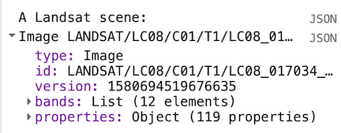
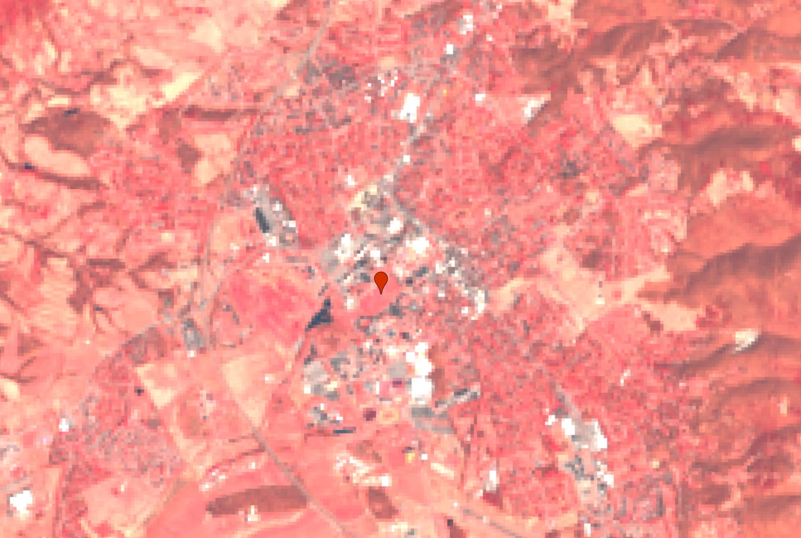
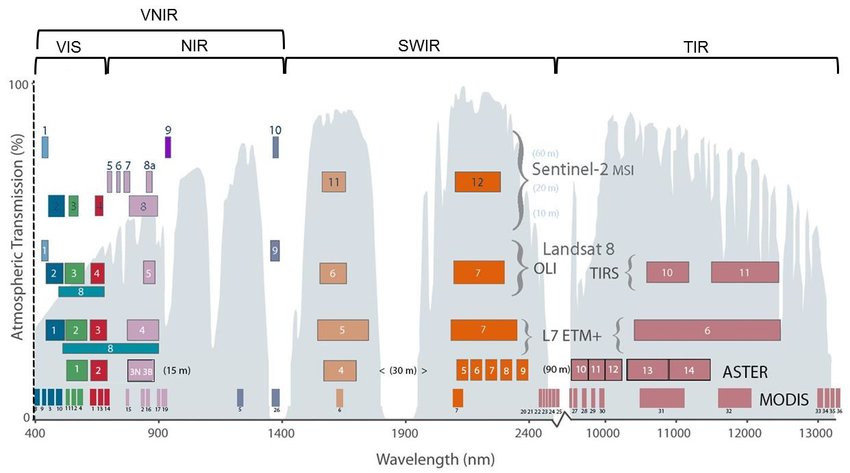

# Lab 02 - Digital Imagery & Image Processing {#lab2}

## Overview

In this lab, we will search for and visualize imagery in Google Earth Engine. We will discuss the difference between radiance and reflectance, make true color and false color composites from different bands and visually identify land cover types based on characteristics from the imagery. We will also discuss atmospheric effect on data collection by looking at the different data products available. 

####  Learning Outcomes

- Extract single scenes from collections of images
- Create and visualize different composites according
- Use the Inspector tab to assess pixel values
- Understand the difference between radiance and reflectance through visualization

## Searching for Imagery

The Landsat program is a joint program between NASA and the United States Geological Survey (USGS) that has launched a sequence of Earth observation satellites (Landsat 1,2,...9). The Landsat program provides the [longest continuous observation of the Earth's surface](https://www.youtube.com/embed/ZZx1xmNGcXI?list=PLD240BBC85537B9BE), originating in 1984. Take the time to monitor some of the fascinating [timelapses](https://earthengine.google.com/timelapse/) that GEE provides, which uses Landsat to showcase things like urban development, glacial retreat and deforestation.  

Let's load a Landsat scene over our region of interest, inspect the units and plot the radiance. Specifically, use imagery from the Landsat 8, the most recent of the [sequence of Landsat satellites](https://www.usgs.gov/core-science-systems/nli/landsat/landsat-8) (at the time of writing, Landsat 9 just launched, but data is not yet available). 

To inspect a Landsat 8 image (also called a *scene*) in our region of interest (ROI), we can choose a point to center our map, filter the image collection to get a scene with few clouds, and display information about the image in the console.

You can either scroll to the area on the map you're interested in and choose a point or use the search bar to find your location. Use the geometry tool to make a point in Blacksburg, VA (for these exercises we will include the point location in the script). 


We will specifically be using USGS Landsat 8 Collection 1 Tier 1 Raw Scenes - if you read the documentation, the values refer to scaled, calibrated at-sensor radiance. Tier 1 means it is ready for analysis and is the highest quality imagery. There's quite a bit to learn about how the Landsat data is processed - if you will be working with Landsat extensively, take the time to read the Data Users [Handbook](https://www.usgs.gov/landsat-missions/landsat-8-data-users-handbook) for more information.

We will filter the `ImageCollection` by date (year 2014) and location (to the ROI, which for this exercise is Blacksburg, VA), sort by a metadata property included in the imagery called `CLOUD_COVER` and get the first image out of this sorted collection.

```javascript
var point = ee.Geometry.Point([-80.42, 37.22]);
var landsat = ee.ImageCollection("LANDSAT/LC08/C01/T1")
//  Note that we need to cast the result of first() to Image.   
var image = ee.Image(landsat        
                     //  Filter to get only images in the specified range.  
                     .filterDate('2014-01-01',  '2014-12-31')        
                     //  Filter to get only images at the location of the point.     
                     .filterBounds(point)        
                     //  Sort the collection by a metadata property.     
                     .sort('CLOUD_COVER')        
                     //  Get the first image out of this collection.     
                     .first());  
//  Print the information to the console 
print('A Landsat scene:', image);  
```

The variable `image` now stores a reference to an object of type `ee.Image`. In other words, we have taken the image collection and reduced it down to a single image, which is now ready for visualization. 

Before we visualize the data, go to the console and click on the dropdown. 




Expand and explore the image by clicking the triangle next to the image name to see more information stored in that object. Specifically, expand `properties` and inspect the long list of metadata items stored as properties of the image. This is where the `CLOUD_COVER` property you just used is stored.

There are band specific coefficients (`RADIANCE_ADD_*`, `RADIANCE_MULT_*` where \* is a band name) in the metadata for converting from the digital number (DN) stored by the image into physical units of radiance. These coefficients will be useful in later exercises.

## Visualizing Landsat Imagery

Recall from the last lab that Landsat 8 measures radiance in multiple spectral bands. A common way to visualize images is to set the red band to display in red, the green band to display in green and the blue band to display in blue - just as you would create a normal photograph. This means trying to match the [spectral response of the instrument](http://landsat.gsfc.nasa.gov/?p=5779) to the spectral response of the photoreceptors in the human eye. It's not a perfect match but this is called a *true-color* image. When the display bands don't match human visual perception (as we will see later), the visualization is called a *false-color composite*. 

#### True Color Composite

To build a true color image we are building a variable called `trueColor`  that selects the red / green / blue bands in order and includes the min and max value to account for the appropriate radiometric resolution - this piece can be tricky, as it is unique for each dataset you work with. You can find the band names and min-max values to use from the dataset documentation page, but a great starting point is to use the 'code example' snippet for each dataset, which will set up the visualization parameters for you.  

```javascript
var point = ee.Geometry.Point([-80.42, 37.22]);
var landsat = ee.ImageCollection("LANDSAT/LC08/C01/T1")
//  Note that we need to cast the result of first() to Image.   
var image = ee.Image(landsat        
                     //  Filter to get only images in the specified range.  
                     .filterDate('2014-01-01',  '2014-12-31')        
                     //  Filter to get only images at the location of the point.     
                     .filterBounds(point)        
                     //  Sort the collection by a metadata property.     
                     .sort('CLOUD_COVER')        
                     //  Get the first image out of this collection.     
                     .first());  
//  Define visualization parameters in a JavaScript dictionary.   
var trueColor = {    
  bands: ['B4', 'B3', 'B2'],    
  min: 4000,    
  max: 13000
};  
// Add the image to the  map, using the visualization parameters.   
Map.addLayer(image, trueColor, 'true-color image');  
```

There is more than one way to discover the appropriate min and max values to display. Try going to the **Inspector** tab and clicking somewhere on the map. The value in each band, in the pixel where you clicked, is displayed as a list in the console. Try clicking on dark and bright objects to get a sense of the range of pixel values. Also, [layer manager](https://developers.google.com/earth-engine/playground#layer-manager) in the upper right of the map display lets you automatically compute a linear stretch based on the pixels in the map display. 

#### False Color Composite

Let's do the same thing, but this time we will build a false-color composite. This particular set of bands results in a *color-IR composite* because the near infra-red (NIR) band is set to red. As you inspect the map, look at the pixel values and try to find relationships between the NIR band and different land types. Using false color composites is a very common and powerful method of identifying land characteristics by leveraging the power of signals outside of the visible realm. Mining engineers commonly use hyperspectral data to pinpoint composites with unique signatures, and urban growth researchers commonly use the infrared band to pinpoint roads and urban areas. 

```javascript
var point = ee.Geometry.Point([-80.42, 37.22]);
var landsat = ee.ImageCollection("LANDSAT/LC08/C01/T1")
//  Note that we need to cast the result of first() to Image.   
var image = ee.Image(landsat        
                     //  Filter to get only images in the specified range.  
                     .filterDate('2014-01-01',  '2014-12-31')        
                     //  Filter to get only images at the location of the point.     
                     .filterBounds(point)        
                     //  Sort the collection by a metadata property.     
                     .sort('CLOUD_COVER')        
                     //  Get the first image out of this collection.     
                     .first());  
//  Print the information to the console 
print('A Landsat scene:', image);  
//  Define visualization parameters in a JavaScript dictionary.   
//  Define false-color visualization parameters.   
var falseColor = {
  bands: ['B5', 'B4', 'B3'],    
  min: 4000,    
  max: 13000   
};  
// Add the image to the  map, using the visualization parameters.   
Map.addLayer(image, falseColor, 'false-color composite'); 
```



Read through the Landsat data documentation and try playing with different band combinations, min and max values to build different visualizations. 

**Unique Feature**: You can include multiple visualization parameters in your script and toggle the layers on and off with the layer manager for easy comparison. 




## At-Sensor Radiance

The image data you have used so far is stored as a digital number that measures the intensity within the bit range - if data is collected in an 8-bit system, 255 would be very high intensity and 0 will be no intensity. To convert each digital number into a physical unit (at-sensor [radiance](https://en.wikipedia.org/wiki/Radiance) in Watts/m2/sr/𝝁m), we can use a linear equation:

$$
L_{\lambda} = a_{\lambda} * DN_{\lambda} + b_{\lambda}  \qquad
$$


Note that every term is indexed by lamda ($\lambda$, the symbol for wavelength) because the coefficients are different in each band. See [Chander et al. (2009)](http://www.sciencedirect.com/science/article/pii/S0034425709000169) for details on this linear transformation between DN and radiance. In this exercise, you will generate a radiance image and examine the differences in radiance from different targets.

Earth Engine provides built-in functions for converting Landsat imagery to radiance in Watts/m2/sr/𝝁m. It will automatically reference the metadata values for each band and apply the equation for you, saving you the trouble of conducing numerous calculations.

This code applies the transformation to a subset of bands (specified by a list of band names) obtained from the image using select(). That is to facilitate interpretation of the radiance spectrum by removing the panchromatic band ('B8'), an atmospheric absorption band ('B9') and the QA band ('BQA'). 

Note that the visualization parameters are different to account for the radiance units.

```javascript
var point = ee.Geometry.Point([-80.42, 37.22]);
var landsat = ee.ImageCollection("LANDSAT/LC08/C01/T1")
//  Note that we need to cast the result of first() to Image.   
var image = ee.Image(landsat        
                     //  Filter to get only images in the specified range.  
                     .filterDate('2014-01-01',  '2014-12-31')        
                     //  Filter to get only images at the location of the point.     
                     .filterBounds(point)        
                     //  Sort the collection by a metadata property.     
                     .sort('CLOUD_COVER')        
                     //  Get the first image out of this collection.     
                     .first());  
//  Use these bands.    
var bands = ['B1', 'B2', 'B3', 'B4', 'B5', 'B6', 'B7', 'B10', 'B11'];  
// Get an image that  contains only the bands of interest.   
var dnImage = image.select(bands);  
// Apply the  transformation.   
var radiance =  ee.Algorithms.Landsat.calibratedRadiance(dnImage);  
// Display the result.   
var radParams = {bands: ['B4', 'B3', 'B2'], min: 0, max: 100};  
Map.addLayer(radiance, radParams, 'radiance');  
```

Examine the radiance image by using **Inspector** and clicking different land cover types on the map near Blacksburg, VA. Click the chart icon () in the console to get a bar chart of the different radiance values for each pixel. If the shape of the chart resembles Figure 1, that's because the radiance (in bands 1-7) is mostly reflected solar irradiance. The radiance detected in bands 10-11 is thermal, and is *emitted* (not reflected) from the surface.


## Top-of-Atmosphere (TOA) Reflectance 

The Landsat sensor is in orbit approximately 700 kilometers above Earth. If we are focused on the imagery of remote sensing (as opposed to studying something like atmospheric conditions or ambient temperature), then we want to find insights about the surface of the earth. To understand the way we calculate information, there are three main components.

Digital Number (DN) is a value that is associated with each pixel - it is generic (in that it is an intensity value dependent upon the bit range), and it allows you to visualize the image where all pixels are in context. In most cases, DN is appropriate for analysis, image processing, machine learning, etc.

Radiance is the radiation that collected by a sensor - this includes radiation from the surface of Earth, radiation scattered by clouds, position of the sun relative to the Earth and sensor, etc. In general, we want to correct radiance values and convert to reflectance. 

Reflectance is the ratio (unitless)  of energy from the sun to the energy reflected off Earth's surface. In fact, it's more complicated than this because radiance is a directional quantity, but this definition captures the basic idea  We can identify materials based on their reflectance spectra. Because this ratio is computed using whatever radiance the sensor measures (which may contain all sorts of atmospheric effects), it's called *at-sensor* or *top-of-atmosphere* (TOA) reflectance. 

Top of Atmosphere reflectance is the reflectance that includes the radiation from earth's surface and radiation from earth's atmosphere. 

Let's examine the spectra for TOA Landsat data. To get TOA data for Landsat, we can do the transformation using the built-in functions created by Earth Engine. We will be using 'USGS Landsat 8 Collection 1 Tier 1 TOA Reflectance' ImageCollection.

```javascript
var point = ee.Geometry.Point([-80.42, 37.22]);
var landsat = ee.ImageCollection("LANDSAT/LC08/C01/T1_TOA")
//  Note that we need to cast the result of first() to Image.   
var image = ee.Image(landsat        
                     //  Filter to get only images in the specified range.  
                     .filterDate('2014-01-01',  '2014-12-31')        
                     //  Filter to get only images at the location of the point.     
                     .filterBounds(point)        
                     //  Sort the collection by a metadata property.     
                     .sort('CLOUD_COVER')        
                     //  Get the first image out of this collection.     
                     .first());  
var point = ee.Geometry.Point([-80.42, 37.22]);
//  Use these bands.    
var bands = ['B1', 'B2', 'B3', 'B4', 'B5', 'B6', 'B7', 'B10', 'B11'];  
Map.addLayer(image, 
             {bands: ['B4', 'B3', 'B2'], 
              min: 0, max: 0.3}, 'toa');  
// Define reflective  bands as bands B1-B7. See the docs for slice().   
var reflectiveBands = bands.slice(0, 7);      
// See  http://landsat.usgs.gov/band_designations_landsat_satellites.php   
var wavelengths = [0.44, 0.48, 0.56, 0.65, 0.86, 1.61, 2.2];      
// Select only the  reflectance bands of interest.   
var reflectanceImage =  image.select(reflectiveBands);      
// Define an object of  customization parameters for the chart.   
var options = {
  title: 'Landsat  8 TOA spectrum in Blacksburg, VA',    
               hAxis: {title: 'Wavelength  (micrometers)'},
               vAxis: {title: 'Reflectance'},
               lineWidth: 1,
               pointSize: 4};      
// Make the chart, using  a 30 meter pixel.   
var chart = ui.Chart.image.regions(
  reflectanceImage, 
  point, null, 30, null, wavelengths)
		.setOptions(options);      
// Display the chart.   
print(chart); 
```


Since reflectance is a unitless ratio in [0, 1], change the visualization parameters to correctly display the TOA data:

Using **Inspector**, click several locations on the map and examine the resultant spectra. It should be apparent, especially if you chart the spectra, that the scale of pixel values in different bands is drastically different. Specifically, bands 10-11 are not in [0, 1].  The reason is that these are thermal bands, and are converted to brightness temperature, in Kelvin, as part of the TOA conversion. Very little radiance is reflected in this wavelength range; most is emitted from the Earth's surface. That emitted radiance can be used to estimate [brightness temperature](https://en.wikipedia.org/wiki/Brightness_temperature) using the inverted [Planck equation](https://en.wikipedia.org/wiki/Planck's_law). Examine the temperature of various locations. Now add this command to the TOA image before adding it to the map to get only bands 1-9 

* ` .select('B([0-9])')`

To make plots of reflectance, select the reflective bands from the TOA image and use the Earth Engine [charting API](https://developers.google.com/earth-engine/charts). 

There are several new methods in this code. The `slice()` method gets entries in a list based on starting and ending indices. Search the docs (on the **Docs** tab) for 'slice' to find other places this method can be used. Construction of the chart is handled by an object of customization parameters ([learn more about customizing charts](https://developers.google.com/earth-engine/charts_image_histogram)) passed to [Chart.image.regions()](https://developers.google.com/earth-engine/charts_image_regions). Customizing charts within GEE can be difficult, so spend time modifying the characteristics. 

> **Question 1**: Upload the TOA reflectance plot you generated for Blacksburg, VA and briefly describe the relationship of reflectance peaks and troughs in the chart to the electromagnetic spectrum. 

## Surface Reflectance 

The ratio of upward radiance *at the Earth's surface* to downward radiance *at the Earth's surface* is called surface reflectance. Unlike TOA reflectance, in which this information is collected at the sensor, the radiances at the Earth's surface have been affected by the atmosphere. both the inbound and outbound radiance from the sun is affected by its path through the atmosphere to the sensor. Unravelling those effects is called atmospheric correction ("compensation" is probably a more accurate term) and is beyond our scope of this lab. However, most satellite imagery providers complete this correction for the consumers. While you could use the raw scenes directly, if your goal is conduct analysis quickly and effectively, using the corrected Surface Reflectance image collections are quite beneficial and will save you quite a bit of time.

On your own: To explore Landsat Surface Reflectance data, search 'Landsat 8 Surface Reflectance' and import the 'USGS Landsat 8 Surface Reflectance Tier 2' `ImageCollection`.  Filter to the same date, location and cloudiness as with the raw and TOA collections and get the first image.

> **Question 2**: Upload the surface reflectance plot you just generated and briefly describe its features. What differs or remains the same between the TOA plot and the surface reflectance plot?

> **Question 3**: When you add `sr` to the map, you will need to scale the imagery or change the visualization parameters. Why? Read the dataset description to find out.  
>
> Hint: What is the scale factor for bands 1-9?

## Additional Exercises

> **Question 4**: In your code, set the value of a variable called `azimuth` to the solar azimuth of the image from 1d. Do not hardcode the number. Use `get()`. Print the result and show you set the value of `azimuth`.

> **Question 5**: Add a layer to the map in which the image from 1d is displayed with band 7 set to red, band 5 set to green and band 3 set to blue. Upload a visual of the layer and show how you would display the layer name as `falsecolor`. 

> **Question 6**: What is the brightness temperature of the given Blacksburg, VA point? 
>
> Show how you make a variable in your code called temperature and set it to the band 10 brightness temperature. Use [this guide](https://developers.google.com/earth-engine/reducers_reduce_region) for help.

```javascript
var point = ee.Geometry.Point([-80.42, 37.22]);
var  temperature = toaImage.reduceRegion(
  { <YOUR SOLUTION HERE>   })
		.get(  <YOUR SOLUTION  HERE>);  
```

> **Question 7**: What is the surface reflectance (in [0,1], meaning you will need to apply the scale factor) in band 5 (NIR) at the Blacksburg, VA point? 
>
> Show how you make a variable in your code called `reflectance` that stores this value.
