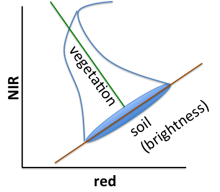

# Lab 03 - Spectral Indices & Transformations{#lab3}


## Overview

In this lab, we will work with the spectral characteristics in our data to visualize and extract insights that go beyond basic visual interpretation. We will work with the different spectral bands offered by Landsat 8 to find unique patterns that can help us solve problems and conduct analysis. By the end of this lab, you should be able to understand how to build and visualize existing indices, as well as construct your own, identify how different indices can help your use case, and understand the mechanism behind how they work. 

## Spectral Indices

Spectroscopy is the study of how radiation is absorbed, reflected and emitted by different materials. While this discipline has its origins in chemistry and physics, we can utilize the same techniques to identify different land cover types from satellite data.  In the chart below, land cover types have unique spectral characteristics. Snow has a major peak at lower wavelengths and is near zero after 1.5 micrometer, where as soil has very low reflectance at lower levels of wavelength but relatively strong and steady reflectance after ~0.75 micorometers. Spectral indices are built to leverage these unique characteristics and isolate specific types of land cover. 

Land covers are separable at different wavelengths. Vegetation curves (green) have high reflectance in the NIR range, where radiant energy is scattered by cell walls ([Bowker, 1985](http://ntrs.nasa.gov/archive/nasa/casi.ntrs.nasa.gov/19850022138.pdf)) and low reflectance in the red range, where radiant energy is [absorbed by chlorophyll](https://en.wikipedia.org/wiki/Chlorophyll#/media/File:Chlorophyll_ab_spectra-en.svg). We can leverage this information to build indices that help us differentiate vegative from urban areas. In the next few sections, we will cover several of the most important indices in use. 


## Important Indices 

#### Normalized Difference Vegetation Index (NDVI)

The Normalized Difference Vegetation Index (NDVI) has a [long history](https://en.wikipedia.org/wiki/Normalized_Difference_Vegetation_Index) in remote sensing, and is one of the most widely used measures. The typical formulation is:

$$ \text{NDVI} = (\text{NIR} - \text{red}) / (\text{NIR} + \text{red}) $$

Where *NIR* refers to the near infrared band and *red* refers to the red peak in the visible spectrum.

Because NDVI is a popular and well-known index, we can use the built-in functionality within Earth Engine `normalizedDifference()`to calculate NDVI. You can follow the steps below to build your own indices. 

First, build a baseline true color image around our region of interest, Blacksburg, VA. We will work with the Landsat 8 Collection 1 Tier 1 TOA Reflectance data from 2015, sort by cloud cover and extract the first image.

```javascript
var point = ee.Geometry.Point([-80.42, 37.22]);
var landsat = ee.ImageCollection("LANDSAT/LC08/C01/T1_TOA")
var  image = ee.Image(landsat     
                      .filterBounds(point)     
                      .filterDate('2015-06-01', '2015-09-01')
                      .sort('CLOUD_COVER')
                      .first());
var trueColor = {bands: ['B4', 'B3', 'B2'], 
                 min: 0, max: 0.3};   
Map.centerObject(point, 12);                  
Map.addLayer(image, trueColor, 'image');  
```

Now that we have the true color baseline image, we can build the NDVI index and visualize it. For visualization, we are creating a custom pallette, where low values trend towards white and high values trend towards green. 

```javascript
var point = ee.Geometry.Point([-80.42, 37.22]);
var landsat = ee.ImageCollection("LANDSAT/LC08/C01/T1_TOA")
var image = ee.Image(landsat     
                      .filterBounds(point)     
                      .filterDate('2015-06-01', '2015-09-01')
                      .sort('CLOUD_COVER')
                      .first());
var  ndvi = image.normalizedDifference(['B5', 'B4']);  
var  vegPalette = ['white', 'green']; 
Map.centerObject(point, 12);
Map.addLayer(ndvi, {min: -1, max: 1,  
                    palette: vegPalette}, 'NDVI'); 
```

Use the **Inspector** to check pixel values in areas of vegetation and non-vegetation. Also inspect how the values of lakes and rivers compare.


> **Question 1A**: What are some of the sample pixel values of the NDVI in the below categories. Indicate which parts of the images you used and how you determined what each of their values were.
>
> 1. Vegetation
> 2. Urban features
> 3. Bare earth 
> 4. Water

#### Enhanced Vegetation Index (EVI) 

The Enhanced Vegetation Index (EVI) is designed to minimize saturation and background effects in NDVI ([Huete, 2002](http://www.sciencedirect.com/science/article/pii/S0034425702000962)). 

$$ \text{EVI} = 2.5 * (\text{NIR} - \text{red}) / (\text{NIR} + 6 * \text{red} - 7.5 * \text{blue} + 1) $$

Since it is not a normalized difference index, we have to build a unique [expression](https://developers.google.com/earth-engine/image_math#expressions) and then identify all of the different segments. Programmatically, bands are specifically referenced with the help of [an object](https://developer.mozilla.org/en-US/docs/Web/JavaScript/Guide/Grammar_and_Types#Object_literals) that is passed as the second argument to `image.expression()` (everything within the curly brackets). 

```javascript
var point = ee.Geometry.Point([-80.42, 37.22]);
var landsat = ee.ImageCollection("LANDSAT/LC08/C01/T1_TOA")
var  image = ee.Image(landsat     
                      .filterBounds(point)     
                      .filterDate('2015-06-01', '2015-09-01')
                      .sort('CLOUD_COVER')
                      .first());
// Build the expression
var exp = '2.5  * ((NIR - RED) / (NIR + 6 * RED - 7.5 * BLUE + 1))';
var evi = image.expression( exp, 
                            {'NIR': image.select('B5'),
                             'RED': image.select('B4'),
                             'BLUE': image.select('B2')
                            });  
var vegPalette = ['white', 'green']; 
Map.centerObject(point, 12);
Map.addLayer(evi,  
             {min: -1, max: 1,  palette: vegPalette}, 
             'EVI');  
```

> **Question 1B**: Compare EVI to NDVI across those same land use categories as in the previous question. What do you observe -- how are the images and values similar or different across the two indices?

#### Normalized Difference Water Index (NDWI)

The Normalized Difference Water Index (NDWI) was developed by [Gao (1996)](http://www.sciencedirect.com/science/article/pii/S0034425796000673) as an index to identify the water content within vegetation. SWIR stands for short-wave infrared, which is the Landsat band 6.  This is not an exact implementation of NDWI, according to the [OLI spectral response](http://landsat.gsfc.nasa.gov/?p=5779), since OLI does not have a band in the right position (1.26 𝛍m) - but for our purposes, this is an approximation that does an acceptable job of identifying water content. 

$$\text{NDWI} = (\text{NIR} - \text{SWIR})) / (\text{NIR} + \text{SWIR})$$

```javascript
var point = ee.Geometry.Point([-80.42, 37.22]);
var landsat = ee.ImageCollection("LANDSAT/LC08/C01/T1_TOA")
var  image = ee.Image(landsat     
                      .filterBounds(point)     
                      .filterDate('2015-06-01', '2015-09-01')
                      .sort('CLOUD_COVER')
                      .first());
var ndwi = image.normalizedDifference(['B5', 'B6']);  
var waterPalette = ['white', 'blue'];   
Map.centerObject(point, 12);
Map.addLayer(ndwi,  
             {min: -1, max: 1,  palette: waterPalette}, 
             'NDWI');  
```

#### Normalized Difference Water *Body* Index (NDWBI)

It's unfortunate that two *different* NDWI indices were independently invented in 1996. To distinguish, define the Normalized Difference Water *Body* Index (NDWBI) as the index described in [McFeeters (1996)](http://www.tandfonline.com/doi/abs/10.1080/01431169608948714#.VkThFHyrTlM):

$$\text{NDWBI} = (\text{green} - \text{NIR}) / (\text{green} + \text{NIR})$$

As previously, implement NDWBI with `normalizedDifference()` and display the result.

```javascript
var point = ee.Geometry.Point([-80.42, 37.22]);
var landsat = ee.ImageCollection("LANDSAT/LC08/C01/T1_TOA")
var  image = ee.Image(landsat     
                      .filterBounds(point)     
                      .filterDate('2015-06-01', '2015-09-01')
                      .sort('CLOUD_COVER')
                      .first());
var waterPalette = ['white', 'blue'];            
var ndwbi = image.normalizedDifference(['B3', 'B5']);   
Map.addLayer(ndwbi, 
             {min: -1, 
              max: 0.5,  
              palette: waterPalette}, 
             'NDWBI');   
```


You can combine the code blocks to compare the actual values at different pixel locations. Use inspector to test out different land areas.

> **Question 2**: Compare NDWI and NDWBI. What do you observe? What do each of the indices try to focus on?

#### Normalized Difference Bare Index (NDBI)

The Normalized Difference Bare Index (NDBI) was developed by [Zha, 2003)](http://www.tandfonline.com/doi/abs/10.1080/01431160304987) to aid in the differentiation of urban areas by using a combination of the shortwave and near infrared. 

$$ \text{NDBI} = (\text{SWIR} - \text{NIR}) / (\text{SWIR} + \text{NIR}) $$

Note that NDBI is the negative of NDWI. Compute NDBI and display with a suitable palette. (Check [this reference](https://developer.mozilla.org/en-US/docs/Web/JavaScript/Reference/Global_Objects/Array) to demystify the palette reversal)

```javascript
var point = ee.Geometry.Point([-80.42, 37.22]);
var landsat = ee.ImageCollection("LANDSAT/LC08/C01/T1_TOA")
var  image = ee.Image(landsat     
                      .filterBounds(point)     
                      .filterDate('2015-06-01', '2015-09-01')
                      .sort('CLOUD_COVER')
                      .first());
var waterPalette = ['white', 'blue'];   
var barePalette =  waterPalette.slice().reverse(); 
var ndbi = image.normalizedDifference(['B6', 'B5']);   
Map.addLayer(ndbi, {min: -1, max: 0.5,  palette: barePalette}, 'NDBI');  
```

#### Burned Area Index (BAI) 

The Burned Area Index (BAI) was developed by [Chuvieco et al. (2002)](http://www.tandfonline.com/doi/abs/10.1080/01431160210153129) to assist in the delineation of burn scars and assessment of burn severity. It is based on maximizing the spectral characteristics of charcoal reflectance. To examine burn indices, load an image from 2013 showing the [Rim fire](https://en.wikipedia.org/wiki/Rim_Fire) in the Sierra Nevadas. We'll start by creating a true image of the area to see how well this index highlights the presence of wildfire. 

```javascript
var point = ee.Geometry.Point(-120.083, 37.850);
var landsat = ee.ImageCollection("LANDSAT/LC08/C01/T1_TOA")
var image = ee.Image(landsat
  .filterBounds(point)
  .filterDate('2013-08-17', '2013-09-27')
  .sort('CLOUD_COVER')
  .first());
var trueColor = {bands: ['B4', 'B3', 'B2'], 
                 min: 0, max: 0.3};   
Map.centerObject(point, 12);                  
Map.addLayer(image, trueColor, 'image');  
```

Closely examine the true color display of this image. Can you spot where the fire occurred? If difficult, let's look at the burn index.


```javascript
var point = ee.Geometry.Point(-120.083, 37.850);
var landsat = ee.ImageCollection("LANDSAT/LC08/C01/T1_TOA")
var image = ee.Image(landsat
  .filterBounds(point)
  .filterDate('2013-08-17', '2013-09-27')
  .sort('CLOUD_COVER')
  .first());
var trueColor = {bands: ['B4', 'B3', 'B2'], 
                 min: 0, max: 0.3};   
Map.centerObject(point, 12);                  
Map.addLayer(image, trueColor, 'image');  

// Build Burn Index expression
var exp = '1.0  / ((0.1 - RED)**2 + (0.06 - NIR)**2)';
var bai = image.expression(exp,   
                               {'NIR': image.select('B5'),   
                                'RED': image.select('B4') });
                                
var burnPalette = ['green', 'blue', 'yellow', 'red'];   
Map.addLayer(bai, {min: 0, max: 400,  palette: burnPalette}, 'BAI');
```

The charcoal burn area is now very evident. Being that Landsat has historical data and a wide array of sensors, this can be a powerful way to understand natural phenomena. 


> **Question 3**: Compare NDBI and the BAI displayed results -- what do you observe?

#### Normalized Burn Ratio Thermal (NBRT)

The Normalized Burn Ratio Thermal (NBRT) was developed based on the idea that burned land has low NIR reflectance (less vegetation), high SWIR reflectance (think ash), and high brightness temperature ([Holden et al. 2005](http://www.tandfonline.com/doi/abs/10.1080/01431160500239008)). Unlike the other indices, a lower NBRT means a higher likelihood of recent burn (for visualization, reverse the scale). This index can be used to diagnose the severity of wildfires (see [van Wagtendonk et al. 2004](http://www.sciencedirect.com/science/article/pii/S003442570400152X)).

```javascript
var point = ee.Geometry.Point(-120.083, 37.850);
var landsat = ee.ImageCollection("LANDSAT/LC08/C01/T1_TOA")
var image = ee.Image(landsat
  .filterBounds(point)
  .filterDate('2013-08-17', '2013-09-27')
  .sort('CLOUD_COVER')
  .first());
var trueColor = {bands: ['B4', 'B3', 'B2'], 
                 min: 0, max: 0.3};   
Map.centerObject(point, 12);                  
Map.addLayer(image, trueColor, 'image');  
// Build Burn Index expression
var exp = '(NIR - 0.0001 * SWIR *  Temp) / (NIR + 0.0001 * SWIR * Temp)'
var nbrt = image.expression(exp,   
                                {'NIR': image.select('B5'),   
                                 'SWIR': image.select('B7'),   
                                 'Temp': image.select('B11')  
                                });  
var burnPalette = ['green', 'blue', 'yellow', 'red'];   
Map.addLayer(nbrt, {min: 1, max: 0.9,  palette: burnPalette}, 'NBRT'); 
```

#### Normalized Difference Snow Index (NDSI)

The Normalized Difference Snow Index (NDSI) was designed to estimate the amount of a pixel covered in snow ([Riggs et al. 1994](http://ieeexplore.ieee.org/xpls/abs_all.jsp?arnumber=399618&tag=1)).

$$\text{NDSI} = (\text{green} - \text{SWIR}) /(\text{green} + \text{SWIR})$$

Let's look at Aspen, Colorado and use Landsat 8 data in the winter. You can use the layer manager to turn on and off the snow layer to compare results with the true color image. How does it compare? Reference the spectral reflectance chart at the beginning of the lab and look at the profile for snow. You will see that it has a distinct profile. In the image below, it does a very good job of matching the true color image - valleys and roads that do not have snow on them are accurately shown. 

```javascript
var point = ee.Geometry.Point([-106.81, 39.19]);
var landsat = ee.ImageCollection("LANDSAT/LC08/C01/T1_TOA")
var image = ee.Image(landsat
  .filterBounds(point)
  .filterDate('2013-11-17', '2014-03-27')
  .sort('CLOUD_COVER')
  .first());
var trueColor = {bands: ['B4', 'B3', 'B2'], 
                 min: 0, max: 0.3};   
Map.centerObject(point, 12);                  
Map.addLayer(image, trueColor, 'image');  
var ndsi = image.normalizedDifference(['B3', 'B6']);      
var snowPalette = ['red', 'green', 'blue', 'white'];   
Map.addLayer(ndsi,              
             {min: -0.5, max: 0.5,  palette: snowPalette},              
             'NDSI');  
```


## Transformations

We've went over indices to highlight unique characteristics in our imagery by utilizing the bands outside of the visible spectrum. 

Linear transforms are linear combinations of input pixel values. These can result from a variety of different strategies, but a common theme is that pixels are treated as arrays of band values, and we can use these arrays to create weighted values for specific purposes.

#### Tasseled cap (TC)

Based on observations of agricultural land covers in the NIR-red spectral space, [Kauth and Thomas (1976)](http://citeseerx.ist.psu.edu/viewdoc/download?doi=10.1.1.461.6381&rep=rep1&type=pdf) devised a [rotational transform](https://en.wikipedia.org/wiki/Change_of_basis) of the form 

$$ p_1 = R^T p_0 $$


where $$p_0$$ is the original pixel vector (a stack of the *p* band values as an [Array](https://developers.google.com/earth-engine/arrays_intro)), **$$p_1$$** is the rotated pixel and **R** is an [orthonormal basis](https://en.wikipedia.org/wiki/Orthonormal_basis) of the new space (therefore is $$R^T$$ its inverse). Kauth and Thomas found **R** by defining the first axis of their transformed space to be parallel to the soil line in the following chart, then used the [Gram-Schmidt process](https://en.wikipedia.org/wiki/Gram–Schmidt_process) to find the other basis vectors.




Assuming that **R** is available, one way to implement this rotation in Earth Engine is with arrays. Specifically, make an array of TC coefficients. Since these coefficients are for the TM sensor, get a less cloudy Landsat 5 scene. To do the matrix multiplication, first convert the input image from a multi-band image to an array image in which each pixel position stores an array. Do the matrix multiplication, then convert back to a multi-band image.


```javascript
var point = ee.Geometry.Point([-106.81, 39.19]);
var coefficients = ee.Array([    
  [0.3037, 0.2793, 0.4743, 0.5585, 0.5082, 0.1863],    
  [-0.2848, -0.2435, -0.5436, 0.7243, 0.0840, -0.1800],
  [0.1509, 0.1973, 0.3279, 0.3406, -0.7112, -0.4572],
  [-0.8242, 0.0849, 0.4392, -0.0580, 0.2012, -0.2768],
  [-0.3280, 0.0549, 0.1075, 0.1855, -0.4357, 0.8085],
  [0.1084, -0.9022, 0.4120, 0.0573, -0.0251, 0.0238]
]);  
var landsat = ee.ImageCollection("LANDSAT/LT05/C01/T1_TOA")
var image = ee.Image(landsat
  .filterBounds(point)
  .filterDate('2008-06-01', '2008-09-01')
  .sort('CLOUD_COVER')
  .first());
var bands = ['B1', 'B2', 'B3', 'B4', 'B5', 'B7'];
// Make an Array Image,  with a 1-D Array per pixel.
var arrayImage1D =  image.select(bands).toArray();
// Make an Array Image  with a 2-D Array per pixel, 6x1.
var arrayImage2D = arrayImage1D.toArray(1);  
var componentsImage = ee.Image(coefficients)
				.matrixMultiply(arrayImage2D)
// Get rid of the extra  dimensions.
				.arrayProject([0])  
// Get a multi-band image  with TC-named bands.  
				.arrayFlatten(
          [['brightness', 'greenness', 'wetness', 'fourth', 'fifth', 'sixth']]
        );       
var vizParams = {
  bands: ['brightness', 'greenness', 'wetness'],
  min: -0.1, max: [0.5,  0.1, 0.1]
};
Map.addLayer(componentsImage, vizParams, 'TC components');  
```


> Question 3: Upload the a tasseled cap image from a point near Blacksburg, VA and interpret the output. what are some of the values that you can extract when using **Inspector**? Are the results meaningful? 

#### Principal Component Analysis (PCA)

Like the Tasseled Cap transform, the [PCA transform](https://en.wikipedia.org/wiki/Principal_component_analysis) is a rotational transform in which the new basis is orthonormal, but the axes are determined from statistics of the input image, rather than empirical data. Specifically, the new basis is the [eigenvectors](https://en.wikipedia.org/wiki/Eigenvalues_and_eigenvectors) of the image's [variance-covariance matrix](https://en.wikipedia.org/wiki/Covariance_matrix). As a result, the principal components are uncorrelated. To demonstrate, use the Landsat 8 image converted to an array image. Use the `reduceRegion()` [method](https://developers.google.com/earth-engine/reducers_reduce_region) to compute statistics (band covariances) for the image.

A [*reducer*](https://developers.google.com/earth-engine/reducers_intro) is an object that tells Earth Engine what statistic to compute. Note that the result of the reduction is an object with one property, an array, that stores the covariance matrix. The next step is to compute the eigenvectors and eigenvalues of that covariance matrix. Since the eigenvalues are appended to the eigenvectors, slice the two apart and discard the eigenvectors. Perform the matrix multiplication, as with the TC components. Finally, convert back to a multi-band image and display the first PC.

Use the [layer manager](https://developers.google.com/earth-engine/playground#layer-manager) to stretch the result appropriately. What do you observe? Try displaying some of the other principal components. The image parameters in the code chunk below are built specifically for Pricipal Component 1. 

```javascript
var point = ee.Geometry.Point([-80.42, 37.22]);
var landsat = ee.ImageCollection("LANDSAT/LC08/C01/T1_TOA")
var image = ee.Image(landsat
  .filterBounds(point)
  .filterDate('2013-11-17', '2014-03-27')
  .sort('CLOUD_COVER')
  .first());
var bands = ['B2', 'B3', 'B4', 'B5', 'B6', 'B7', 'B10', 'B11'];
var arrayImage =  image.select(bands).toArray();  
var covar = arrayImage.reduceRegion({
  reducer: ee.Reducer.covariance(),
  maxPixels: 1e9
});
var covarArray = ee.Array(covar.get('array'));  
var eigens = covarArray.eigen();  
var eigenVectors = eigens.slice(1, 1);  
var principalComponents = 			ee.Image(eigenVectors).matrixMultiply(arrayImage.toArray(1));  
var pcImage = principalComponents      
				.arrayProject([0])    
// Make the one band  array image a multi-band image, [] -> image.    
				.arrayFlatten(
          [['pc1', 'pc2', 'pc3', 'pc4', 'pc5', 'pc6', 'pc7', 'pc8']]
        );      
// Customize the visual parameters for PC1
imageVisParam = {
  "opacity":1,
  "bands":["pc1"],
  "min":-420,"max":-400,
  "gamma":1};
Map.centerObject(point, 10);    
Map.addLayer(pcImage.select('pc1'), imageVisParam, 'PC');
```


> **Question 4**: How much did you need to stretch the results to display outputs for principal component 2? 
>
> Display and upload images of each the other principal components, stretching each band as needed for visual interpretation and indicating how you selected the min and max values. 
>
> How do you interpret each PC band? On what basis do you make that interpretation? 

#### Spectral Unmixing

The [linear spectral mixing model](http://ieeexplore.ieee.org/xpls/abs_all.jsp?arnumber=974727&tag=1) is based on the assumption that each pixel is a mixture of "pure" spectra. The pure spectra, called *endmembers*, are from land cover classes such as water, bare land, vegetation. The goal is to solve the following equation for **f**, the *P*x1 vector of endmember fractions in the pixel:  

$$ Sf = p $$

where **S** is a *B*x*P* matrix in which the columns are *P* pure endmember spectra (known) and **p** is the *B*x1 pixel vector when there are *B* bands (known). In this example, $B= 6$: 

The first step is to get the endmember spectra, which we can do by computing the mean spectra in polygons around regions of pure land cover. In this example, we will use a location in northern Washington State and use the geometry tools to select homogeneous areas of bare land, vegetation and water.

Using the [geometry drawing tools](https://developers.google.com/earth-engine/playground#geometry-tools), make three layers clicking **+ new layer**. In the first layer, digitize a polygon around pure bare land, in the second layer make a polygon of pure vegetation, and in the third layer, make a water polygon. Name the imports `bare`, `water` and, and `vegetation`, respectively. 

Note: For a starting point, we included some basic polygons but feel free to replace in a region of your choice. 

```javascript
var point = ee.Geometry.Point([-123.25, 48.11]);
var landsat = ee.ImageCollection("LANDSAT/LC08/C01/T1_TOA")
var image = ee.Image(landsat
  .filterBounds(point)
  .filterDate('2013-06-17', '2014-03-27')
  .sort('CLOUD_COVER')
  .first());
// Polygons of bare earth, water and vegetation
var bare = 
    ee.Geometry.Polygon(
        [[[-123.2370707334838, 48.1151452657945],
          [-123.2370707334838, 48.11351208612645],
          [-123.23410957473136, 48.11351208612645],
          [-123.23410957473136, 48.1151452657945]]], null, false);
var water = 
    ee.Geometry.Polygon(
        [[[-123.2748188020549, 48.12059599002954],
          [-123.2748188020549, 48.118074835535865],
          [-123.2673086168132, 48.118074835535865],
          [-123.2673086168132, 48.12059599002954]]], null, false);
var vegetation = 
    ee.Geometry.Polygon(
        [[[-123.27462568300582, 48.11533866992809],
          [-123.27462568300582, 48.114163936320416],
          [-123.27215805071212, 48.114163936320416],
          [-123.27215805071212, 48.11533866992809]]], null, false);
var unmixImage = image.select(['B2', 'B3', 'B4', 'B5', 'B6', 'B7']);
```

Check the polygons you made by charting mean spectra in them using [Chart.image.regions()](https://developers.google.com/earth-engine/charts_image_regions):

Your chart should look something like:


```javascript
var unmixImage = image.select(['B2', 'B3', 'B4', 'B5', 'B6', 'B7']);  
print(Chart.image.regions(unmixImage, ee.FeatureCollection([
    ee.Feature(bare, {label: 'bare'}), 
    ee.Feature(water, {label: 'water'}),
    ee.Feature(vegetation, {label: 'vegetation'})]), 
  ee.Reducer.mean(), 30, 'label', [0.48, 0.56, 0.65, 0.86, 1.61, 2.2]));
```

Use the [reduceRegion() method](https://developers.google.com/earth-engine/reducers_reduce_region) to compute mean spectra in the polygons you made. Note that the return value of reduceRegion() is a Dictionary, with reducer output keyed by band name. Get the means as a list by calling `values()`. Each of these three lists represents a mean spectrum vector. Stack the vectors into a 6x3 Array of endmembers by concatenating them along the 1-axis (or columns direction).

Turn the 6-band input image into an image in which each pixel is a 1D vector (`toArray()`), then into an image in which each pixel is a 6x1 matrix (`toArray(1)`). Now that the dimensions match, in each pixel, solve the equation for **f**. Finally, convert the result from a 2D array image into a 1D array image (`arrayProject()`), then to a multi-band image (`arrayFlatten()`). The three bands correspond to the estimates of bare, vegetation and water fractions in **f**. Display the result where bare is red, vegetation is green, and water is blue (the `addLayer()` call expects bands in order, RGB)

```javascript
var bareMean = unmixImage.reduceRegion(
  ee.Reducer.mean(), bare, 30).values();   
var waterMean = unmixImage.reduceRegion(
  ee.Reducer.mean(), water, 30).values();   
var vegMean = unmixImage.reduceRegion(
  ee.Reducer.mean(), vegetation, 30).values();  
var endmembers = ee.Array.cat([bareMean,  vegMean, waterMean], 1);  
var arrayImage = unmixImage.toArray().toArray(1);
var unmixed =  ee.Image(endmembers).matrixSolve(arrayImage);
var unmixedImage = unmixed.arrayProject([0])
				.arrayFlatten(
          [['bare', 'veg', 'water']]
        );  
Map.addLayer(unmixedImage, {}, 'Unmixed');  
```


> Question 5: Repeat this process for Blacksburg, VA. Upload the mean spectra chart you generated for bare, water, and land and the map. Interpret the output of the image by selecting different pixels with **Inspector**

#### Hue-Saturation-Value Transform

The Hue-Saturation-Value (HSV) model [is a color transform of the RGB color space](https://en.wikipedia.org/wiki/HSL_and_HSV). Among many other things, it is useful for [pan-sharpening](https://en.wikipedia.org/wiki/Pansharpened_image). This involves converting an RGB to HSV, swapping the panchromatic band for the value (V), then converting back to RGB. For example, using the Landsat 8 scene:

```javascript
var point = ee.Geometry.Point([-80.42, 37.22]);
var landsat = ee.ImageCollection("LANDSAT/LC08/C01/T1_TOA")
var image = ee.Image(landsat
  .filterBounds(point)
  .filterDate('2013-06-17', '2014-03-27')
  .sort('CLOUD_COVER')
  .first());
// Convert Landsat RGB bands to HSV   
var hsv = image.select(['B4', 'B3', 'B2']).rgbToHsv();
// Convert back to RGB,  swapping the image panchromatic band for the value.
var rgb = ee.Image.cat([
  hsv.select('hue'),
  hsv.select('saturation'),
  image.select(['B8'])]).hsvToRgb();
Map.centerObject(point, 12);
Map.addLayer(rgb, {max: 0.4}, 'Pan-sharpened');  
```

> **Question 6**: Compare the pan-sharpened image with the original image. What do you notice that's different? The same? 

## Spectral Transformation

### Linear Filtering

In the present context, linear *filtering* (or [convolution](http://www.dspguide.com/ch24/1.htm)) refers to a linear combination of pixel values in a 'neighborhood', or [kernel](https://en.wikipedia.org/wiki/Kernel_(image_processing)), where the weights of the kernel determine the coefficients in the linear combination (for this lab, the terms *kernel* and *filter* are interchangeable.) Filtering an image can be useful for extracting image information at different [spatial frequencies](http://www.dspguide.com/ch24/5.htm) by reducing noise. For this reason, smoothing filters are called *low-pass* filters (they let *low*-frequency data *pass* through) and edge detection filters are called *high-pass* filters. To implement filtering in Earth Engine use [image.convolve()](https://developers.google.com/earth-engine/guides/image_convolutions) with an ee.Kernel for the argument.

#### Smoothing

Smoothing means to convolve an image with a smoothing kernel. 

A simple smoothing filter is a square kernel with uniform weights that sum to one. Convolving with this kernel sets each pixel to the mean of its neighborhood. Print a square kernel with uniform weights (this is sometimes called a "pillbox" or "boxcar" filter):

Expand the kernel object in the console to see the weights. This kernel is defined by how many pixels it covers (i.e. `radius` is in units of 'pixels'). A kernel with radius defined in 'meters' adjusts its size in pixels, so you can't visualize its weights, but it's more flexible in terms of adapting to inputs of different scale. In the following, use kernels with radius defined in meters except to visualize the weights.

```javascript
var point = ee.Geometry.Point([-80.42, 37.22]);
var naip = ee.ImageCollection("USDA/NAIP/DOQQ")
var image = ee.Image(naip
  .filterBounds(point)
  .filterDate('2013-06-17', '2017-03-27')
  .first());
// Print a uniform kernel to see its weights.
print('A uniform kernel:', ee.Kernel.square(2));

```


Define a kernel with 2-meter radius (which corresponds to how many pixels in the NAIP image? Hint: try [projection.nominalScale()](https://developers.google.com/earth-engine/guides/projections)), convolve the image with the kernel and compare the input image with the smoothed image:

```javascript
// Define a square, uniform kernel.
var uniformKernel = ee.Kernel.square({
 radius: 2,
 units: 'meters',
});
// Filter the image by convolving with the smoothing filter.
var smoothed = image.convolve(uniformKernel);
var trueColorVis = {
  min: 0.0,
  max: 255.0,
};
Map.centerObject(point, 12);
Map.addLayer(smoothed, trueColorVis, 'smoothed image');
```

To make the image even smoother, try increasing the size of the neighborhood by increasing the pixel radius. to the human eye, the image is more blurry, but in many Machine Learning and Computer Vision algorithms, this process improves our output by reducing noise. 


A Gaussian kernel can also be used for smoothing. Think of filtering with a Gaussian kernel as computing the weighted average in each pixel's neighborhood. 

```javascript
// Print a Gaussian kernel to see its weights.
print('A Gaussian kernel:', ee.Kernel.gaussian(2));
// Define a square Gaussian kernel:
var gaussianKernel = ee.Kernel.gaussian({
 radius: 2,
 units: 'meters',
});
// Filter the image by convolving with the Gaussian filter.
var gaussian = image.convolve(gaussianKernel);
var trueColorVis = {
  min: 0.0,
  max: 255.0,
};
Map.centerObject(point, 12);
Map.addLayer(gaussian, trueColorVis, 'smoothed image');
```

> **Question 7**: What happens as you increase the pixel radius for each smoothing? What differences can you discern between the weights and the visualizations of the two smoothing kernels?

#### Edge Detection

Convolving with an edge-detection kernel is used to find rapid changes in values that usually signify the edges of objects in the image data. 

A classic edge detection kernel is the [Laplacian](https://en.wikipedia.org/wiki/Discrete_Laplace_operator) kernel. Investigate the kernel weights and the image that results from convolving with the Laplacian. Other edge detection kernels include the [Sobel](https://en.wikipedia.org/wiki/Sobel_operator), [Prewitt](https://en.wikipedia.org/wiki/Prewitt_operator) and [Roberts](https://en.wikipedia.org/wiki/Roberts_cross) kernels. [Learn more about additional edge detection methods in Earth Engine](https://developers.google.com/earth-engine/image_edges).    

```javascript
var point = ee.Geometry.Point([-80.42, 37.22]);
var naip = ee.ImageCollection("USDA/NAIP/DOQQ")
var image = ee.Image(naip
  .filterBounds(point)
  .filterDate('2013-06-17', '2017-03-27')
  .first());
// Define a Laplacian, or edge-detection kernel.
var laplace = ee.Kernel.laplacian8({ normalize: false });
// Apply the edge-detection kernel.
var edges = image.convolve(laplace);
var trueColorVis = {
  min: 0.0,
  max: 255.0,
  format: 'png'
};
Map.centerObject(point, 12);
Map.addLayer(edges, trueColorVis,'edges');
```


> **Question 8:** Choose another edge detection method and upload the image - what characteristics do you see, and how does it compare to Laplacian Edge detection? 

## Additional Exercises

> **Question 9**: Look in google scholar to identify 2-3 publications that have used NDVI and two-three that used EVI. For what purposes were these indices used and what was the justification provided for that index? 

> **Question 10**: Discuss a spectral index that we did not cover in this lab relates to your area of research/interest. What is the the name of the spectral index, the formula used to calculate it, and what is it used to detect? Provide a citation of an academic article that has fruitfully used that index. 

> **Question 11**: Find 1-2 articles that use any of the linear transformation methods we practiced in this lab in the service of addressing an important social issue (e.g., one related to agriculture, environment, or development). Provide the citations and discussed how the transformation is used and how it's justified in the article. 

