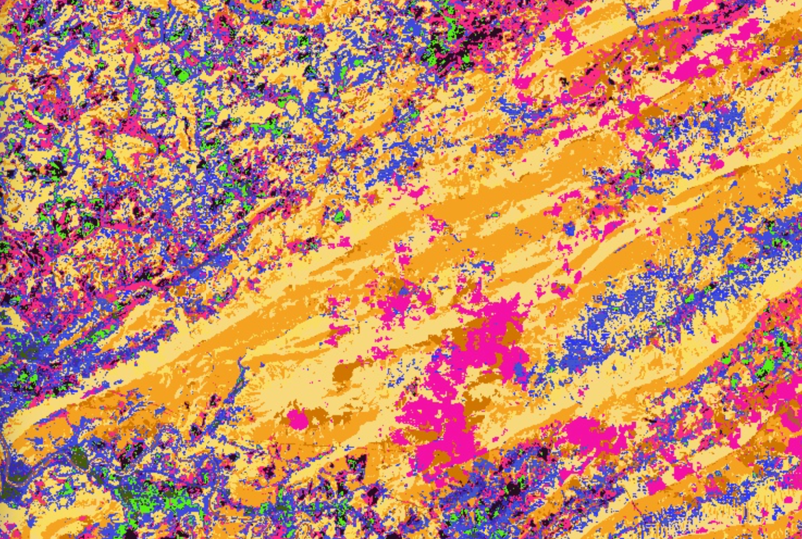
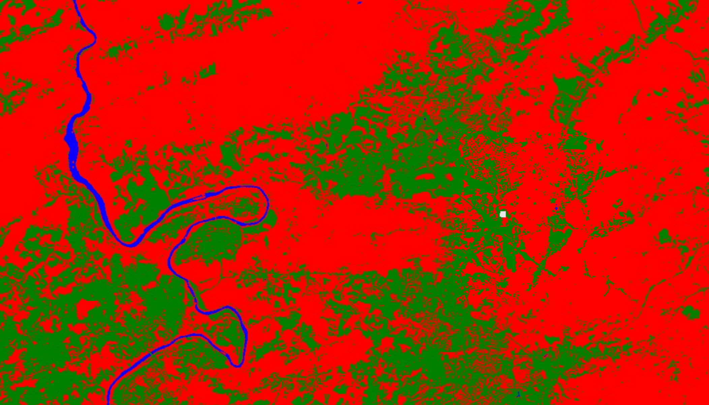

# Lab 04 - Classification{#lab4}

## Overview

This lab will cover the process of using machine learning (ML) to create both unsupervised and supervised classification models for land use categorization. We will discuss the methodology involved and potential use cases, explore parameter tuning and go through the process of building a relatively simple classification model using Random Forest and CART, which you can use as a starting point for future research.   

## Introduction to Classification

While it is possible for a human to look at a satellite image and identify objects or land cover types based on their visual characteristics, the sheer magnitude and volume of imagery makes it virtually impossible to do this manually at scale. To compensate, machine learning allows computers to process this information much quicker than a human and find meaningful insights in the imagery. Image classification is an essential component in today's remote sensing, and there are many opportunities in this growing field. By training ML models to efficiently process the data and return labeled information, we can focus on the higher-level insights.

Google Earth Engine offers many options to work with classification. Most broadly, we can separate classification into two parts - supervised and unsupervised classification. We will introduce both components and work our way through several examples. 

For practical purposes, we can define pixel-wise prediction as guessing the value of some geographic variable of interest `g`, using a function `G` that takes as input a pixel vector **`p`**:
$$
G_{t}(p_{i}) = g_{i}
$$
The *i* in this equation refers to a particular instance from a set of pixels. Think of *G* as a guessing function and $g_{i}$ as the guess for pixel *i*.  The **T** in the subscript of *G* refers to a *training set* (a set of known values for **p** and the correct *g*), used to infer the structure of *G*. You have to choose a suitable *G* to train with **T**. 

When `g` is nominal, or a fixed category (ex., {'water', 'vegetation', 'bare'}), we call this classification. 

When `g` is numeric (ex., {0, 1, 2, 3}), we call this regression. 

This is a simplistic description of a problem addressed in a broad range of fields including mathematics, statistics, data mining, machine learning. For our purposes, we will go through some examples using these concepts in Google Earth Engine and then provide more resources for further reading at the end. 

## Unsupervised Classification

Unsupervised classification finds unique groupings in the dataset without manually developed training data (no guidance). The computer will cycle through the pixels, look at the characteristics of the different bands, and pixel-by-pixel begin to group information together. Perhaps pixels with a blue hue and a low NIR value are grouped together, while green-dominant pixels are also grouped together. The outcome of unsupervised classification is that each pixel is categorized within the context of the image and the number of categories specified. One important point is that the number of clusters is set by the user, and this plays a major role in how the algorithm operates. Too many clusters creates unnecessary noise, while too few clusters does not have enough granularity.

Google Earth Engine provides [documentation](https://developers.google.com/earth-engine/guides/clustering) on working with unsupervised classification within their ecosystem, and we will be focusing on the `ee.Clusterer` package, which provides a flexible unsupervised classification (or clustering) in an easy-to-use way.

Clusterers are used in the same manner as classifiers in Earth Engine. The general workflow for clustering is:

1. Assemble features with numeric properties to find clusters
2. Instantiate a clusterer - set its parameters if necessary
3. Train the clusterer using the training data
4. Apply the clusterer to an image or feature collection
5. Label the clusters

Begin by creating a study region - in this case we will be working in an area near Blacksburg, VA.

We will be working with Landsat 8 imagery, which we will filter to the region and to the year of 2019. `maskl8sr()` is a function used to mask out cloud pixels. Visualize the true color image first to get an understanding of the region. 

```javascript
// Create region
var region = 
    ee.Geometry.Polygon(
        [[[-80.62707329831015, 37.333629367422276],
          [-80.62707329831015, 37.144488460273884],
          [-80.19517327389609, 37.144488460273884],
          [-80.19517327389609, 37.333629367422276]]]);
// Function to mask clouds based on the pixel_qa band of Landsat 8 SR data.
function maskL8sr(image) {
// Bits 3 and 5 are cloud shadow and cloud, respectively.
        var cloudShadowBitMask = (1 << 3);
        var cloudsBitMask = (1 << 5);
        // Get the pixel QA band.
        var qa = image.select('pixel_qa');
        // Both flags should be set to zero, indicating clear conditions.
        var mask = qa.bitwiseAnd(cloudShadowBitMask).eq(0)
                .and(qa.bitwiseAnd(cloudsBitMask).eq(0));
           return image.updateMask(mask);
}
// Load Landsat 8 annual composites.
var landsat = ee.ImageCollection('LANDSAT/LC08/C01/T1_SR')
      .filterDate('2019-01-01', '2019-12-31')
      .map(maskL8sr)
      .filterBounds(region)
      .median();
//Display Landsat data
var visParams = {
       bands: ['B4', 'B3', 'B2'],
       min: 0,
       max: 3000,
       gamma: 1.4,
};
Map.centerObject(region, 9);
Map.addLayer(landsat, visParams, "Landsat 8 (2016)");
```

In this case, we will randomly select a sample of 5000 pixels in the region to build a clustering model - we will use this sample data to find clustering groups and then apply it to the rest of the data. 

  We will also set the variable `clusterNum` to idenfity how many categories to use. Start with 15, and modify based on the output and needs of your experiment. Note that we are using `ee.Clusterer.wekaKMeans`, 

```javascript
// Create a training dataset.
var sample = landsat.sample({
     region: region,
     scale: 30,
     numPixels: 5000
});
var clusterNum = 15  
// Instantiate the clusterer and train it.
var clusterer = ee.Clusterer.wekaKMeans(clusterNum).train(sample);
// Cluster the input using the trained clusterer.
var result = landsat.cluster(clusterer);
print("result", result.getInfo());
// Display the clusters with random colors.
Map.addLayer(result.randomVisualizer(), {}, 'Unsupervised Classification');
```

As you can see from the output, the result is quite vivid. On the 'layers' toggle on the top-right of the map section, increase the transparency of the layer to compare it to the satellite imagery.



Change the variable in `clusterNum` and run through some different options to find better results. Note that the output of an unsupervised clustering model is not specifying that each pixel should be a certain type of label (ex, the pixel is 'water'), but rather that these pixels have similar characteristics. 

Unsupervised is a great starting point of understanding your data. While it is not typically used as standalone results, it can be used as a layer in supervised classification to improve performance in the supervised classification.  

> **Question 1**: If you were going to use a clustering model to identify water in the image, is 15 an appropriate cluster number? What would you deem to be an optimal number of clusters?

## Supervised Classification

Just like in unsupervised classification, GEE has [documentation](https://developers.google.com/earth-engine/classification) that works through several examples. Supervised classification is an iterative process of obtaining training data, creating an initial model, reviewing the results and tuning the parameters. Many projects using supervised classification may take several months or years of fine-tuning, requiring constant refinement and maintenance. Below is a list of the steps in building a supervised classification model according to GEE. 

1. Collect the training data 
2. Instantiate the classifier
3. Train the classifier
4. Classify the image 
5. Tune the model 
6. Repeat the process 


We will begin by creating training data manually within GEE. Using the geometry tools and the Landsat composite as a background, we can digitize training polygons. We’ll need to do two things: identify where polygons occur on the ground, and label them with the proper class number.

1. Draw a polygon around an area of bare earth (dirt, no vegetation), then [configure the import](https://developers.google.com/earth-engine/playground#geometry-tools). Import as FeatureCollection, then click **`+ New property`**. Name the new property 'class' and give it a value of 0. The dialog should show **class**: 0. Name the import 'bare'. 
2. **`+ New property`** > Draw a polygon around vegetation > import as FeatureCollection > add a property > name it 'class' and give it a value of 1. Name the import 'vegetation'. 
3. **`+ New property`** > Draw a polygon around water > import as FeatureCollection > add a property > name it 'class' and give it a value of 2. Name the import 'water'. 
4. You should have three FeatureCollection imports named 'bare', 'vegetation' and 'water'. Merge them into one FeatureCollection:

> *Note*: We are providing a few starting point polygons to begin experimenting with - in the exercises, you will use the above instructions to build your own polygons. 

```javascript
var water = ee.FeatureCollection(
        [ee.Feature(
            ee.Geometry.Polygon(
                [[[-80.6172789596943, 37.04886769922969],
                  [-80.60715093845407, 37.058183583673205],
                  [-80.60612097019235, 37.06201920367848],
                  [-80.60165777439157, 37.06530672362588],
                  [-80.59273138279, 37.07133347348626],
                  [-80.59873953098337, 37.075168428598126],
                  [-80.61418905490915, 37.060512376088454]]]),
            {
              "class": 2,
              "system:index": "0"
            })]);
var bare = ee.FeatureCollection(
        [ee.Feature(
            ee.Geometry.Polygon(
                [[[-80.53788557285348, 37.08119439478304],
                  [-80.53960218662301, 37.07551082587341],
                  [-80.53076162570993, 37.07688039951336],
                  [-80.52380933994333, 37.078523855226926],
                  [-80.52483930820505, 37.085371203913176],
                  [-80.53101911777536, 37.08311164722038],
                  [-80.53608312839548, 37.08044117520197]]]),
            {
              "class": 1,
              "system:index": "0"
            })]);
 var vegetation = ee.FeatureCollection(
        [ee.Feature(
            ee.Geometry.Polygon(
                [[[-80.57367696994821, 37.07931133179868],
                  [-80.56517973178903, 37.07801027914314],
                  [-80.56080236667673, 37.083008938497635],
                  [-80.55749788517038, 37.08516579245161],
                  [-80.5611027740864, 37.08978741569377],
                  [-80.56612386936227, 37.08879464631953],
                  [-80.57337656253854, 37.08420719827087]]]),
            {
              "class": 0,
              "system:index": "0"
            })]);
var trainingFeatures = bare.merge(vegetation).merge(water);
```

In the merged FeatureCollection, each Feature should have a property called 'class' where the classes are consecutive integers, starting at 0.

For Landsat, we will use the following bands for their predictive values - we could just keep the visual bands, but using a larger number of predictive values in many cases improves the model's ability to find relationships and patterns in the data. Create a training set **T** for the classifier by sampling the Landsat composite with the merged features. The choice of classifier is not always obvious, but a CART (a [decision tree](https://en.wikipedia.org/wiki/Decision_tree_learning) when running in classification mode) is an excellent starting point. Instantiate a CART and train it.

```javascript
var predictionBands = ['B2', 'B3', 'B4', 'B5', 'B6', 'B7', 'B10', 'B11'];
var classifierTraining = landsat.select(predictionBands)
  .sampleRegions({
   collection: trainingFeatures, 
   properties: ['class'], 
   scale: 30
  });
var classifier = ee.Classifier.smileCart().train({
 features: classifierTraining, 
 classProperty: 'class', 
 inputProperties: predictionBands
});
var classified = landsat.select(predictionBands)
				.classify(classifier);
Map.addLayer(classified, 
             {min: 0, max: 2, 
              palette: ['red', 'green', 'blue']}, 
             'classified');
```



Inspect the result. Some things to test if the result is unsatisfactory:

1. Other classifiers
   1. Try some of the other classifiers in Earth Engine to see if the result is better or different. You can find different classifiers under `Docs` on the left panel of the console. 
2. Different (or more) training data.
   1. Try adjusting the shape and/or size of your training polygons to have a more representative sample of your classes. It is very common to either underfit or overfit your model when beginning the process. 
3. Add more predictors. 
   1. Try adding spectral indices to the input variables.

## Accuracy Assessment

The previous section asked the question whether the result is satisfactory or not. In remote sensing, the quantification of the answer is called accuracy assessment. In the regression context, a standard measure of accuracy is the [Root Mean Square Error](https://en.wikipedia.org/wiki/Root-mean-square_deviation) (RMSE) or the [correlation](https://en.wikipedia.org/wiki/Correlation_and_dependence) between known and predicted values. (Although the RMSE is returned by the linear regression reducer, beware: this is computed from the training data and is NOT a fair estimate of expected prediction error when guessing a pixel not in the training set). It is testing how accurate the model is based on the existing training data, but proper methodology uses separate ground-truth values for testing. In the classification context, accuracy measurements are often derived from a [confusion matrix](https://en.wikipedia.org/wiki/Confusion_matrix).

The first step is to partition the set of known values into training and testing sets. Reusing the classification training set, add a column of random numbers used to partition the known data where about 60% of the data will be used for training and 40% for testing. Train the classifier with the trainingSet, classify the testing set and get a confusion matrix. Note that the classifier automatically adds a property called 'classification', which is compared to the 'class' property added when you imported your polygons:

Print the confusion matrix and expand the object to inspect the matrix. The entries represent the number of pixels. Items on the diagonal represent correct classification and items off the diagonal are misclassifications, where the class in row *i* is classified as column *j* 

So there are a total of 640 pixels of water in the test sample - of these 640 pixels, 1 pixel was miscalculated as bare land, and 0 pixels were miscalculated as vegetation. You can get basic descriptive statistics from the confusion matrix, along with consumers / producers accuracy, which are built-in functions that are calculated from a confusion matrix. The [documentation](https://developers.google.com/earth-engine/apidocs/ee-confusionmatrix) of working with confusion matrices contains some interesting information and extensions. 


You can test different classifiers by replacing CART with some other classifier of interest. Also note that as a result of the randomness in the partition, you may get different results from different runs. 

```javascript
var trainingTesting = classifierTraining.randomColumn();
var trainingSet = trainingTesting.filter(ee.Filter.lessThan('random', 0.6));
var testingSet = trainingTesting.filter(ee.Filter.greaterThanOrEquals('random', 0.6));  
var trained = ee.Classifier.smileCart().train({
  features: trainingSet,
  classProperty: 'class',
  inputProperties: predictionBands
}); 
var confusionMatrix =  
    ee.ConfusionMatrix(testingSet.classify(trained)
                       .errorMatrix({actual: 'class',predicted: 'classification'}));  
print('Confusion matrix:', confusionMatrix);
print('Overall Accuracy:', confusionMatrix.accuracy());
print('Producers Accuracy:', confusionMatrix.producersAccuracy());
print('Consumers Accuracy:', confusionMatrix.consumersAccuracy());  
```

> **Important**: this is a simplified example to simply showcase how to get started with supervised classification. These accuracy levels are artificially high, and as you increase the number of categories and add complexity to the model, you will have to fine-tune your process along the way. 

## Hyperparameter Tuning

Another well-known classifier used extensively in Remote Sensing is a random forest. A random forest is a collection of decision trees that find optimal splits in the data to compute an average (regression) or vote on a label (classification). Their adaptability makes them one of the most effective classification models, and is an excellent starting point. Because random forests are so effective, we need to make things a little harder for it to be interesting. Do that by adding noise to the training data.

```javascript
// Load Landsat 8 annual composites.
var landsat = ee.ImageCollection('LANDSAT/LC08/C01/T1_SR')
      .filterDate('2019-01-01', '2019-12-31')
      .map(maskL8sr)
      .filterBounds(region)
      .median();   
var predictionBands = ['B2', 'B3', 'B4', 'B5', 'B6', 'B7', 'B10', 'B11'];
var sample = landsat.select(predictionBands).sampleRegions(
  {collection: trainingFeatures
   .map(function(f) {
    return f.buffer(300)
   }), properties: ['class'], scale: 30});  
var classifier = ee.Classifier.smileRandomForest(10)
				.train({features: sample,
                classProperty: 'class',
                inputProperties: predictionBands
               });
var classified =  landsat.select(predictionBands).classify(classifier);   Map.addLayer(classified, {min: 0, max: 2,  palette: 
             ['red', 'green', 'blue']}, 'classified')                                                                     
```

Note that the only parameter to the classifier is the number of trees (10). How many trees should you use? Making that choice is best done by hyperparameter tuning. For example,  

```javascript
var sample  = sample.randomColumn();
var train = sample.filter(ee.Filter.lt('random', 0.6));
var test = sample.filter(ee.Filter.gte('random', 0.6));
var numTrees = ee.List.sequence(5, 50, 5);
var accuracies = numTrees.map(function(t) {
var classifier =  ee.Classifier.smileRandomForest(t)
				.train({
          features: train,
          classProperty: 'class',
          inputProperties: predictionBands
  });
  return test.classify(classifier)
    .errorMatrix('class',  'classification')
    .accuracy();
});
print(ui.Chart.array.values({
  array: ee.Array(accuracies),
  axis: 0,
  xLabels: numTrees
}));  
```

You should see something like the following chart, in which the number of trees is on the x-axis and estimated accuracy is on the y-axis.


We always get very good accuracy in this simple example, as mentioned before. We can see that 10 is not the optimal number of trees, but after adding more (up to about 20 or 30), we don't get much more accuracy for the increased computational burden. In this chart specifically, perhaps 20 trees is optimal - as datasets grow larger, the computational burden begins to play a larger role and has to be taken into account. 

## Classification Assignment

> **Assignment**: Design a four-class classification for your area of interest. Decide on suitable input data and manually collect training points (or polygons) and instantiate a random forest classifier. In your code, have a variable called trees that sets the optimal number of trees according to your hyper-parameter tuning. Have a variable called `maxAccuracy` that stores the estimated accuracy for the optimal number of trees.

## Regression

Classifying imagery is an essential part of remote sensing research. In the previous lab, we began working with classification and regression, and we will continue on this same path for the first half of this lab. We will begin to explore Random Forest models more in depth, which were briefly introduced in the previous lab.  Ultimately, the purpose of classification in this context is to use known characteristics of a subset of the image to make a best-estimate classification of the rest of the image.  

In the present context, regression means predicting a numeric variable instead of a class label. No lab on regression would be complete without the requisite introduction to least squares regression.

### Ordinary Least Squares (OLS)

[Ordinary regression](https://en.wikipedia.org/wiki/Ordinary_least_squares) is when *G* is a linear function of the form *G*(**p**) = **βp** where **β** is a vector of coefficients. Once *G* is trained by some training set **T**, we can estimate the the value for some unknown **p** by multiplying it with **β**. 

Suppose the goal is to estimate percent tree cover in each Landsat pixel.

For this exercise, we will use data that has a known values for *g*., 'MODIS Terra Vegetation Continuous Fields Yearly Global 250m'. Since water is coded as 200 in this image, replace the 200's with 0's and display the result. Documentation for the `.where` clause is at this [link](https://developers.google.com/earth-engine/apidocs/ee-image-where?hl=en). Scroll in and note that when you click on a water area it will say 'masked', where as land areas will provide a numerical value listed as 'Percent_Tree_Cover'. Each pixel represents percent tree cover (as an integer value) at 250 meter resolution in 2010.

```javascript
var mod44b = ee.ImageCollection("MODIS/006/MOD44B")
var tree = ee.Image(mod44b.sort('system:time_start', false).first());
var percentTree = tree.select('Percent_Tree_Cover')
  .where(tree.select('Percent_Tree_Cover').eq(200), 0);
var visualization = {
  bands: ['Percent_Tree_Cover'],
  min: 0.0,
  max: 100.0,
  palette: ['bbe029', '0a9501', '074b03']
};
Map.addLayer(percentTree, visualization, 'percent tree cover'); 
```

For predictor variables (**p**)we will use 'USGS Landsat 5 TM Collection 1 Tier 1 Raw Scenes'. Filter to the year 2010 and the [WRS-2](https://www.usgs.gov/faqs/what-worldwide-reference-system-wrs?qt-news_science_products=0#qt-news_science_products) path and row (or given point) to get only scenes over the San Francisco Bay area in 2010. Use an Earth Engine algorithm to get a cloud-free composite of Landsat imagery.

Specify the bands of the Landsat composite to be used as predictors (i.e. the elements of **p**):

Now that all the input data is ready, we can build the shell of our linear regression equation. It's customary to include a constant term in linear regression to make it the [best linear unbiased estimator](https://en.wikipedia.org/wiki/Gauss–Markov_theorem). Stack a constant, the predictor variables and the 'Percent Tree Cover' Image as the variable `trainingImage`, representing known *g*: If you print `trainingImage` to the console, you will see that the format of the data that we have follows the typical equation for linear regression. 

$$ y = \beta_0 + \beta_1X_1 + ... + \beta_nX_n + \epsilon $$

Sample 1000 pixels out of `trainingImage`, to get a table of Feature Collections, each containing a value for each band (1-7), a value for the 'Percent Tree Cover', and a constant (value of 1).

```javascript
var point = ee.Geometry.Point([-122.10, 37.70]);
var landsat5_raw = ee.ImageCollection("LANDSAT/LT05/C01/T1");
var landsat5_filtered = landsat5_raw.filterDate('2010-01-01', '2010-12-31')
  .filterBounds(point)
var landsat = ee.Algorithms.Landsat.simpleComposite({
  collection: l5filtered,
  asFloat: true
});
Map.setCenter(-121.9, 37.7, 10)
Map.addLayer(landsat, {bands: ['B4', 'B3', 'B2'], max: 0.3}, 'composite');
var predictionBands = ['B1', 'B2', 'B3', 'B4', 'B5', 'B6', 'B7'];
var trainingImage = ee.Image(1)
  .addBands(landsat.select(predictionBands))
  .addBands(percentTree);
var training = trainingImage.sample({
 region: landsat5_filtered.first().geometry(), 
 scale: 30, 
 numPixels: 1000
});
var trainingList = ee.List(predictionBands)
  .insert(0, 'constant')
  .add('Percent_Tree_Cover');
var regression = training.reduceColumns({ 
    reducer: ee.Reducer.linearRegression(8),  
    selectors: trainingList
  });
```

Inspect the first element of `training` to make sure it has all of the expected data. 

> **Question 1**: What do you expect to see when you inspect the first element of training, and how does that compare with what you ultimately end up seeing?

The next step is to train *G*. Make a list of the variable names, predictors followed by *g*:

In Earth Engine, [linear regression is implemented as a Reducer](https://developers.google.com/earth-engine/reducers_regression). This means that training *G* is a reduction of the **T** table, performed using the list of variables as an input. The argument tells the reducer how many of the input variables are predictors - note that we have 1 as a constant. 

Print `regression` - we now have a coefficient for each of the predictor variables (in the order specified by the inputs list), along with a value for residuals (the difference between the observed and predicted values).


To use the coefficients to make a prediction in every pixel, first turn the output coefficients into an image, then perform the multiplication and addition that implements $\beta_p$: 

```javascript
var coefficients = ee.Array(regression.get('coefficients'))
		.project([0])  
		.toList();
var predictedTreeCover = ee.Image(1)
		.addBands(landsat.select(predictionBands))				
		.multiply(ee.Image.constant(coefficients))				
		.reduce(ee.Reducer.sum())	
		.rename('predictedTreeCover');
Map.addLayer(predictedTreeCover,  
             {min: 0, max: 100, 
              palette:['bbe029', '0a9501', '074b03']}, 
             'prediction');
```

Carefully inspect this result by using the inspector on the prediction layer and comparing it to the satellite imagery basemap. Is it satisfactory?


If not, it might be worth testing some other regression functions, adding more predictor variables, collecting more training data, or all of the above. In remote sensing research, this is not a one-step process - to find value in these models, you will need to continuously improve, iterate and retest your assumptions. 

> Question 2: Upload your predicted layer and your satellite imagery basemap. Discuss the salient features of the predicted output and which steps you may want to take in order to improve the results.

## Nonlinear Regression

If ordinary linear regression is not satisfactory, Earth Engine contains other functions that can make predictions of a continuous variable. Unlike linear regression, other regression functions are implemented by the classifier library. 

For example, a Classification and Regression Tree (CART) is a machine learning algorithm that can learn non-linear patterns in your data. Reusing the **T** table (without the constant term), train a CART as follows:

```javascript
var cartRegression = ee.Classifier.smileCart()
  .setOutputMode('REGRESSION')
  .train({
   features: training, 
   classProperty: 'Percent_Tree_Cover', 
   inputProperties: predictionBands
  });

var cartRegressionImage = landsat.select(predictionBands)
  .classify(cartRegression, 'cartRegression');
Map.addLayer(cartRegressionImage, {min: 0, max: 100}, 'CART regression');
```

Use the 'inspector' to compare the linear regression to the CART regression. Although CART can work in both classification and regression mode, not all classifiers are as easily adaptable. 


> **Question 3**: What do you observe when comparing the linear regression to the CART regression? Are the prediction values similar? If the output for both are similar, does the value seem to match the background imagery?

---


