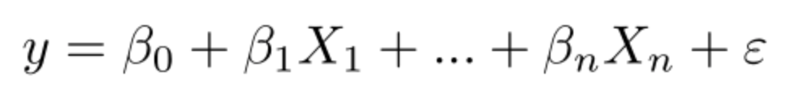
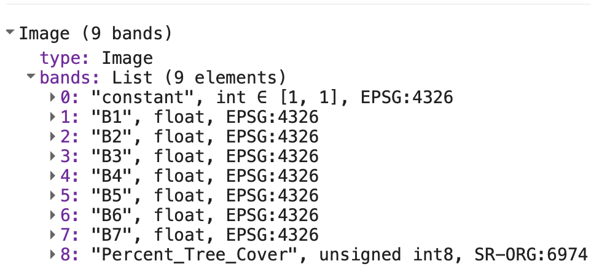
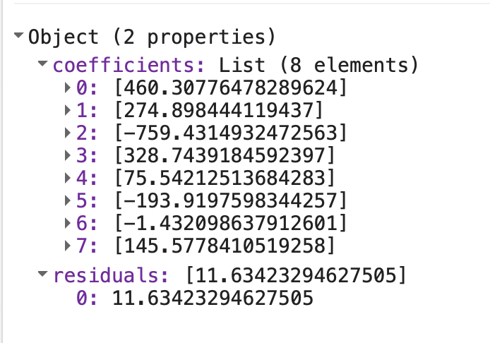
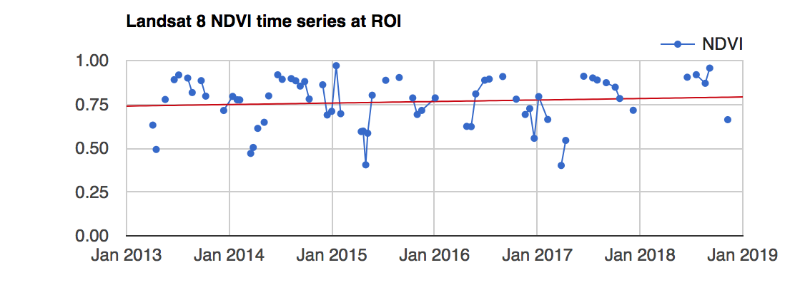
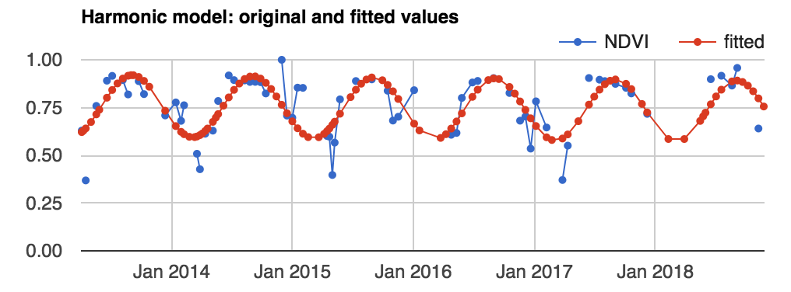

# Linear Regression 

## Overview{-}

# Linear Regression

**Overview:** 

Classifying imagery is an essential component in Remote Sensing research. In the previous lab, we began working with classification and regression, and we will continue on this same path for the first half of this lab. We will begin to explore Random Forest models more in depth, which were briefly introduced in the previous lab. 

Ultimately, the purpose of classification in this context is to use known characteristics of a subset of the image to make a best-estimate classification of the rest of the image.  

## Regression

In the present context, regression means predicting a numeric variable instead of a class label. No lab on regression would be complete without the requisite introduction to least squares regression.

### Ordinary Least Squares (OLS)

[Ordinary regression](https://en.wikipedia.org/wiki/Ordinary_least_squares) is when *G* is a linear function of the form *G*(**p**) = **βp** where **β** is a vector of coefficients. Once *G* is trained by some training set **T**, we can estimate the the value for some unknown **p** by multiplying it with **β**. 

Suppose the goal is to estimate percent tree cover in each Landsat pixel.


Import data to use known values for *g*. Search 'vegetation continuous fields' to import 'MOD44B.006' as the variable`mod44b` and extract the most recent image.  

```javascript
var tree = ee.Image(mod44b.sort('system:time_start', false).first());
```

Since water is coded as 200 in this image, replace the 200's with 0's and display the result. Documentation for the `.where` clause is at this [link](https://developers.google.com/earth-engine/apidocs/ee-image-where?hl=en). Scroll in and note that when you click on a water area it will say 'masked', where as an area on land will provide a numerical value listed as 'Percent_Tree_Cover'.

```javascript
var percentTree = tree.select('Percent_Tree_Cover')
  .where(tree.select('Percent_Tree_Cover').eq(200), 0);
var visualization = {
  bands: ['Percent_Tree_Cover'],
  min: 0.0,
  max: 100.0,
  palette: ['bbe029', '0a9501', '074b03']
};
Map.addLayer(percentTree, visualization, 'percent tree cover'); 
```

Each pixel will represents percent tree cover (as an integer value) at 250 meter resolution in 2010.


Import data to use as predictor variables (**p**). Search 'landsat 5 raw' and import 'USGS Landsat 5 TM Collection 1 Tier 1 Raw Scenes'. Name the import `landsat5_raw`. Filter by time and the [WRS-2](https://www.usgs.gov/faqs/what-worldwide-reference-system-wrs?qt-news_science_products=0#qt-news_science_products) path and row to get only scenes over the San Francisco bay area in 2010.

```javascript
var landsat5_filtered = landsat5_raw.filterDate('2010-01-01', '2010-12-31')
    .filterMetadata('WRS_PATH', 'equals', 44)
    .filterMetadata('WRS_ROW', 'equals', 34);
```

Use an Earth Engine algorithm to get a cloud-free composite of Landsat imagery in 2010. Note that this will provide landsat imagery over the area of San Francisco - if you use the inspector to click anywhere else, the values are 'masked'.

```javascript
var landsat = ee.Algorithms.Landsat.simpleComposite({
 collection: l5filtered,
 asFloat: true
});
Map.setCenter(-121.9, 37.7, 10)
Map.addLayer(landsat, {bands: ['B4', 'B3', 'B2'], max: 0.3}, 'composite');
```

Specify the bands of the Landsat composite to be used as predictors (i.e. the elements of **p**):

```javascript
var predictionBands = ['B1', 'B2', 'B3', 'B4', 'B5', 'B6', 'B7'];
```


Now that all the input data is ready, we can build the shell of our linear regression equation. It's customary to include a constant term in linear regression to make it the [best linear unbiased estimator](https://en.wikipedia.org/wiki/Gauss–Markov_theorem). Stack a constant, the predictor variables and the 'Percent Tree Cover' Image as the variable `trainingImage`, representing known *g*:

```javascript
var trainingImage = ee.Image(1)
  .addBands(landsat.select(predictionBands))
  .addBands(percentTree);
```

If you print `trainingImage` to the console, you will see that the format of the data that we have follows the typical equation for linear regression. 



Sample 1000 pixels out of `trainingImage`, to get a table of Feature Collections, each containing a value for each band (1-7), a value for the 'Percent Tree Cover', and a constant (value of 1).

```javascript
var training = trainingImage.sample({
 region: landsat5_filtered.first().geometry(), 
 scale: 30, 
 numPixels: 1000
});
```

Inspect the first element of `training` to make sure it has all of the expected data. 

The next step is to train *G*. Make a list of the variable names, predictors followed by *g*:

```javascript
var trainingList = ee.List(predictionBands)
  .insert(0, 'constant')
  .add('Percent_Tree_Cover');
```

In Earth Engine, [linear regression is implemented as a Reducer](https://developers.google.com/earth-engine/reducers_regression). This means that training *G* is a reduction of the **T** table, performed using the list of variables as an input. The argument (8) tells the reducer how many of the input variables are predictors - note that we have 1 as a constant. 

```javascript
var regression = training.reduceColumns({ 
    reducer: ee.Reducer.linearRegression(8),  
    selectors: trainingList
  });
```

Print `regression` - we now have a coefficient for each of the predictor variables (in the order specified by the inputs list), along with a value for residuals (the difference between the observed and predicted values).



To use the coefficients to make a prediction in every pixel, first turn the output coefficients into an image, then perform the multiplication and addition that implements **βp**: 

```javascript
var coefficients = ee.Array(regression.get('coefficients'))
		.project([0])  
		.toList();
var predictedTreeCover = ee.Image(1)
		.addBands(landsat.select(predictionBands))				
		.multiply(ee.Image.constant(coefficients))				
		.reduce(ee.Reducer.sum())	
		.rename('predictedTreeCover');
Map.addLayer(predictedTreeCover,  
             {min: 0, max: 100, 
              palette:['bbe029', '0a9501', '074b03']}, 
             'prediction');
```

Carefully inspect this result by using inspector on the prediction layer and comparing it to the satellite imagery basemap. Is it satisfactory? If not, it might be worth testing some other regression functions, adding more predictor variables, collecting more training data, or all of the above. In remote sensing research, this is not a one-step process - to find value in these models, you will need to continuously improve, iterate and retest your assumptions. 

# Nonlinear Regression

If ordinary linear regression is not satisfactory, Earth Engine contains other functions that can make predictions of a continuous variable. Unlike linear regression, other regression functions are implemented by the classifier library. 

For example, a Classification and Regression Tree (CART, see [Brieman et al. 1984](https://books.google.com/books/about/Classification_and_Regression_Trees.html?id=JwQx-WOmSyQC)) is a machine learning algorithm that can learn non-linear patterns in your data. Reusing the **T** table (without the constant term), train a CART as follows:

```javascript
var cartRegression = ee.Classifier.smileCart()
  .setOutputMode('REGRESSION')
  .train({
   features: training, 
   classProperty: 'Percent_Tree_Cover', 
   inputProperties: predictionBands
  });
```


Make predictions over the input imagery (the term 'classify' in this context is a misnomer):

```javascript
var cartRegressionImage = landsat.select(predictionBands)
  .classify(cartRegression, 'cartRegression');
Map.addLayer(cartRegressionImage, {min: 0, max: 100}, 'CART regression');
```

Use the 'inspector' to compare the linear regression to the CART regression. What do you observe? Are the prediction values similar? If the output for both are similar, does the value seem to match the background imagery? 

Although CART can work in both classification and regression mode, not all the classifiers are so easily adaptable. 


# Time Series

**Overview:** 

One of the paradigm-changing features of Earth Engine is the ability to access decades of imagery without the previous limitation of needing to download, organize, store and process. Because these files can be prohibitively large, this limited most projects to viewing two or three images from different periods. With Earth Engine, users can access tens or hundreds of thousands of images to understand the context of change across decades. 

The purpose of this lab is to establish a foundation for time series analysis of remotely sensed data, usually in the form of a temporally ordered stack of images. You will be introduced to concepts of smoothing, interpolation, linear modeling and phenology. At the completion of the lab, you will be able to perform analysis of multi-temporal data for determining trend and seasonality on a per-pixel basis.

## Multi-Temporal Data in Earth Engine

Time series in Earth Engine are represented as image collections. This can make time series analysis complicated because

- There is a different time series in each pixel
- The size (length) of the time series varies across pixels
- Missing data may occur in any pixel at any time (e.g. due to cloud masking, hardware errors)

As a result of these complicating factors, analyzing time series in Earth Engine is unlike traditional methods. Specifically, use joins to define temporal relationships between collection items. As you will soon discover, it's possible to perform many traditional time series methods by mapping functions over joined collections. 

First, some very basic notation. A scalar pixel at time *t* is given by $$p_{t}$$ and a pixel vector by **p***t*. An estimate is a variable with a hat on: (e.g. the estimated pixel value at time is $$p̂_{t}$$). A time series is just a collection of *N* pixels, sorted chronologically: { $$p_{t}$$  = $$t_{0}$$ + $$t_{1}$$...$$t_{n}$$ }, where each *t* is the given value of each pixel in the series.

##  Data Preparation and Preprocessing

The first step in analysis of time series data is to import data of interest and plot it at an interesting location.

We will begin by importing Landsat 8 Surface Reflectance, Tier 1 (this data is currently deprecated, but works for this lab). Make a single point geometry with the drawing tools and position the point in a location of interest. (How about an annual grassland or a deciduous forest, which change characteristics seasonally) Name the import `roi`. Preprocess the Landsat imagery by filtering it to the location of interest, masking clouds, and adding the variables in the model:

```javascript
var landsat_8_sr = ee.ImageCollection("LANDSAT/LC08/C01/T1_SR")
// This field contains UNIX time in milliseconds.
var timeField = 'system:time_start';
// Function to cloud mask from the pixel_qa band of Landsat 8 SR data.
function maskL8sr(image) {
 // Bits 3 and 5 are cloud shadow and cloud, respectively.
 var cloudShadowBitMask = 1 << 3;
 var cloudsBitMask = 1 << 5;
 // Get the pixel QA band.
 var qa = image.select('pixel_qa');
 // Both flags should be set to zero, indicating clear conditions.
 var mask = qa.bitwiseAnd(cloudShadowBitMask).eq(0)
   .and(qa.bitwiseAnd(cloudsBitMask).eq(0));
 // Return the masked image, scaled to reflectance, without the QA bands.
 return image.updateMask(mask).divide(10000)
   .select('B[0-9]*')
   .copyProperties(image, ['system:time_start']);
}
// Use this function to add variables for NDVI, time and a constant
// to Landsat 8 imagery.
var addVariables = function(image) {
 // Compute time in fractional years since the epoch.
 var date = ee.Date(image.get(timeField));
 var years = date.difference(ee.Date('1970-01-01'), 'year');
 // Return the image with the added bands.
 return image
  // Add an NDVI band.
  .addBands(image.normalizedDifference(['B5', 'B4']).rename('NDVI'))
  // Add a time band.
  .addBands(ee.Image(years).rename('t'))
  .float()
  // Add a constant band.
  .addBands(ee.Image.constant(1));
};
// Remove clouds, add variables and filter to the area of interest.
var filteredLandsat = landsat_8_sr
 .filterBounds(roi)
 .map(maskL8sr)
 .map(addVariables);
```

To visualize the data, make a chart at the location of interest. Add a linear trend line for reference (you'll compute that line soon):

```javascript
// Plot a time series of NDVI at a single location.
var l8Chart = ui.Chart.image.series(filteredLandsat.select('NDVI'), roi)
  .setChartType('ScatterChart')
  .setOptions({
   title: 'Landsat 8 NDVI time series at ROI',
   trendlines: {0: {
				color: 'CC0000'
   }},
   lineWidth: 1,
   pointSize: 3,
  });
print(l8Chart);
```

You should see something an output similar to this. Note that you can see a very slight upwards trend of the value at the point. Additionally, within each year there is seasonality, which means that there is a pattern that repeats within the year. 



 

## Linear Modeling of Time

Lots of interesting analyses can be done to time series by harnessing the `linearRegression()` [reducer](https://developers.google.com/earth-engine/api_docs#eereducerlinearregression). To Estimate linear trend over time, consider the following linear model, where *epsilon* is a random error:


This is the model behind the trendline added to the chart you just created. This model is useful for detrending data and reducing variability. For now, the goal is to discover the values of the *β*'s in each pixel.

To fit this trend model to the Landsat-based NDVI series using ordinary least squares (see Lab 5), use the linearRegression() reducer:

```javascript
// List of the independent variable names
var independents = ee.List(['constant', 't']);
// Name of the dependent variable.
var dependent = ee.String('NDVI');
// Compute a linear trend. This will have two bands: 'residuals' and 
// a 2x1 band called coefficients (columns are for dependent variables).
var trend = filteredLandsat.select(independents.add(dependent))
  .reduce(ee.Reducer.linearRegression(independents.length(), 1));
// Map.addLayer(trend, {}, 'trend array image')
// Flatten the coefficients into a 2-band image
var coefficients = trend.select('coefficients')
 .arrayProject([0])
 .arrayFlatten([independents]);
```

The coefficients’ image is a two band image in which each pixel contains values for $$β_{0}$$ and  $$β_{1}$$. Use the model to "detrend" the original NDVI time series. By detrend, we mean account for the slope of the chart. 

```javascript
// Compute a de-trended series.
var detrended = filteredLandsat.map(function(image) {
 return image.select(dependent).subtract(
   image.select(independents).multiply(coefficients).reduce('sum'))
   .rename(dependent)
   .copyProperties(image, [timeField]);
});
```

```javascript
// Plot the detrended results.
var detrendedChart = ui.Chart.image.series(detrended, roi, null, 30)
  .setOptions({
   title: 'Detrended Landsat time series at ROI',
   lineWidth: 1,
   pointSize: 3,
  });
print(detrendedChart);
```

## Estimate Seasonality with a Harmonic Model

Rewrite for simplification:


-----

Consider the following linear model, where *e**t* is a random error, *A* is amplitude, *ω* is frequency, and *φ* is phase:

*p**t* = *β*0 + *β*1*t + A*cos(2π*ωt - φ*) + *e**t* 

  = *β*0 + *β*1*t + β*2cos(2π*ωt*) + *β*3sin(2π*ωt*) + *e**t*       (2)

Note that *β*2 = *A*cos(*φ*) and *β*3 = *A*sin(*φ*), implying *A* = (*β*22 + *β*32)½ and *φ* = atan(*β*3/*β*2). (See [Shumway and Stoffer (2017)](http://www.stat.pitt.edu/stoffer/tsa4/tsaEZ.pdf) equations 4.1 - 4.2). To fit this model to the time series, set *ω*=1 (one cycle per unit time) and use ordinary least squares regression.

----


The setup for fitting the model is to first add the harmonic variables (the third and fourth terms of equation 2) to the image collection.

```javascript
// Use these independent variables in the harmonic regression.
var harmonicIndependents = ee.List(['constant', 't', 'cos', 'sin']);
// Add harmonic terms as new image bands.
var harmonicLandsat = filteredLandsat.map(function(image) {
 var timeRadians = image.select('t').multiply(2 * Math.PI);
 return image
  .addBands(timeRadians.cos().rename('cos'))
  .addBands(timeRadians.sin().rename('sin'));
});
```

Fit the model as with the linear trend, using the linearRegression() reducer:

```javascript
var harmonicTrend = harmonicLandsat
 .select(harmonicIndependents.add(dependent))
 // The output of this reducer is a 4x1 array image.
 .reduce(ee.Reducer.linearRegression({
  numX: harmonicIndependents.length(), 
  numY: 1
 }));
```


Plug the coefficients in to equation 2 in order to get a time series of fitted values:

```javascript
// Turn the array image into a multi-band image of coefficients.
var harmonicTrendCoefficients = harmonicTrend.select('coefficients') .arrayProject([0]) .arrayFlatten([harmonicIndependents]);
// Compute fitted values.
var fittedHarmonic = harmonicLandsat.map(function(image) { 
  return image.addBands(  
    image.select(harmonicIndependents)   
    .multiply(harmonicTrendCoefficients)   
    .reduce('sum')   
    .rename('fitted'));});
// Plot the fitted model and the original data at the ROI.
print(ui.Chart.image.series(fittedHarmonic.select(['fitted','NDVI']), roi,
                            ee.Reducer.mean(), 30)  
      .setSeriesNames(['NDVI', 'fitted'])  
      .setOptions({   
  title: 'Harmonic model: original and fitted values',   
  lineWidth: 1,   
  pointSize: 3,}));
```

You should see something like:




Although any coefficients can be mapped directly, it is useful and interesting to map the phase and amplitude of the estimated harmonic model. First, compute phase and amplitude from the coefficients, then map the resulting image. 

```javascript
// Compute phase and amplitude.
var phase = harmonicTrendCoefficients.select('sin')  .atan2(harmonicTrendCoefficients.select('cos'))  
// Scale to [0, 1] from radians.  
.unitScale(-Math.PI, Math.PI);
var amplitude = harmonicTrendCoefficients.select('sin')  .hypot(harmonicTrendCoefficients.select('cos'))  
// Add a scale factor for visualization.  
.multiply(5);
// Compute the mean NDVI.
var meanNdvi= filteredLandsat.select('NDVI').mean();
// Use the HSV to RGB transformation to display phase and amplitude.
var rgb = ee.Image.cat([ phase,   
                         amplitude, 
                         meanNdvi  
                        ]).hsvToRgb()
Map.addLayer(rgb, {}, 'phase (hue), amplitude (sat), ndvi (val)');
```


-----

** Note - Keep this last section? 

## Auto-Covariance and Auto-Correlation

The [autocovariance](https://en.wikipedia.org/wiki/Autocovariance) of a time series refers to the dependence (specifically the [covariance](https://en.wikipedia.org/wiki/Covariance)) of values in the time series at time *t* with values at time *h* = *t* − *l*, where *l* is the lag. The [autocorrelation](https://en.wikipedia.org/wiki/Autocorrelation) is the covariance normalized by the standard deviations of the covariates. Specifically, assume our time series is stationary and define the autocovariance and autocorrelation according to [Shumway and Stoffer (2017)](http://www.stat.pitt.edu/stoffer/tsa4/tsaEZ.pdf) equations 1.27 and 1.26, respectively. Comparing values at time *t* to previous values is useful not only for computing autocovariance, but also for a variety of other time series analyses as well, as you'll see shortly. 

To combine image data with previous values, in Earth Engine, the first step is to join the previous values to the current values. To do that, use a [join](https://developers.google.com/earth-engine/joins_intro) to create what we'll call a *lagged collection*:

Create a lagged ImageCollection

Consider the following function to create a lagged collection:

```javascript
var lag = function(leftCollection, rightCollection, lagDays) { var filter = ee.Filter.and(   ee.Filter.maxDifference({    difference: 1000 * 60 * 60 * 24 * lagDays,    leftField: timeField,     rightField: timeField   }),    ee.Filter.greaterThan({    leftField: timeField,     rightField: timeField  })); return ee.Join.saveAll({  matchesKey: 'images',  measureKey: 'delta_t',  ordering: timeField,   ascending: false, // Sort reverse chronologically }).apply({  primary: leftCollection,   secondary: rightCollection,   condition: filter });};
```

This function joins a collection to itself, using a filter that gets all the images before but within a specified time difference (in days) of each image. That list of previous images within the lag time is stored in a property of the image called images, sorted reverse chronologically. For example, to create a lagged collection from the detrended Landsat imagery:

```javascript
var lagged17 = lag(detrended, detrended, 17);
```

Why 17 days? Recall that the temporal cadence of Landsat is 16 days. Specifying 17 days in the join gets one previous image, but no more. To compute autocovariance or other interesting statistics, map functions over the lagged collection as in the following sections.

Compute autocovariance and autocorrelation


The autocovariance reducer expects a set of one-dimensional arrays as input. So pixel values corresponding to time *t* need to be stacked with pixel values at time *t* − *l* as multiple bands in the same image. Consider the the following function for that purpose:

```javascript
var merge = function(image) { // Function to be passed to iterate. var merger = function(current, previous) {  return ee.Image(previous).addBands(current); }; return ee.ImageCollection.fromImages(image.get('images')).iterate(merger, image);};
```

and use that function to merge the bands from the lagged collection:

```javascript
var merged17 = ee.ImageCollection(lagged17.map(merge));
```


Now the bands from time *t* and *h* are all in the same image. Note that the band name of *p**h* was the same as *p**t*. During the merging process, it gets a '_1' appended to it. Use a function to convert the merged bands to arrays with bands *p**t* and *p**h*, then reduce with the covariance reducer:

```javascript
var covariance = function(mergedCollection, band, lagBand) { return mergedCollection.select([band, lagBand]).map(function(image) {  return image.toArray(); }).reduce(ee.Reducer.covariance(), 8);};var lagBand = dependent.cat('_1');var covariance17 = ee.Image(covariance(merged17, dependent, lagBand));
```


The output of the covariance reducer is an array image, in which each pixel stores a 2x2 [variance-covariance](https://en.wikipedia.org/wiki/Covariance_matrix) array. The off diagonal elements are covariance, which you can map directly:

```javascript
Map.addLayer(covariance17.arrayGet([0, 1]), {}, 'covariance (lag=17 days)');
```


The diagonal elements of the variance-covariance array are variances. Use this function to compute correlation from the variance-covariance array: 

```javascript
var correlation = function(vcArrayImage) { var covariance = ee.Image(vcArrayImage).arrayGet([0, 1]); var sd0 = ee.Image(vcArrayImage).arrayGet([0, 0]).sqrt(); var sd1 = ee.Image(vcArrayImage).arrayGet([1, 1]).sqrt(); return covariance.divide(sd0).divide(sd1).rename('correlation');};
```

and map the correlation:

```javascript
var correlation17 = correlation(covariance17);Map.addLayer(correlation17, {min: -1, max: 1}, 'correlation (lag = 17 days)');
```

It's worth noting that you can do this for longer lags as well (try 34 days). Of course, that images list will fill up with all the images that are within *l* of *t*. Those other images are also useful, for example in fitting autoregressive models as described later.


 Cross-Covariance and Cross-Correlation

Cross-covariance is analogous to auto-covariance, except instead of measuring the correspondence between a variable and itself at a lag, it measures the correspondence between a variable and a covariate at a lag. Specifically, define the cross-covariance and cross-correlation according to [Shumway and Stoffer (2017)](http://www.stat.pitt.edu/stoffer/tsa4/tsaEZ.pdf) equations 1.30 and 1.31, respectively. 

You already have all the code needed to compute cross-covariance and cross-correlation! But you do need a time series of another variable. Suppose we postulate that NDVI is related in some way to the precipitation before the NDVI was observed. To estimate the strength of this relationship (in every pixel), load precipitation, join, merge, and reduce as previously:

```javascript
// Precipitation (covariate) var chirps = ee.ImageCollection('UCSB-CHG/CHIRPS/PENTAD');// Join the t-l (l=1 pentad) precipitation images to the Landsat.var lag1PrecipNDVI = lag(filteredLandsat, chirps, 5);// Add the precipitation images as bands.var merged1PrecipNDVI = ee.ImageCollection(lag1PrecipNDVI.map(merge));// Compute and display cross-covariance.var cov1PrecipNDVI = covariance(merged1PrecipNDVI, 'NDVI', 'precipitation');Map.addLayer(cov1PrecipNDVI.arrayGet([0, 1]), {}, 'NDVI - PRECIP cov (lag = 5)');// Compute and display cross-correlation.var corr1PrecipNDVI = correlation(cov1PrecipNDVI);Map.addLayer(corr1PrecipNDVI, {min: -0.5, max: 0.5}, 'NDVI - PRECIP corr (lag = 5)');
```

What do you observe from this result? Specifically, how can we do better? One possible drawback of this computation is that it's only based on five days of precipitation, whichever five days came right before the NDVI image. Perhaps precipitation in the month before the observed NDVI is relevant? Test that idea with the following:

```javascript
// Join the precipitation images from the previous monthvar lag30PrecipNDVI = lag(filteredLandsat, chirps, 30);print(lag30PrecipNDVI);var sum30PrecipNDVI = ee.ImageCollection(lag30PrecipNDVI.map(function(image) { var laggedImages = ee.ImageCollection.fromImages(image.get('images')); return ee.Image(image).addBands(laggedImages.sum().rename('sum'));}));// Compute covariance.var cov30PrecipNDVI = covariance(sum30PrecipNDVI, 'NDVI', 'sum');Map.addLayer(cov1PrecipNDVI.arrayGet([0, 1]), {}, 'NDVI - sum cov (lag = 30)');// Correlation.var corr30PrecipNDVI = correlation(cov30PrecipNDVI);Map.addLayer(corr30PrecipNDVI, {min: -0.5, max: 0.5}, 'NDVI - sum corr (lag = 30)');
```

Observe that the only change is to the merge() method. Instead of merging the bands of the NDVI image and the covariate (precipitation), the entire list of precipitation is summed and added as a band (eliminating the need for iterate()).

As long as there is sufficient temporal overlap between the time series, these techniques can be extended to longer lags and longer time series. But watch out. There are some nuances to determining the statistical significance of correlation estimates. See [Shumway and Stoffer (2017)](http://www.stat.pitt.edu/stoffer/tsa4/tsaEZ.pdf) example 1.26 for details.

# Auto-Regressive Models

The discussion of autocovariance preceded this section in order to introduce the concept of lag. Now that you have a way to get previous values of a variable, it's worth considering [auto-regressive models](https://en.wikipedia.org/wiki/Autoregressive_model). Suppose that pixel values at time *t* depend in some way on previous pixel values. If you have observed significant, non-zero autocorrelations in a time series, this may not be a crazy assumption. Specifically, you may postulate a linear model such as:

*p**t* = *β*0 + *β*1*p**t-1* + *β*2*p**t-2* + *e**t*                              (3)

To fit this model, you need a lagged collection as created previously except with a longer lag (e.g. *l* = 34 days). The next steps are to merge the bands, then reduce with the linear regression reducer.


Create a lagged collection, where the images list stores the two previous images: 

```javascript
var lagged34 = ee.ImageCollection(lag(filteredLandsat, filteredLandsat, 34));
```


Merge the bands of the lagged collection such that each image has bands at time *t* and bands at times *t*-1,..., *t* − *l*. Note that it's necessary to filter out any images that don't have two previous temporal neighbors:

```javascript
var merged34 = lagged34.map(merge).map(function(image) { return image.set('n', ee.List(image.get('images')).length());}).filter(ee.Filter.gt('n', 1));
```


Fit the regression model using the linearRegression() reducer:

```javascript
var arIndependents = ee.List(['constant', 'NDVI_1', 'NDVI_2']);var ar2 = merged34 .select(arIndependents.add(dependent)) .reduce(ee.Reducer.linearRegression(arIndependents.length(), 1));// Turn the array image into a multi-band image of coefficients.var arCoefficients = ar2.select('coefficients') .arrayProject([0]) .arrayFlatten([arIndependents]);
```


Compute the fitted values using an [expression](https://developers.google.com/earth-engine/image_math#expressions). Because this model is a function of previous pixel values, which may be masked, if any of the inputs to equation 3 are masked, the output of the equation will also be masked. That's why you should use an expression here, unlike the previous linear models of time. 

```javascript
// Compute fitted values.var fittedAR = merged34.map(function(image) { return image.addBands(  image.expression('beta0 + beta1 * p1 + beta2 * p2', {   p1: image.select('NDVI_1'),   p2: image.select('NDVI_2'),   beta0: arCoefficients.select('constant'),   beta1: arCoefficients.select('NDVI_1'),   beta2: arCoefficients.select('NDVI_2')  }).rename('fitted'));});
```


Plot the results. Note the missing values that result from masked data

```javascript
print(ui.Chart.image.series(fittedAR.select(['fitted', 'NDVI']), roi, ee.Reducer.mean(), 30)  .setSeriesNames(['NDVI', 'fitted'])  .setOptions({   title: 'AR(2) model: original and fitted values',   lineWidth: 1,   pointSize: 3,}));
```

At this stage, note that the missing data has become a real problem. Any data point for which at least one of the previous points is masked or missing is also masked. It may be possible to avoid this problem by substituting the output from equation 3 (the modeled value) for the missing or masked data. Unfortunately, the code to make that happen is not straightforward. If you're feeling brave, check out [this solution](https://code.earthengine.google.com/c5fbadc5136d94e80ba428376b05d148).


## Where to submit {-}

Submit your responses to these questions on [Gradescope](https://www.gradescope.com/courses/293173/assignments/1446622/submissions) by 10am on Wednesday, October 06 If needed, the access code for our course is `6PEW3W`.
