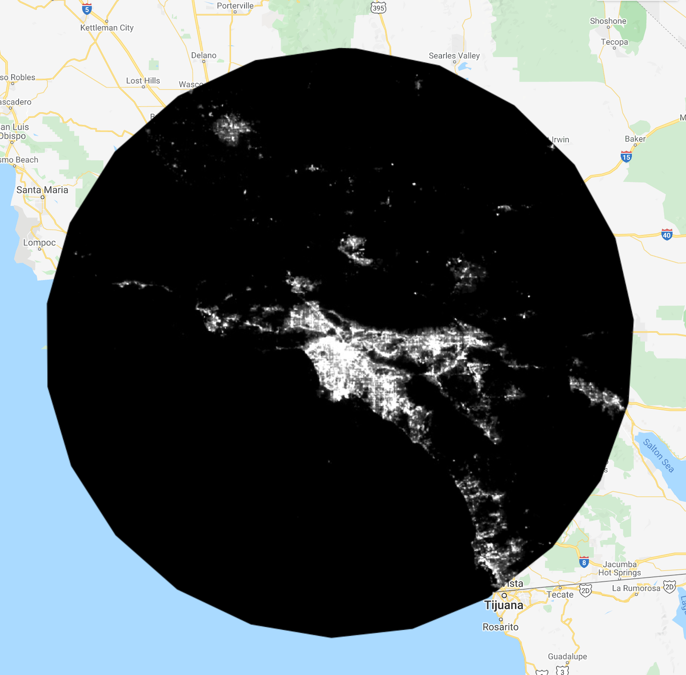
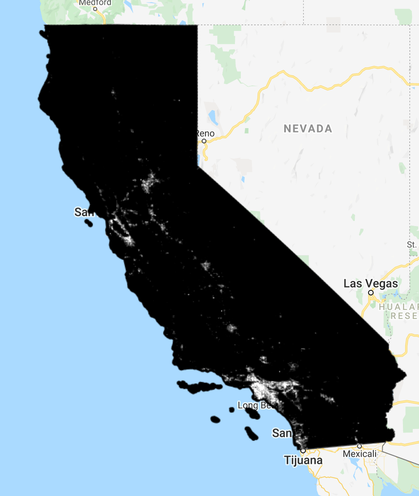
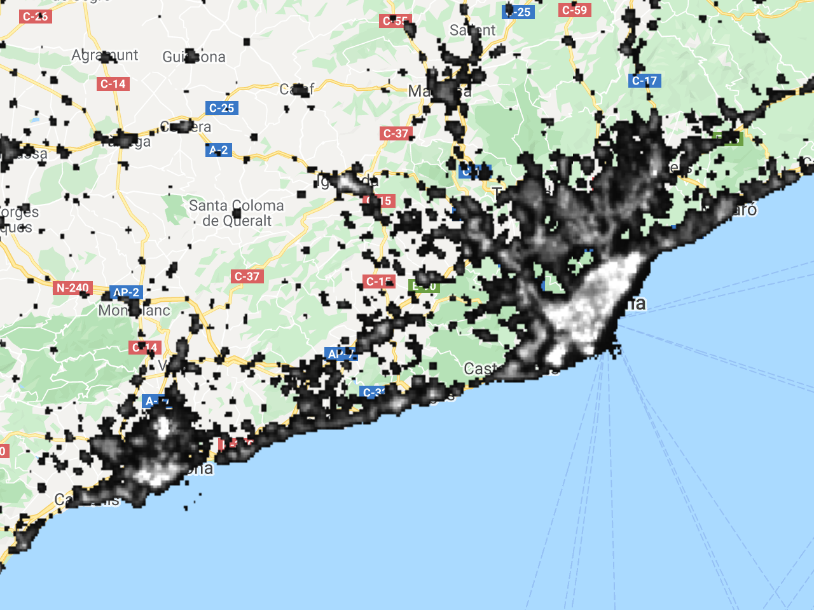
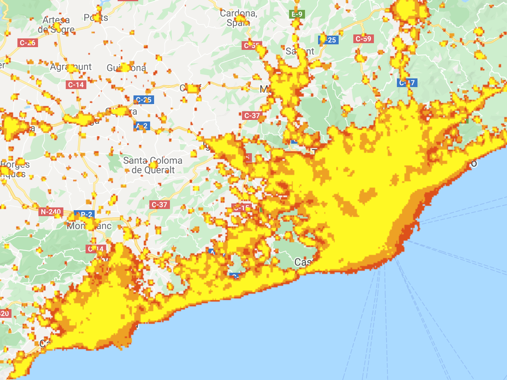
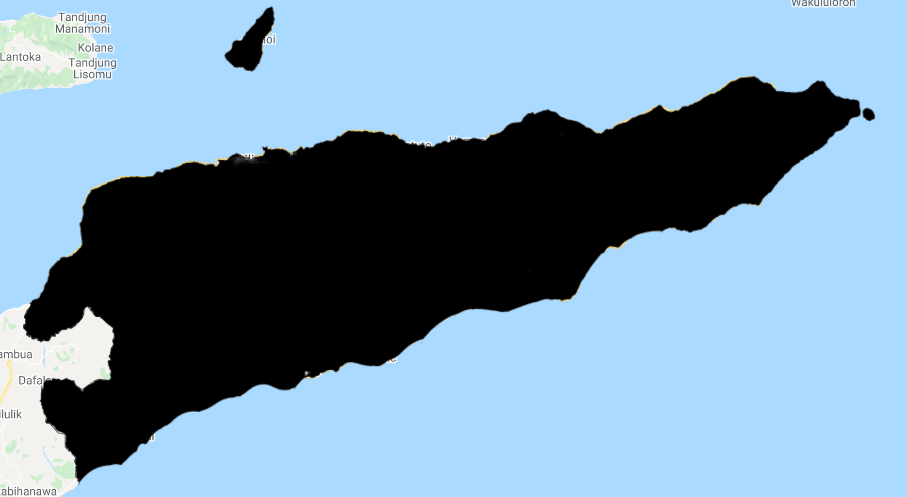
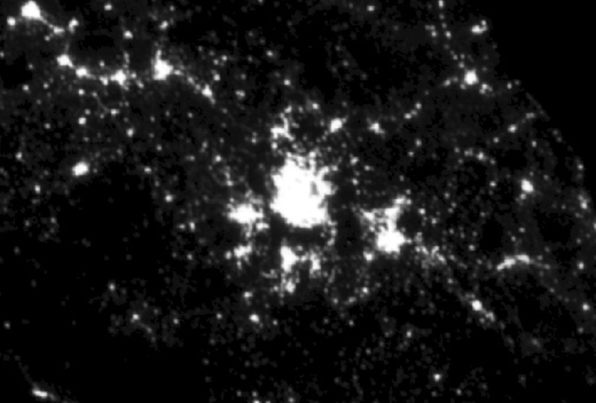
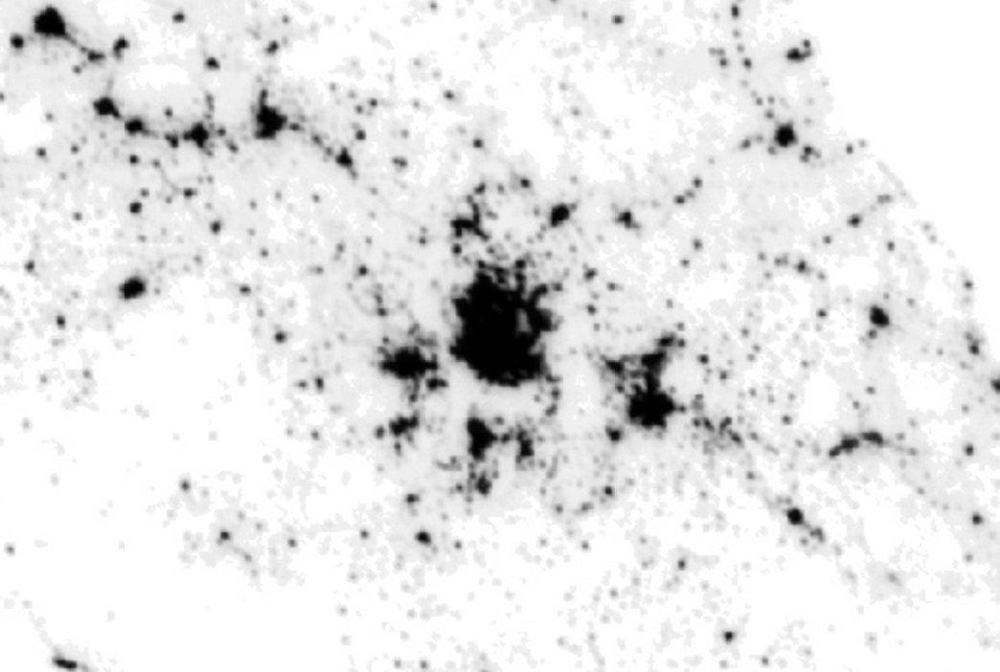
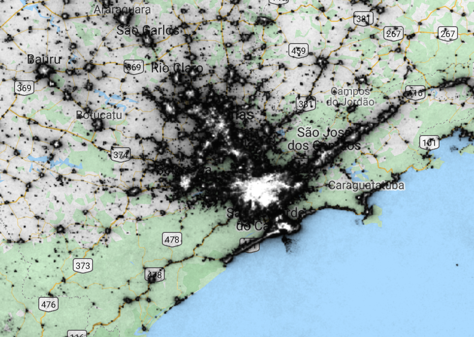

# Night Time Lights Appendix {#lab6}

## Overview{-}

Capturing and visualizing low-light emittance from around the earth has been utilized in various applications since the mid-1960's. By consistently quantifying light emittance over long time periods, it is possible to use this as a proxy for economic development, especially in areas where there is not high-quality data and metrics to work with. Google Earth Engine has consolidated this data into an operational archive dating back to 1992, which is an excellent way to find meaningful insights using this data set.

This tutorial is a supplement to the excellent *Open Nighttime Lights* [tutorial](https://worldbank.github.io/OpenNightLights/welcome.html) that the World Bank developed. The World Bank tutorial consists of six modules, including a background on the history of the data, working with the tools, extracting imagery, data analysis and image classification. It also contains an archive in which you can archive the raw data directly from Amazon Web Services and an applications section that attempts to estimate electricity usage using the nighttime data set. Each segment is well-written, and there is extensive documentation throughout. 

The caveat here is that up until this point in the course, we have worked with the Google Earth Engine JavaScript code editor - Because the World Bank tutorial covers topics such as working with data frames, statistics and classification, it utilizes the Google Earth Engine Python API in a Jupyter Notebook. Python is a more natural fit and contains more capabilities for data analysis and Machine Learning than JavaScript, and while the GEE code editor is excellent at working with objects and methods, many of you might prefer working with Python. Based on your background and what you want to get out of this course, here is our general suggestion on how to proceed. 

1. If you are comfortable working with Python, Jupyter Notebooks and setting up your own environment (pip, Conda, Brew), than follow along with the tutorial as it is. Module 2-2 in the World Bank tutorial explains how to get an environment up and running.
   1. If this is the case, spend some time reading about the functionality in the [geemap](https://geemap.org) package - it consolidates much of the mapping features in Earth Engine in an intuitive way, as well as functionality to integrate your results with Folium and custom basemaps.

2. If you want to learn to use Python but have never worked with virtual environments, then consider going through the tutorial in a Google Colab - it requires no setup of infrastructure, and you can get running immediately while learning Python. Once you are comfortable with this, you can always learn how to set up your own environment. Explanations on getting started can be located [here](https://worldbank.github.io/OpenNightLights/tutorials/mod2_3_introduction_to_Jupyter_notebooks.html). Note that there are several components of the tutorial, primarily in visualization using leaflet, that will not work. 
3. If you want to stick with working with JavaScript, then the section below will provide you with some capabilities of doing the core functions in the code editor, mainly the segment in Module 3. After that, we suggest exporting the data for further analysis. 

Again, this lab is more of a supplement for students that wish to keep using JavaScript and the GEE code editor. It is not designed to fully replace the World Bank tutorial, and while will get you started, there will be things that you will have to figure out on your own. 

## Basic Operations 

Module 1 is an essential introduction to the NightTime Lights dataset, while Module 2 introduces you to the data and the setting up your environment. In this section, we will covering the essential components of obtaining the data that you need in the correct context, some basic processing, building a composite and exporting the data  in JavaScript, with enough code to show you how to get started and how to follow along with the tutorial. 

We will follow along with module exactly as it is set up,  so that you can refer to the Module and section numbers. 

1. **Obtaining the Data**

   The code chunk below should be a good starting point on ingesting the data, looking at the range of data, and visualizing the average value across the image collection. Follow along with the same concepts in the tutorial, test using a specific image (instead of an image collection) and visualize your results. You can modify the opacity manually using the slider on the `layers` tab, and then build it into your [visualization](https://developers.google.com/earth-engine/guides/image_visualization?hl=en#code-editor-javascript).

   Note: JavaScript uses Lon / Lat, while Python uses lat / long while building points or setting map areas. 

```javascript
// Read in Nighttime Lights
var dmsp = ee.ImageCollection("NOAA/DMSP-OLS/NIGHTTIME_LIGHTS");
// Print size of the image collection
print(dmsp.size());
// Print out the dates of image collection
var imgrange = dmsp.reduceColumns(ee.Reducer.minMax(), ["system:time_start"]);
var start = ee.Date(imgrange.get('min'));
var end = ee.Date(imgrange.get('max'));
print('Date range: ', start, end);
// Take average visibility 
var nighttimeLights = dmsp.select('avg_vis');
var nighttimeLightsVis = {
  min: 3.0,
  max: 60.0,
};
var center_lat = 38.9072;
var center_lon = -77.0369;
var zoomlevel=7;
// 
Map.setCenter(center_lon, center_lat, zoomlevel);
Map.addLayer(nighttimeLights, nighttimeLightsVis, 'Nighttime Lights');
```

2. **Image Clipping**

   This section follows along with some of our earlier work in clipping our image to a certain area. Whether you need to bring in your own shapefiles. The code below clips a single around a 200km buffer around Los Angeles. 

```javascript
// Get December image - "avg_rad" band
var viirs2019_12 = ee.ImageCollection("NOAA/VIIRS/DNB/MONTHLY_V1/VCMSLCFG").filterDate(
  "2019-12-01","2019-12-31").select('avg_rad').median()
// Set visibility parameters
var nighttimeLightsVis = {
  min: 3.0,
  max: 60.0,
};
var center_lat = 34.05;
var center_lon = -118.25;
// Build a 200km buffer around a point
// Clip image to boundary of buffer
var aoi = ee.Geometry.Point([center_lon, center_lat]).buffer(200000);
var viirs2019_12_clipped = viirs2019_12.clip(aoi)
var zoomlevel=7;
// map set center 
Map.setCenter(center_lon, center_lat, zoomlevel);
Map.addLayer(viirs2019_12_clipped, nighttimeLightsVis, 'Clipped to Buffer');
```




You can do the same thing with either your own polygon vector files (import shapefile, kml), or use one of the vector files that GEE maintains - we can test use the TIGER state boundary file and clip the image to California. 

```javascript
// Get December image - "avg_rad" band
var viirs2019_12 = ee.ImageCollection("NOAA/VIIRS/DNB/MONTHLY_V1/VCMSLCFG").filterDate(
  "2019-12-01","2019-12-31").select('avg_rad').median()
// Set visibility parameters
var nighttimeLightsVis = {
  min: 3.0,
  max: 60.0,
};
var center_lat = 37;
var center_lon = -120;
// Boundary of states
// Filter to California 
var aoi_CA = ee.FeatureCollection('TIGER/2016/States').filter(
  ee.Filter.eq('NAME', 'California'))
var viirs2019_12_clipped = viirs2019_12.clip(aoi_CA)
var zoomlevel=6;
// map set center 
Map.setCenter(center_lon, center_lat, zoomlevel);
Map.addLayer(viirs2019_12_clipped, nighttimeLightsVis, 'California NightTime Lights'); 
```



The previous two examples showed the process of clipping individual images - to clip an entire image 		collection and extract a composite image, we can follow the same general approach, but use the `map` function to clip each image of the collection to our boundary. However, note that depending on the use case and the size of the image collection, this might take time to run and still leave you with a large amount of data. Before exporting all the data, perhaps reduce the image collection by extracting mean / median values, or use the reduce function. 

```javascript
var viirsDNB = ee.ImageCollection("NOAA/VIIRS/DNB/MONTHLY_V1/VCMSLCFG").select('avg_rad')
// Define our clipping function
// Built specifically for the purposes of clipping to California
function clip_func(im_col) {
    return im_col.clip(aoi_CA);
}
// Set visibility parameters
var nighttimeLightsVis = {
  min: 3.0,
  max: 60.0,
};
var center_lat = 37;
var center_lon = -120;
var zoomlevel=6;
// Boundary of States
// Filter to California 
var aoi_CA = ee.FeatureCollection('TIGER/2016/States').filter(
  ee.Filter.eq('NAME', 'California'))
// use `map` - which applied our function to each image in the image collection
var viirs_dmb_clipped = viirsDNB.map(clip_func)
// map set center 
Map.setCenter(center_lon, center_lat, zoomlevel);
Map.addLayer(viirs_dmb_clipped, nighttimeLightsVis, 'California NightTime Lights');
```

3. **Conditional Operations**

In this section, we will go over how to mask individual pixels based on conditional statements. This is one section that we will cover in JavaScript, but is probably easier to conduct in Python using 'Pythonic' methods and libraries such as NumPy. The charting is easer to work with in Python, but in the code chunk below, you can go through how to build a histogram smoothed with a Gaussian filter to identify where a value to might be appropriate. Then, build a binary mask using GEE's built in conditionals:  

```javascript
// get December image, we're using the "avg_rad" band
var viirs2019_12 = ee.ImageCollection("NOAA/VIIRS/DNB/MONTHLY_V1/VCMSLCFG").filterDate(
  "2019-12-01","2019-12-31").select('avg_rad').median()
// center on Catalonia
var lat = 41.83
var lon = 1.67
// create a 200 km buffer around the center of Catalonia
var aoi = ee.Geometry.Point(lon, lat).buffer(200000);
```

**Build the Histogram**

This histogram is quite tough to read, but there are values that range from 0 to over 1000 - note that the vast majority fall within the range of 0 and 4. This is used to get a basic understanding of our data. 

--------> Need to improve

```javascript
// 
var hist = viirs2019_12.reduceRegion({
  reducer: ee.Reducer.autoHistogram(),
  geometry: aoi,
  scale: 100,
  bestEffort: true
});
// The result of the region reduction by `autoHistogram` is an array. Get the
// array and cast it as such for good measure.
var histArray = ee.Array(hist.get('avg_rad')) ;
print(histArray)
// Subset the values that represent the bottom of the bins and project to
// a single dimension. Result is a 1-D array.
var binBottom = histArray.slice(1, 0, 1).project([0]);
// Subset the values that represent the number of pixels per bin and project to
// a single dimension. Result is a 1-D array.
var nPixels = histArray.slice(1, 1, null).project([0]);
// Chart the two arrays using the `ui.Chart.array.values` function.
var histColumnFromArray = ui.Chart.array.values({
  array:nPixels,
  axis: 0,
  xLabels: binBottom})
  .setChartType('ColumnChart');
print(histColumnFromArray);
```

**Mask values**

The histogram shows us that a massive number of values fall near zero - if we build a mask using GEE's built in conditionals to keep only pixels that have a value above 4, the output allows us to focus in on areas that have meaningful values. Additionally, this will improve compute time and analysis. 

```javascript
// Output is a binary mask (0-1)
var mask_value = 4
var viirs2019_12_mask = viirs2019_12.gte(mask_value)
// Initialize our map
var nighttimeVis = {min: 0.0, max: 120.0};
Map.setCenter(lon, lat, 8);
Map.addLayer(viirs2019_12.mask(viirs2019_12_mask), nighttimeVis,  'Nighttime');
```



Note that just like in the lab, you can chain together conditionals to make a layered mask, and build a customized pallette. 

```javascript
var zones = viirs2019_12.gt(1.5).add(viirs2019_12.gt(2)).add(viirs2019_12.gt(5))
// Initialize our map
var nighttimeVis = {min: 0.0, max: 120.0};
Map.setCenter(lon, lat, 8);
Map.addLayer(zones.mask(zones), {'palette':['#cc0909','#e67525','#fff825']}, 'zones');
```



4. **Cell Statistics and Band Math**

It is worthwhile to read through this section thoroughly on the World Bank tutorial, as the techniques you learn here will be very useful in later sections. We will go over scaling an image to center each pixel at zero. We are working in the region of East Timor - the general process is to read in the December 2017 Nighttime Lights average, clip it to the East Timor Feature Collection, and then calculate the mean and standard deviation using the `reduceRegion` function. Now that we have those values, we can standardize the scaling. Compare the before and after images - in the first, it is very difficult to get any meaningful values, because the range of values is so narrow. Once scaled, we can more easily differentiate between urban areas and rural areas. You will also note that by doing this, the noise increases as well, as you can tell from the reduced 'sharpness' of the image. This can be an issue in many cases, and will be addressed in other components of the module. 

```javascript
// get December image, we're using the "avg_rad" band
var viirs2017_12 = ee.ImageCollection(
  "NOAA/VIIRS/DNB/MONTHLY_V1/VCMSLCFG").filterDate(
  "2017-12-01","2017-12-31").select('avg_rad').first()
// get the geometry for Timor-Leste from GEE's tagged datasets
var tls = ee.Feature(ee.FeatureCollection(
  "FAO/GAUL/2015/level0").filter(ee.Filter.eq(
  'ADM0_NAME', 'Timor-Leste')).first()).geometry()
// clip our VIIRS image to Timor-Leste
var ntl_tls = viirs2017_12.clip(tls)
// Set visibility parameters
var nighttimeLightsVis = {
  min: 3.0,
  max: 60.0,
};
Map.setCenter(126.25, -8.5, 9);
Map.addLayer(ntl_tls, nighttimeLightsVis, '"VIIRS-DNB Dec 2017"');
```



```javascript
// Reduce image to find the mean and standard deviation
var mu = ntl_tls.reduceRegion(ee.Reducer.mean())
var std = ntl_tls.reduceRegion(ee.Reducer.stdDev())
// Convert these to Numbers using the ee.Number constructor
var mu = ee.Number(mu.get('avg_rad'))
var std = ee.Number(std.get('avg_rad'))
// Print Output to ensure values look correct
print('Mean Avg Radiance', mu.getInfo())
print('StdDev', std.getInfo())
// Subtract mean and divide by standard deviation
var ntl_tls_std = ntl_tls.subtract(mu).divide(std)
// Set visibility parameters
var nighttimeLightsVis = {
  min: -4,
  max: 4,
};
Map.setCenter(126.25, -8.5, 9);
Map.addLayer(ntl_tls_std, nighttimeLightsVis, 'Scaled Image');
```


5. **Expressions**

In this module, we will work with the `.expression()` methods built-into images. This allows us to work with customized functions and complete more advanced band math than pre-built functionality. This is a very short module, but the key point here is that being able to manipulate and find unique relationships in imagery. Once you understand how to build an expression, opportunities are limitless. In the images below, we invert the pixel values by multiplying each pixel by -1 and adding 63 (max value). 

```javascript
// get 1996 composite, apply mask, and add as layer
var dmsp1996 = ee.Image("NOAA/DMSP-OLS/NIGHTTIME_LIGHTS/F121996").select('stable_lights')
var lat = 19.43
var lon = -99.13
var nighttimeLightsVis = {
  min: 0.0,
  max: 63.0,
};
Map.setCenter(lon, lat, 7);
Map.addLayer(dmsp1996, nighttimeLightsVis, '1996 Composite')
```



```javascript
// Use Expression to invert the pixels
var dmsp1996_inv = dmsp1996.multiply(-1).add(63)
Map.addLayer(dmsp1996_inv, nighttimeLightsVis, '1996 Composite Inverse')
```

 

6. **Expression (Continued)**

In the previous example we built an expression using some of the GEE built-in operations, such as `.multiplication()` and `.add()`. This works well for that specific use case, but is limiting when you need to use operations that are not specifically provided within GEE. Another methodology is to build our expression with a string and then provide the input as a key-value pair. See the code chunk below for the methodology. Additionally, for calculations that involve massive amounts of data, there are some speed advantages in doing it this way. Follow along with the World Bank tutorial using this methodology, and try to build some of your own functions to see the result. Using 'Inspector' would be helpful to test whether your function acted as expected. 

```javascript
var inv_formula = "(X*-1) + 63"
// We plug this formula in, identify our variable "X" and set it to our 1996 DMSP-OLS "stable_lights" band
var dmsp1996_inv2 = dmsp1996.expression(inv_formula, {'X':dmsp1996})
Map.addLayer(dmsp1996_inv2, nighttimeLightsVis, '1996 Composite Inverse')
```

7. **Make a Composite**

Building a temporal composite is an important part of analysis and modeling. We went through these concepts in earlier labs, although this tutorial extends some of the functionality. 

```javascript
// 2015 image collection - "avg_rad" band
var viirs2015 = ee.ImageCollection("NOAA/VIIRS/DNB/MONTHLY_V1/VCMSLCFG").filterDate(
  "2015-01-01","2015-12-31").select('avg_rad')
// Confirm that there are 12 images in this collection 
print('Images:', viirs2015.size().getInfo())
var viirs2015med = viirs2015.median()
// iniatialize map on Sao Paulo
var lat = -23.54
var lon = -46.63
var nighttimeLightsVis = {
  min: 0.0,
  max: 63.0,
};
// Initialize the map
Map.setCenter(lon, lat, 7);
Map.addLayer(viirs2015med.mask(viirs2015med), nighttimeLightsVis, '2015 Monthly Median')
```



------> Research alternative to loop - convert function in 7.4.3 to `.map`

```javascript
// Define start and end years
var start = 2015
var end = 2019
var years = ee.List.sequence(start, end)
print('Number of years: ', years.size().getInfo())
var colID = "NOAA/VIIRS/DNB/MONTHLY_V1/VCMSLCFG"
function viirs_annual_median_reduce(year) {
    return ee.ImageCollection(colID).filter(    		ee.Filter.calendarRange(year,year,"year")).select(
      "avg_rad").median().set('year',year)
}
// Map function to each year in our list
var yearComps = ee.ImageCollection.fromImages(years.map(viirs_annual_median_reduce))
```

8. **Importing and Exporting Data**

Using the GEE code editor is relatively straightforward for importing spatial files, such as Shapefiles. Follow the [documentation](https://developers.google.com/earth-engine/guides/table_upload?hl=en) and you should be able to import the data that you need. 

While the [documentation](https://developers.google.com/earth-engine/guides/exporting?hl=en) on exporting data is also relatively straightforward, it is important to understand exactly what you are exporting. 

Refer to lab 01 for more information and some examples of importing and exporting data. 

## Conclusion

As noted earlier, this lab is more of a JavaScript supplement to the excellent World Bank tutorial. There are many data and remote sensing libraries in Python that can help you take your work to the next stage.   


