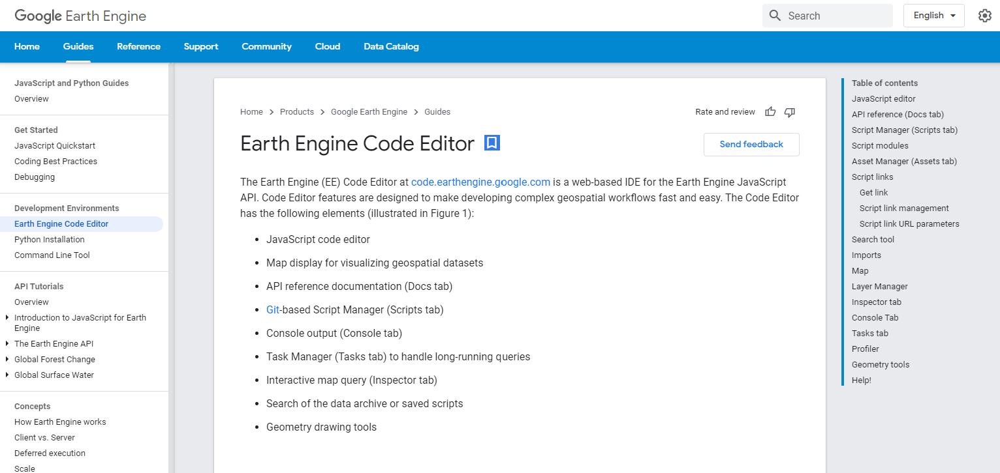

# Digital Imagery & Image Processing {#lab2}


## Overview  {-}
The purpose of this lab is to enable you to search, find and visualize imagery in Google Earth Engine. At completion, you should be able to understand the difference between radiance and reflectance, load imagery with the units of interest (radiance or reflectance, for example), make true color and false color composites and visually identify land cover types based on spectral characteristics.

####  Learning Outcomes  {-}
- Search and import imagery in GEE
- Extract single scenes from collections of images
- Create and visualize different composites according to desired parameters
- Use the Inspector tab to assess pixel values
- Understand the difference between radiance and reflectance through visualization

## Searching for Imagery (Exercise 1)

The Landsat program is a joint NASA/USGS program that has launched a sequence of Earth observation satellites, named Landsat 1, 2,... etc. The Landsat program has resulted in the [longest continuous observation of the Earth's surface](https://www.youtube.com/embed/ZZx1xmNGcXI?list=PLD240BBC85537B9BE). In this exercise, you will load a Landsat scene over your area of interest, inspect the units and make a plot of radiance.  Specifically, use imagery from the Landsat 8, the most recent of the [sequence of Landsat satellites](https://www.usgs.gov/core-science-systems/nli/landsat/landsat-8). To inspect a Landsat 8 image (also called a *scene*) in your region of interest (ROI), define your ROI as a point, filter the image collection to get a scene with few clouds, and display some information about the image in the console.


a. Search for 'San Francisco' in the playground search bar and click the result under “Places” to pan and zoom the map to San Francisco. 

\begin{figure}

{\centering \includegraphics[width=0.95\linewidth]{sf_gee_example} 

}

\caption{Playground Search for San Francisco in the GEE Console}(\#fig:sfgeeexample)
\end{figure}

<!--  -->

b. Use the [geometry tools](https://developers.google.com/earth-engine/playground#geometry-tools) to make a point in San Francisco (Exit the drawing tool when you're finished). Name the resultant [import](https://developers.google.com/earth-engine/playground#imports) 'point' by clicking on the import name ('geometry' by default).

c. Search for 'landsat 8 raw' and import the 'USGS Landsat 8 Collection 1 Tier 1 Raw Scenes' ImageCollection. Name the import `landsat`.

d. Filter the `ImageCollection` by date and location, sort by a metadata property called `CLOUD_COVER` and get the first image out of this sorted collection:

    ```javascript
    //  Note that we need to cast the result of first() to Image.   
    var image = ee.Image(landsat        
                         //  Filter to get only images in the specified range.  
                         .filterDate('2014-01-01',  '2014-12-31')        
                         //  Filter to get only images at the location of the point.     
                         .filterBounds(point)        
                         //  Sort the collection by a metadata property.     
                         .sort('CLOUD_COVER')        
                         //  Get the first image out of this collection.     
                         .first());  
    
    ```

e. The variable `image` now stores a reference to an object of type `ee.Image`. Display a human-readable representation of the image by printing it to the console. 

    ```javascript
      //  Print the information to the console 
      print('A Landsat scene:', image);  
    ```

f. Activate the [**Console**](https://developers.google.com/earth-engine/playground#console-tab) and observe that after the descriptive text, an object is displayed. Expand and explore the object by clicking the little triangle next to the image name to see more information stored in that object. Specifically, expand `properties` and inspect the long list of metadata items stored as properties of the image. This is where that `CLOUD_COVER` property you just used is stored.

g. Note that there are band specific coefficients (`RADIANCE_ADD_*`, `RADIANCE_MULT_*` where \* is a band name) in the metadata for converting from the digital number (DN) stored by the image into physical units of radiance. These coefficients will be useful in later exercises.

## Visualizing Landsat Imagery

Recall that [Landsat 8 measures radiance in multiple spectral bands](https://svs.gsfc.nasa.gov/cgi-bin/details.cgi?aid=11491). A common way to visualize images is to set the red band to display in red, the green band to display in green and the blue band to display in blue. This means trying to match the [spectral response of the instrument](http://landsat.gsfc.nasa.gov/?p=5779) to the spectral response of the photoreceptors in the human eye. It's not a perfect match. Despite that, a visualization done in this manner is called a *true-color* image. When the display bands don't match human visual perception, the resultant visualization is called a *false-color composite*. In this exercise, you will make several different visualizations of the scene you found in exercise 1. 


a. Add the image found in exercise 1 to the map display with the following code: 

    ```javascript
    //  Define visualization parameters in a JavaScript dictionary.   
    var trueColor = {    
      bands: ['B4', 'B3', 'B2'],    
      min: 4000,    
      max: 12000};  
    // Add the image to the  map, using the visualization parameters.   
    Map.addLayer(image, trueColor, 'true-color image');  
    ```

b. Observe that this Image is displayed according to the visualization instructions in the trueColor dictionary object. Specifically, bands is a list of three bands to display as red, green and blue, respectively (first band is red, second is green, third is blue). To understand where these band names come from, inspect the bands property of the image in the **Console**. To understand how to match bands to colors, see [this helpful page](http://landsat.usgs.gov/band_designations_landsat_satellites.php) and [this  one](http://landsat.usgs.gov/L8_band_combos.php).

c. There is more than one way to discover the appropriate min and max values to display. Try going to the [**Inspector** tab](https://developers.google.com/earth-engine/playground#inspector-tab) and clicking somewhere on the map. Note that value in each band, in the pixel where you clicked, is displayed as a list in the **Inspector**. Try clicking on dark and bright objects to get a sense of the range of pixel values. Also note that the [layer manager](https://developers.google.com/earth-engine/playground#layer-manager) in the upper right of the map display lets you automatically compute a linear stretch based on the pixels in the map display. 

d. Define a new set of visualization parameters and use them to add the image to the map as a false-color composite. This particular set of bands results in a *color-IR composite* because the near infra-red (NIR) band is set to red:

    ```javascript
    //  Define false-color visualization parameters.   
    var falseColor = {    bands: ['B5', 'B4', 'B3'],    min: 4000,    max: 13000   };  
    // Add the image to the  map, using the visualization parameters.   
    Map.addLayer(image, falseColor, 'false-color composite'); 
    ```


e. Try playing with band combinations, min and max DNs to achieve different visualizations. Note that you can compare the displays by toggling layers on and off with the layer manager.

##  Plot at-Sensor Radiance

The image data you have used so far is stored as DNs. To convert DN values into at-sensor [radiance](https://en.wikipedia.org/wiki/Radiance) units in Watts/m2/sr/𝝁m, use a linear equation of the form

$$ L_𝝀 = a_{\lambda} * DN_{\lambda} + b_{\lambda}  \qquad (1) $$

Note that every term is indexed by lamda ($\lambda$, the symbol for wavelength) because the coefficients are different in each band. See [Chander et al. (2009)](http://www.sciencedirect.com/science/article/pii/S0034425709000169) for details on this linear transformation between DN and radiance. In this exercise, you will generate a radiance image and examine the differences in radiance from different targets.

a. Perform the transformation in equation 1 using the Earth Engine function for converting Landsat imagery to radiance in Watts/m2/sr/𝝁m. It will automatically look up the right metadata values for each band and apply the equation for you

    ```javascript
    //  Use these bands.    
    var bands = ['B1', 'B2', 'B3', 'B4', 'B5', 'B6', 'B7', 'B10', 'B11'];  
    // Get an image that  contains only the bands of interest.   
    var dnImage = image.select(bands);  
    // Apply the  transformation.   
    var radiance =  ee.Algorithms.Landsat.calibratedRadiance(dnImage);  
    // Display the result.   
    var radParams = {bands: ['B4', 'B3', 'B2'], min: 0, max: 100};   
    Map.addLayer(radiance, radParams, 'radiance');  
    ```

    Note that this code applies the transformation to a subset of bands (specified by a list of band names) obtained from the image using select(). That is to facilitate interpretation of the radiance spectrum by removing the panchromatic band ('B8'), an atmospheric absorption band ('B9') and the QA band ('BQA'). Also note that the visualization parameters are different to account for the radiance units.

  b. Inspect the radiance image by activating the **Inspector** and clicking locations on the map. (It may be easier if you turn off the other images you're displaying by commenting `Map.addLayer() lines from previous exercises. Comment a line with the Ctrl-/ shortcut or two forward slashes at the start of the line). Click on different land cover types and in the **Inspector**, and click the chart icon () to get a chart of the pixel values. If the shape of the chart resembles Figure 1, that's because the radiance (in bands 1-7) is mostly reflected solar irradiance. The radiance detected in bands 10-11 is thermal, and is *emitted* (not reflected) from the surface.


\begin{figure}

{\centering \includegraphics[width=0.95\linewidth]{irradiance_wavelength} 

}

\caption{Solar irradiance vs wavelenth. Data sources: 6000K blackbody spectrum from http://astrogeology.usgs.gov/tools/thermal-radiance-calculator, adjusted according to the solid angle subtended by the solar disk. TOA and sea level irradiance from http://rredc.nrel.gov/solar/spectra/am1.5/.}(\#fig:irradiancewavelength)
\end{figure}


## Plot Top-of-Atmosphere (TOA) Reflectance 

The Landsat sensor is in orbit approximately 700 kilometers above Earth. The ratio of upward (reflected from the target at Earth's surface) radiance measured by the sensor to downward radiance from the sun is a unitless ratio called [reflectance](https://en.wikipedia.org/wiki/Reflectance). (In fact it's more complicated than that because radiance is a directional quantity, but this definition captures the basic idea). Because this ratio is computed using whatever radiance the sensor measures (which may contain all sorts of atmospheric effects), it's called *at-sensor* or *top-of-atmosphere* (TOA) reflectance. In this exercise, you will load TOA reflectance data and examine spectra at representative locations.

a. To get TOA data for landsat, a transformation of digital numbers is performed as described in [Chander et al. (2009)](http://www.sciencedirect.com/science/article/pii/S0034425709000169). This transformation is automatically done by Earth Engine. Search for 'landsat 8 toa' and import the 'USGS Landsat 8 Collection 1 Tier 1 TOA Reflectance' ImageCollection. Name the import 'toa'. This collection stores TOA images which can be filtered as in exercise 1, substituting 'toa' for 'landsat' as the collection variable.  A shortcut is to find the image ID from the printout of image (defined in exercise 1), then copy this ID directly into the Image constructor, appending _TOA to the collection name (the difference is shown in bold):

    ```javascript
    var toaImage = ee.Image('LANDSAT/LC08/C01/T1_TOA/LC08_044034_20141012');  
    ```


b. Since reflectance is a unitless ratio in [0, 1], change the visualization parameters to correctly display the TOA data:
  
    ```javascript
    Map.addLayer(toaImage, {bands: ['B4', 'B3', 'B2'], min: 0, max: 0.3},  'toa');  
    ```


c. Using the **Inspector**, click several locations on the map and examine the resultant spectra. It should be apparent, especially if you chart the spectra, that the scale of pixel values in different bands is drastically different. Specifically, bands 10-11 are not in [0, 1].  The reason is that these are thermal bands, and are converted to brightness temperature, in [Kelvin](https://en.wikipedia.org/wiki/Kelvin), as part of the TOA conversion. Very little radiance is reflected in this wavelength range; most is emitted from the Earth's surface. That emitted radiance can be used to estimate [brightness temperature](https://en.wikipedia.org/wiki/Brightness_temperature), using the inverted [Planck equation](https://en.wikipedia.org/wiki/Planck's_law). Examine the temperature of various locations. Now add this command to the TOA image before adding it to the map to get only bands 1-9 ` .select('B([0-9])')`


d. To make plots of reflectance, select the reflective bands from the TOA image and use the Earth Engine [charting API](https://developers.google.com/earth-engine/charts). To see a customized chart of reflectance at a point in Golden Gate Park, use:
  
    ```javascript
    //  Hardcode a point in Golden Gate Park.   
    var ggPark = ee.Geometry.Point([-122.4860, 37.7692]);      
    // Define reflective  bands as bands B1-B7. See the docs for slice().   
    var reflectiveBands = bands.slice(0, 7);      
    // See  http://landsat.usgs.gov/band_designations_landsat_satellites.php   
    var wavelengths = [0.44, 0.48, 0.56, 0.65, 0.86, 1.61, 2.2];      
    // Select only the  reflectance bands of interest.   
    var reflectanceImage =  toaImage.select(reflectiveBands);      
    // Define an object of  customization parameters for the chart.   
    var options = {
      title: 'Landsat  8 TOA spectrum in Golden Gate Park',    
                   hAxis: {title: 'Wavelength  (micrometers)'},
                   vAxis: {title: 'Reflectance'},
                   lineWidth: 1,
                   pointSize: 4};      
    // Make the chart, using  a 30 meter pixel.   
    var chart = ui.Chart.image.regions(
      reflectanceImage, 
      ggPark, null, 30, null, wavelengths)
    		.setOptions(options);      
    // Display the chart.   
    print(chart);  
    ```

---

<i class="fa fa-file"></i> **1. Upload the TOA reflectance plot you generated and briefly describe its salient features ** 

---


There are several new methods in this code. The Point constructor takes a list of coordinates as input, as an alternative to a "hand-made" point from the geometry drawing tools that is imported to the script. The `slice()` method gets entries in a list based on starting and ending indices. Search the docs (on the **Docs** tab) for 'slice' to find other places this method can be used. Construction of the chart is handled by an object of customization parameters ([learn more about customizing charts](https://developers.google.com/earth-engine/charts_image_histogram)) passed to [Chart.image.regions()](https://developers.google.com/earth-engine/charts_image_regions).

## Plot Surface Reflectance 

The ratio of upward radiance *at the Earth's surface* to downward radiance *at the Earth's surface* is called surface reflectance. Unlike TOA reflectance, in which those radiances are at the sensor, the radiances at the Earth's surface have been affected by the atmosphere. The radiance incident on the target is affected by its downward path through the atmosphere. The radiance reflected by the target is affected by its upward path through the atmosphere to the sensor. Unravelling those effects is called atmospheric correction ("compensation" is probably a more accurate term) and is beyond our scope. However, helpful scientists at the USGS have already performed this correction for us. 

To explore Landsat surface reflectance data, search 'Landsat 8 surface reflectance' and import the 'USGS Landsat 8 Surface Reflectance Tier 1' `ImageCollection`.  Name the import `sr`. Filter to the same date, location and cloudiness as with the raw and TOA collections and get the first image.

---

<i class="fa fa-file"></i>**2. Upload the surface reflectance plot you just generated and briefly describe its salient features. What differs or remains the same between the TOA plot and the surface reflectance plot? ** 


---

<i class="fa fa-file"></i>**3. When you add `sr` to the map, you will need to scale the imagery or change the visualization parameters.  Why?  Read the dataset description to find out.  Hint: What is the scale factor for bands 1-9? **

---

## Additional Exercises
    
<i class="fa fa-file"></i> **4. In your code, set the value of a variable called `azimuth` to the solar azimuth of the image from 1d. Do not hardcode the number. Use `get()`. Print the result and show you set the value of `azimuth`.**

---

<i class="fa fa-file"></i> **5. Add a layer to the map in which the image from 1d is displayed with band 7 set to red, band 5 set to green and band 3 set to blue. Upload a visual of the layer and show how you would display the layer name as `falsecolor`. **

---


<i class="fa fa-file"></i> **6.  What is the brightness temperature of the golden gate park point? Also show how you make a variable in your code called temperature and set it to the band 10 brightness temperature.** Hint:

```javascript
var  temperature = toaImage.reduceRegion(
  { <YOUR SOLUTION HERE>   })
		.get(  <YOUR SOLUTION  HERE>);  
```

Use [this guide](https://developers.google.com/earth-engine/reducers_reduce_region) for help.

---

<i class="fa fa-file"></i> **7. What is the surface reflectance (in [0,1], meaning you will need to apply the scale factor) in band 5 (NIR) at the golden gate park point? Also show how you make a variable in your code called `reflectance` that stores this value.** 

---


## Where to submit {-}
Submit your responses to these questions on [Gradescope](https://www.gradescope.com/courses/293173/assignments/1446622/submissions) by 10am on Wednesday, September 15. If needed, the access code for our course is `6PEW3W`.

\clearpage
