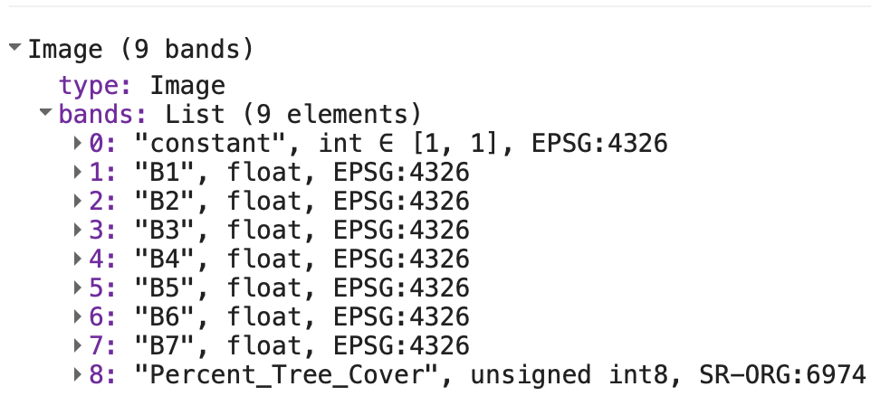
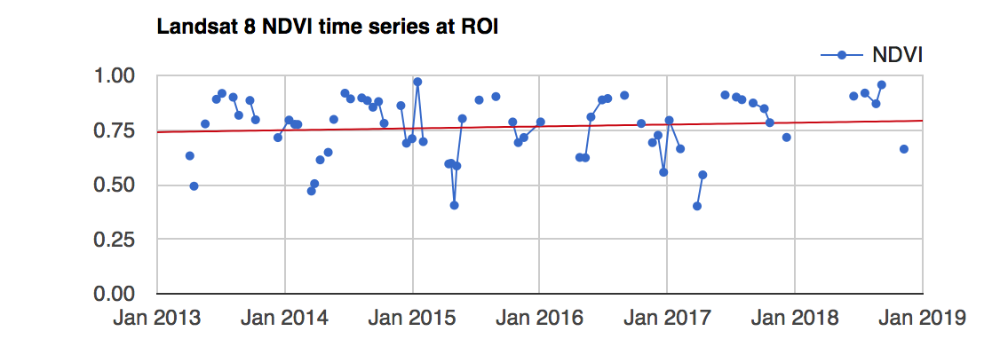
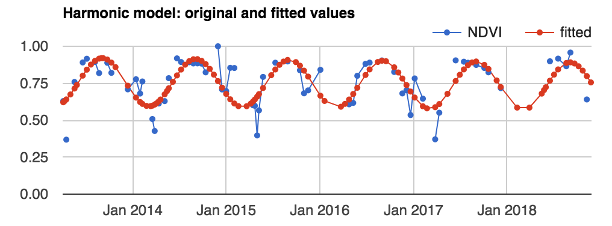

# More Regression and Time Series {#lab5}

## Overview{-}
Classifying imagery is an essential part of Remote Sensing research. In the previous lab, we began working with classification and regression, and we will continue on this same path for the first half of this lab. We will begin to explore Random Forest models more in depth, which were briefly introduced in the previous lab.  Ultimately, the purpose of classification in this context is to use known characteristics of a subset of the image to make a best-estimate classification of the rest of the image.  

We will then move to time series analysis, and part of the lab will allow you to establish a foundation for analyzing time series of remotely sensed data, usually in the form of a temporally ordered stack of images. By completion, you should be able to start to perform analysis of multi-temporal data for evaluating trends and seasonality. By completion, you should be able to perform analysis of multi-temporal data for evaluating trends and seasonality.

## Regression
In the present context, regression means predicting a numeric variable instead of a class label. No lab on regression would be complete without the requisite introduction to least squares regression.

### Ordinary Least Squares (OLS)

[Ordinary regression](https://en.wikipedia.org/wiki/Ordinary_least_squares) is when *G* is a linear function of the form *G*(**p**) = **βp** where **β** is a vector of coefficients. Once *G* is trained by some training set **T**, we can estimate the the value for some unknown **p** by multiplying it with **β**. 

Suppose the goal is to estimate percent tree cover in each Landsat pixel.

Import data to use known values for *g*. Search 'vegetation continuous fields' to import 'MOD44B.006' as the variable `mod44b` and extract the most recent image.  

```javascript
var tree = ee.Image(mod44b.sort('system:time_start', false).first());
```

Since water is coded as 200 in this image, replace the 200's with 0's and display the result. Documentation for the `.where` clause is at this [link](https://developers.google.com/earth-engine/apidocs/ee-image-where?hl=en). Scroll in and note that when you click on a water area it will say 'masked', where as an area on land will provide a numerical value listed as 'Percent_Tree_Cover'.

```javascript
var percentTree = tree.select('Percent_Tree_Cover')
.where(tree.select('Percent_Tree_Cover').eq(200), 0);
var visualization = {
  bands: ['Percent_Tree_Cover'],
  min: 0.0,
  max: 100.0,
  palette: ['bbe029', '0a9501', '074b03']
};
Map.addLayer(percentTree, visualization, 'percent tree cover'); 
```
Each pixel represents percent tree cover (as an integer value) at 250 meter resolution in 2010. Import data to use as predictor variables (**p**). Search 'landsat 5 raw' and import 'USGS Landsat 5 TM Collection 1 Tier 1 Raw Scenes'. Name the import `landsat5_raw`. Filter by time and the [WRS-2](https://www.usgs.gov/faqs/what-worldwide-reference-system-wrs?qt-news_science_products=0#qt-news_science_products) path and row to get only scenes over the San Francisco bay area in 2010.
                                                                                                         
```javascript
var landsat5_filtered = landsat5_raw.filterDate('2010-01-01', '2010-12-31')
.filterMetadata('WRS_PATH', 'equals', 44)
.filterMetadata('WRS_ROW', 'equals', 34);
```
Use an Earth Engine algorithm to get a cloud-free composite of Landsat imagery in 2010. Note that this will provide landsat imagery over the area of San Francisco - if you use the inspector to click anywhere else, the values are 'masked'.

```javascript
var landsat = ee.Algorithms.Landsat.simpleComposite({
  collection: l5filtered,
  asFloat: true
});
Map.setCenter(-121.9, 37.7, 10)
Map.addLayer(landsat, {bands: ['B4', 'B3', 'B2'], max: 0.3}, 'composite');
```

Specify the bands of the Landsat composite to be used as predictors (i.e. the elements of **p**):
  
```javascript
var predictionBands = ['B1', 'B2', 'B3', 'B4', 'B5', 'B6', 'B7'];
```
Now that all the input data is ready, we can build the shell of our linear regression equation. It's customary to include a constant term in linear regression to make it the [best linear unbiased estimator](https://en.wikipedia.org/wiki/Gauss–Markov_theorem). Stack a constant, the predictor variables and the 'Percent Tree Cover' Image as the variable `trainingImage`, representing known *g*:

```javascript
var trainingImage = ee.Image(1)
  .addBands(landsat.select(predictionBands))
  .addBands(percentTree);
```

If you print `trainingImage` to the console, you will see that the format of the data that we have follows the typical equation for linear regression. 

$$ y = \beta_0 + \beta_1X_1 + ... + \beta_nX_n + \epsilon $$

Sample 1000 pixels out of `trainingImage`, to get a table of Feature Collections, each containing a value for each band (1-7), a value for the 'Percent Tree Cover', and a constant (value of 1).

```javascript
var training = trainingImage.sample({
 region: landsat5_filtered.first().geometry(), 
 scale: 30, 
 numPixels: 1000
});
```

Inspect the first element of `training` to make sure it has all of the expected data. 

---

<i class="fa fa-file"></i> **What do you expect to see when you inspect the first element of training, and how does that compare with what you ultimately end up seeing?** 

---

The next step is to train *G*. Make a list of the variable names, predictors followed by *g*:

```javascript
var trainingList = ee.List(predictionBands)
  .insert(0, 'constant')
  .add('Percent_Tree_Cover');
```

In Earth Engine, [linear regression is implemented as a Reducer](https://developers.google.com/earth-engine/reducers_regression). This means that training *G* is a reduction of the **T** table, performed using the list of variables as an input. The argument (8) tells the reducer how many of the input variables are predictors - note that we have 1 as a constant. 

```javascript
var regression = training.reduceColumns({ 
    reducer: ee.Reducer.linearRegression(8),  
    selectors: trainingList
  });
```

Print `regression` - we now have a coefficient for each of the predictor variables (in the order specified by the inputs list), along with a value for residuals (the difference between the observed and predicted values).


<!--  -->
To use the coefficients to make a prediction in every pixel, first turn the output coefficients into an image, then perform the multiplication and addition that implements $\beta_p$: 

```javascript
var coefficients = ee.Array(regression.get('coefficients'))
		.project([0])  
		.toList();
var predictedTreeCover = ee.Image(1)
		.addBands(landsat.select(predictionBands))				
		.multiply(ee.Image.constant(coefficients))				
		.reduce(ee.Reducer.sum())	
		.rename('predictedTreeCover');
Map.addLayer(predictedTreeCover,  
             {min: 0, max: 100, 
              palette:['bbe029', '0a9501', '074b03']}, 
             'prediction');
```

Carefully inspect this result by using the inspector on the prediction layer and comparing it to the satellite imagery basemap. Is it satisfactory?

If not, it might be worth testing some other regression functions, adding more predictor variables, collecting more training data, or all of the above. In remote sensing research, this is not a one-step process - to find value in these models, you will need to continuously improve, iterate and retest your assumptions. 

---

<i class="fa fa-file"></i> **Upload your predicted layer and your satellite imagery basemap. Discuss the salient features of the predicted output and which steps you may want to take in order to improve the results.** 

---

## Nonlinear Regression

If ordinary linear regression is not satisfactory, Earth Engine contains other functions that can make predictions of a continuous variable. Unlike linear regression, other regression functions are implemented by the classifier library. 

For example, a Classification and Regression Tree (CART, see [Brieman et al. 1984](https://books.google.com/books/about/Classification_and_Regression_Trees.html?id=JwQx-WOmSyQC)) is a machine learning algorithm that can learn non-linear patterns in your data. Reusing the **T** table (without the constant term), train a CART as follows:

```javascript
var cartRegression = ee.Classifier.smileCart()
  .setOutputMode('REGRESSION')
  .train({
   features: training, 
   classProperty: 'Percent_Tree_Cover', 
   inputProperties: predictionBands
  });
```

Make predictions over the input imagery:

```javascript
var cartRegressionImage = landsat.select(predictionBands)
  .classify(cartRegression, 'cartRegression');
Map.addLayer(cartRegressionImage, {min: 0, max: 100}, 'CART regression');
```

Use the 'inspector' to compare the linear regression to the CART regression. 

---

<i class="fa fa-file"></i> **What do you observe when comparing the linear regression to the CART regression? Are the prediction values similar? If the output for both are similar, does the value seem to match the background imagery?** 

---

Although CART can work in both classification and regression mode, not all classifiers are as easily adaptable. 


## Time Series
One of the paradigm-changing features of Earth Engine is the ability to access decades of imagery without the previous limitation of needing to download, organize, store and process. Because these files can be prohibitively large, this limited most projects to viewing two or three images from different periods. With Earth Engine, users can access tens or hundreds of thousands of images to understand the context of change across decades. 

<!-- The purpose of this lab is to establish a foundation for time series analysis of remotely sensed data, usually in the form of a temporally ordered stack of images. You will be introduced to concepts of smoothing, interpolation, linear modeling and phenology. At the completion of the lab, you will be able to perform analysis of multi-temporal data for determining trend and seasonality on a per-pixel basis. -->

### Multi-Temporal Data in Earth Engine

Time series in Earth Engine are represented as image collections. This can make time series analysis complicated because

- There is a different time series in each pixel
- The size (length) of the time series varies across pixels
- Missing data may occur in any pixel at any time (e.g. due to cloud masking, hardware errors)

As a result of these complicating factors, analyzing time series in Earth Engine is unlike traditional methods. Specifically, use joins to define temporal relationships between collection items. As you will soon discover, it's possible to perform many traditional time series methods by mapping functions over joined collections. 

First, some very basic notation. A scalar pixel at time *t* is given by $p_{t}$ and a pixel vector by $\textbf{p}_t$. An estimate is a variable with a hat on: (e.g. the estimated pixel value at time is $\hat{p}_{t}$). A time series is just a collection of *N* pixels, sorted chronologically: { $\textbf{p}_{t}  = t_{0} + t_{1}... t_{N}$ }, where each *t* is the given value of each pixel in the series (where $t$ might be in any units, $t_0$ is the smallest and $t_N$ is the largest such $t$ in the series.)

                                                
### Data Preparation and Preprocessing
The first step in analysis of time series data is to import data of interest and plot it at an interesting location.

1. Load a Landsat Time Series
    a. We will begin by importing Landsat 8 Surface Reflectance, Tier 1 (this data is currently deprecated, but works for this lab), name it `landsat_8_sr` . 
    b. Make a single point geometry with the drawing tools and position the point in a location of interest. (How about an annual grassland or a deciduous forest, which change characteristics seasonally?). Name the import `roi`. 

2. Preprocess the Landsat imagery by filtering it to the location of interest, masking clouds, and adding the variables in the model:

    ```javascript
    var landsat_8_sr = ee.ImageCollection("LANDSAT/LC08/C01/T1_SR")
    // This field contains UNIX time in milliseconds.
    var timeField = 'system:time_start';
    // Function to cloud mask from the pixel_qa band of Landsat 8 SR data.
    function maskL8sr(image) {
      // Bits 3 and 5 are cloud shadow and cloud, respectively.
      var cloudShadowBitMask = 1 << 3;
      var cloudsBitMask = 1 << 5;
      // Get the pixel QA band.
      var qa = image.select('pixel_qa');
      // Both flags should be set to zero, indicating clear conditions.
      var mask = qa.bitwiseAnd(cloudShadowBitMask).eq(0)
      .and(qa.bitwiseAnd(cloudsBitMask).eq(0));
      // Return the masked image, scaled to reflectance, without the QA bands.
      return image.updateMask(mask).divide(10000)
      .select('B[0-9]*')
      .copyProperties(image, ['system:time_start']);
    }
    // Use this function to add variables for NDVI, time and a constant
    // to Landsat 8 imagery.
    var addVariables = function(image) {
      // Compute time in fractional years since the epoch.
      var date = ee.Date(image.get(timeField));
      var years = date.difference(ee.Date('1970-01-01'), 'year');
      // Return the image with the added bands.
      return image
      // Add an NDVI band.
      .addBands(image.normalizedDifference(['B5', 'B4']).rename('NDVI'))
      // Add a time band.
      .addBands(ee.Image(years).rename('t'))
      .float()
      // Add a constant band.
      .addBands(ee.Image.constant(1));
    };
    // Remove clouds, add variables and filter to the area of interest.
    var filteredLandsat = landsat_8_sr
    .filterBounds(roi)
    .map(maskL8sr)
    .map(addVariables);
    ```

3. To visualize the data, make a chart at the location of interest. Add a linear trend line for reference (you'll compute that line soon):

    ```javascript
    // Plot a time series of NDVI at a single location.
    var l8Chart = ui.Chart.image.series(filteredLandsat.select('NDVI'), roi)
      .setChartType('ScatterChart')
      .setOptions({
       title: 'Landsat 8 NDVI time series at ROI',
       trendlines: {0: {
    				color: 'CC0000'
       }},
       lineWidth: 1,
       pointSize: 3,
      });
    print(l8Chart);
    ```

You should see something an output similar to the below image. Note that you can see a very slight upwards trend of the value at the point. Additionally, within each year there is seasonality, which means that there is a pattern that repeats within the year. 


<!--  -->

 
### Linear Modeling of Time
Lots of interesting analyses can be done to time series by harnessing the `linearRegression()` [reducer](https://developers.google.com/earth-engine/api_docs#eereducerlinearregression). To estimate linear trends over time, consider the following linear model, where $\epsilon_t$ is a random error:

$$ y = \beta_0 + \beta_1X_1 + ... + \beta_nX_n + \epsilon_t $$
This is the model behind the trendline added to the chart you just created. This model is useful for detrending data and reducing variability. For now, the goal is to discover the values of the $\textbf{\beta}$'s in each pixel.

1. To fit this trend model to the Landsat-based NDVI series using ordinary least squares, use the `linearRegression()` reducer:
                                                                  
    ```javascript
    // List of the independent variable names
    var independents = ee.List(['constant', 't']);
    // Name of the dependent variable.
    var dependent = ee.String('NDVI');
    // Compute a linear trend. This will have two bands: 'residuals' and 
    // a 2x1 band called coefficients (columns are for dependent variables).
    var trend = filteredLandsat.select(independents.add(dependent))
    .reduce(ee.Reducer.linearRegression(independents.length(), 1));
    // Map.addLayer(trend, {}, 'trend array image')
    // Flatten the coefficients into a 2-band image
    var coefficients = trend.select('coefficients')
    .arrayProject([0])
    .arrayFlatten([independents]);
    ```

  
      The coefficients’ image is a two band image in which each pixel contains values for $\beta_0$ and  $\beta_1$. 


2. Use the model to "detrend" the original NDVI time series. By detrend, we mean account for the slope of the chart. 

    ```javascript
    // Compute a de-trended series.
    var detrended = filteredLandsat.map(function(image) {
    return image.select(dependent).subtract(
           image.select(independents).multiply(coefficients).reduce('sum'))
           .rename(dependent)
           .copyProperties(image, [timeField]);
           });
    ```
             
3. Plot the detrended results                    
    ```javascript
    var detrendedChart = ui.Chart.image.series(detrended, roi, null, 30)
    .setOptions({
      title: 'Detrended Landsat time series at ROI',
      lineWidth: 1,
      pointSize: 3,
    });
    print(detrendedChart);
    ```
                                                                                                                                                                     
### Estimate Seasonality with a Harmonic Model
Consider the following linear model, where $e_t$ is random error, $A$ is amplitude, $\omega$ is frequency, and $\phi$ is phase:

$$ 
p_t = \beta_0 + \beta_1t + Acos(2\pi\omega t - \phi) + e_t 
$$

which is equivalent to

$$
p_t = \beta_0 + \beta_1t + \beta_2cos(2\pi\omega t) + \beta_3sin(2\pi\omega t) + e_t       
$$

Note that $\beta_2 = Acos(\phi)$ and $\beta_3 = Asin(\phi)$, implying $A = (\beta_2^2 + \beta_3^2)^½$ and $\phi = atan(\frac{\beta_3}{\beta_2})$). (See [Shumway and Stoffer (2017)](https://virginiatech.on.worldcat.org/v2/oclc/999821221) equations 4.1 - 4.2). To fit this model to the time series, set $\omega$=1 (one cycle per unit time) and use ordinary least squares regression.

1. The setup for fitting the model is to first add the harmonic variables (the third and fourth terms of equation 2) to the image collection.
                                                                                                          
  ```javascript
  // Use these independent variables in the harmonic regression.
  var harmonicIndependents = ee.List(['constant', 't', 'cos', 'sin']);
  // Add harmonic terms as new image bands.
  var harmonicLandsat = filteredLandsat.map(function(image) {
  var timeRadians = image.select('t').multiply(2 * Math.PI);
  return image
  .addBands(timeRadians.cos().rename('cos'))
  .addBands(timeRadians.sin().rename('sin'));
  });
  ```

  Fit the model as with the linear trend, using the `linearRegression()` reducer:

  ```javascript
  var harmonicTrend = harmonicLandsat
  .select(harmonicIndependents.add(dependent))
  // The output of this reducer is a 4x1 array image.
  .reduce(ee.Reducer.linearRegression({
  numX: harmonicIndependents.length(), 
  numY: 1
  }));
  ```
  
2. Plug the coefficients in to equation 2 in order to get a time series of fitted values:

  ```javascript
  // Turn the array image into a multi-band image of coefficients.
  var harmonicTrendCoefficients = harmonicTrend.select('coefficients') .arrayProject([0]) .arrayFlatten([harmonicIndependents]);
  // Compute fitted values.
  var fittedHarmonic = harmonicLandsat.map(function(image) { 
  return image.addBands(  
  image.select(harmonicIndependents)   
  .multiply(harmonicTrendCoefficients)   
  .reduce('sum')   
  .rename('fitted'));});
  // Plot the fitted model and the original data at the ROI.
  print(ui.Chart.image.series(fittedHarmonic.select(['fitted','NDVI']), roi,
                    ee.Reducer.mean(), 30)  
  .setSeriesNames(['NDVI', 'fitted'])  
  .setOptions({   
  title: 'Harmonic model: original and fitted values',   
  lineWidth: 1,   
  pointSize: 3,}));
  ```

<!-- You should see something like: -->

<!-- ```{r harmonicmodel, out.width='95%', fig.asp=.75, echo = FALSE, fig.align = "center"} -->
<!--  -->
<!-- ``` -->

---

<i class="fa fa-file"></i> **Upload the resulting graphic and interpret it. ** 

---


3. Although any coefficients can be mapped directly, it is often useful and interesting to map the phase and amplitude of the estimated harmonic model. First, compute phase and amplitude from the coefficients, then map the resulting image. 


```javascript
// Compute phase and amplitude.
var phase = harmonicTrendCoefficients.select('sin').atan2(harmonicTrendCoefficients.select('cos'))  
// Scale to [0, 1] from radians.  
           .unitScale(-Math.PI, Math.PI);
var amplitude = harmonicTrendCoefficients.select('sin').hypot(harmonicTrendCoefficients.select('cos'))  
// Add a scale factor for visualization.  
           .multiply(5);
// Compute the mean NDVI.
var meanNdvi= filteredLandsat.select('NDVI').mean();
// Use the HSV to RGB transformation to display phase and amplitude.
var rgb = ee.Image.cat([ phase,   
               amplitude, 
               meanNdvi]).hsvToRgb()
Map.addLayer(rgb, {}, 'phase (hue), amplitude (sat), ndvi (val)');
```

---

<i class="fa fa-file"></i> **Upload the resulting map layer and describe its salient features.** 

---

4.  A time series can be decomposed as the sum of sinusoids at different frequencies (See [Shumway and Stoffer (2017)](https://virginiatech.on.worldcat.org/v2/oclc/999821221), equation 4.7).  The harmonic model presented here can be easily extended in this manner by adding bands that represent higher frequencies (e.g. `timeRadians.multiply(2).cos().rename('cos2')` and the corresponding `sin()` band for a harmonic component with two cycles per year) and amending the `harmonicIndependents` variable accordingly.  

If you're feeling plucky, check out [this implementation](https://code.earthengine.google.com/2669122497313113fc4bb81bc8352828) of that idea for an arbitrary number of harmonic terms.  While this will undoubtedly improve the goodness-of-fit of the model, many of the coefficients may be close to zero.  To estimate the importance of terms representing seasonality or higher-frequency harmonic behavior (e.g. double-cropping), an F-statistic can be used when the model assumptions are satisfied.  See, for example, [Shumway and Stoffer (2017)](https://virginiatech.on.worldcat.org/v2/oclc/999821221), equation 2.11.

## Additional Exercises


<i class="fa fa-file"></i> **Look in google scholar to identify 2-3 publications that have used a harmonic regression in a time series analysis of remotely sensed data in particular. Provide citations for the articles, and then describe for what purposes was the technique used and what was the justification provided for its use.**


## Where to submit{-}
Submit your responses to these questions on [Gradescope](https://www.gradescope.com/courses/293173/assignments/1446622/submissions) by 10am on Wednesday, October 06. If needed, the access code for our course is `6PEW3W`.
